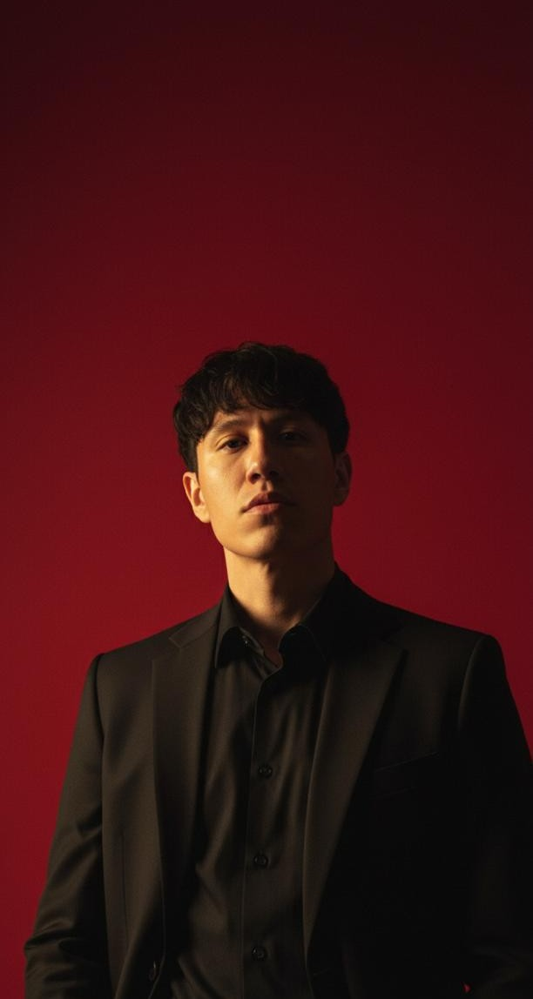
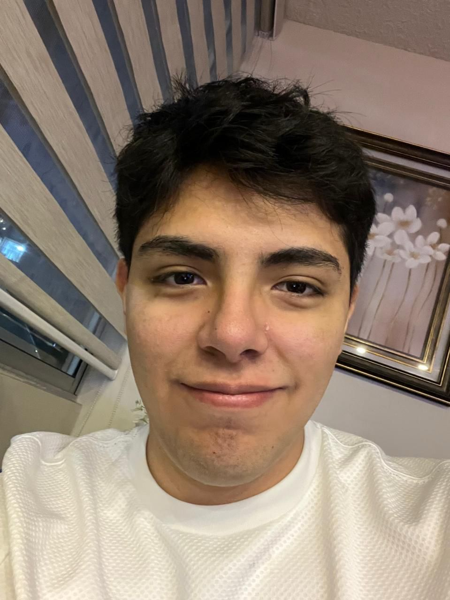

# Introduccion 
## 1.1 Startup Profile
### 1.1.1 Descripción de la Startup
Somos una startup peruana denominada **MDEPS** (Managements Development Engineering Project Systems), creada por estudiantes de la carrera de Ingeniería de Software de la Universidad Peruana de Ciencias Aplicadas (UPC), que tiene como objetivo principal optimizar la gestión de proyectos dentro de las organizaciones mediante el uso de tecnología.

Nuestra misión es lograr que ninguna empresa gestione sus proyectos sin un control centralizado, estandarizado y basado en información confiable, reduciendo así problemas como retrasos, falta de visibilidad, mala comunicación y toma de decisiones ineficientes.

Para cumplir con este propósito, hemos desarrollado el proyecto **Vantage PMO** (Project Management Office), una plataforma web que permite a las organizaciones gestionar, monitorear y controlar todos sus proyectos de manera centralizada, brindando visibilidad en tiempo real, estandarización de procesos y herramientas inteligentes para la toma de decisiones.

### 1.1.2. Perfiles de los Miembros del Equipo

docs: update formatting and improve table structure in readme.
| Foto | Apellido y Nombre | 
| --- | --- | 
 | *Diego Alonso Esquicha Alcántara - u202411799* Soy un estudiante de la carrera de ingeniería de software de quinto ciclo, me destaco por mis habilidades de comunicación y liderazgo para trabajar en equipo. Una de mis fortalezas es el desarrollo de la documentación necesaria para dar a marcha un proyecto o trabajo grupal y la comodidad de aprender de manera rápida y eficiente alguna herramienta tecnológica  
 | *Mike Dylan Guillen Giraldo - u202211881* Soy estudiante de Ingeniería de Software, enfocado en el desarrollo de soluciones tecnológicas eficientes y escalables. He adquirido conocimientos en programación, bases de datos, desarrollo web y fundamentos de ciberseguridad, además de habilidades como el trabajo en equipo y la resolución de problemas. Puedo aportar conocimientos en C++, C#, SQL, MongoDB, PostgreSQL y MySQL, así como desarrollo con Angular y JavaScript, y nociones básicas de TypeScript. También cuento con formación en ciberseguridad, incluyendo análisis de seguridad y fundamentos de seguridad informática. Soy proactivo, adaptable y con capacidad de aprendizaje continuo.  
 | *César Agusto Quispe Llacsahuanga - U202417405* Soy estudiante de Ingeniería de Software, interesado en el desarrollo de soluciones tecnológicas y el aprendizaje continuo en herramientas de programación. Cuento con conocimientos en lógica de programación, bases de datos y desarrollo de aplicaciones, lo que me permite contribuir en la construcción de sistemas eficientes. Me caracterizo por ser responsable, proactivo y con buena disposición para el trabajo en equipo, adaptándome a nuevos retos y aportando en el cumplimiento de los objetivos del proyecto. 
 | *Alvaro Rocha Cotrina - u202411243* Soy estudiante de Ingeniería de Software, con enfoque en el desarrollo backend, bases de datos y lógica de programación. Cuento con experiencia en la creación de aplicaciones y resolución de problemas mediante programación, especialmente en lenguajes como C++ y el diseño de sistemas estructurados. Me caracterizo por ser organizado, responsable y comprometido con el trabajo en equipo, aportando en la construcción de soluciones eficientes y en la correcta estructuración de la arquitectura del sistema. Además, tengo una gran capacidad de aprendizaje y adaptación a nuevas tecnologías, lo que me permite contribuir activamente en el desarrollo del proyecto.
 | *Mauricio Alejandro Teran Zavala - u202417423*  Estudiante de Ingeniería de Software con una sólida base en lógica de programación y desarrollo backend, especializado en Java, C++ y Python. Mi enfoque se centra en la creación de soluciones con impacto social mediante el diseño de APIs RESTful y una gestión eficiente de bases de datos. Más allá de lo técnico, aporto al equipo una disciplina y compromiso forjados en el deporte, lo que me permite trabajar bajo presión y adaptarme con proactividad a los desafíos del proyecto. Mi objetivo es garantizar un código limpio y funcional, fomentando una comunicación efectiva para asegurar que el equipo alcance sus metas con éxito
