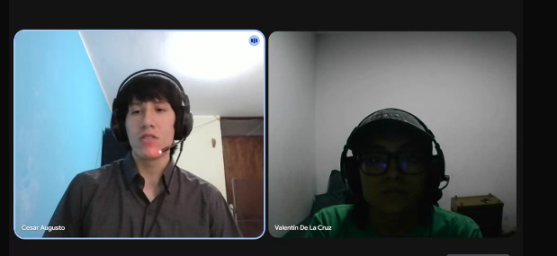
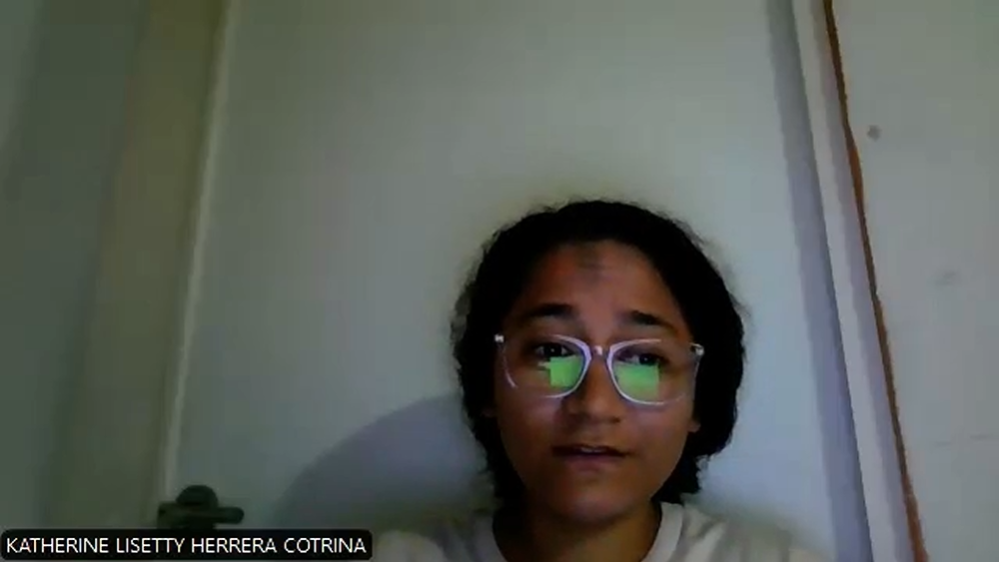
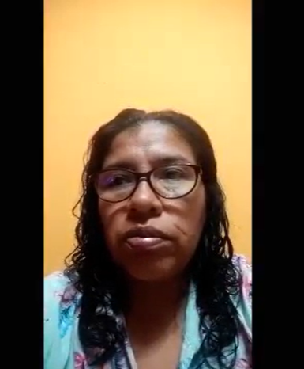
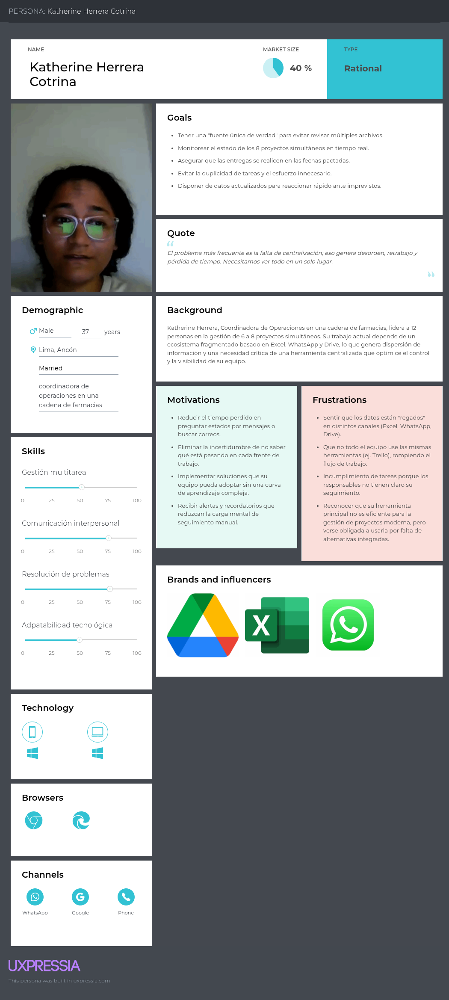

# Requirements Elicitation & Analysis
La recolección y análisis de requisitos es una etapa fundamental en el desarrollo de la plataforma Vantage PMO, ya que permite identificar y comprender las necesidades de los stakeholders involucrados en la gestión de proyectos. A través de técnicas como entrevistas, análisis de la competencia y evaluación de escenarios de uso, se busca obtener una visión clara de problemáticas como la falta de visibilidad, la fragmentación de la información y la ausencia de estandarización en los procesos. Este análisis permite definir los requerimientos clave del sistema, estableciendo una base sólida para el diseño y desarrollo de una solución que optimice la gestión de proyectos y mejore la toma de decisiones dentro de las organizaciones. 

## 2.1 Competidores
En la siguiente sección se presentarán los principales competidores de nuestra solución, así como un análisis general de sus características en comparación con el servicio propuesto.

**Jira**:
Es una de las herramientas más utilizadas en la gestión de proyectos, especialmente en equipos de desarrollo de software. Permite gestionar tareas mediante metodologías ágiles como Scrum y Kanban, ofreciendo funcionalidades como seguimiento de incidencias, control de backlog y generación de reportes. Jira destaca por su alta personalización y potencia, sin embargo, puede resultar complejo para usuarios no técnicos y no está completamente enfocado en la gestión integral de una PMO, ya que se centra más en la ejecución de tareas que en la supervisión estratégica de múltiples proyectos.

**Monday.com**:
Es una plataforma de gestión de trabajo basada en tableros visuales que permite a los equipos organizar tareas, proyectos y flujos de trabajo de manera intuitiva. Ofrece herramientas de automatización, colaboración en tiempo real y visualización del progreso mediante dashboards simples. Aunque es fácil de usar y adaptable a diferentes tipos de equipos, su enfoque es más generalista, por lo que no cubre completamente las necesidades específicas de una oficina de gestión de proyectos (PMO), especialmente en cuanto a estandarización de procesos y control estratégico.

**Microsoft Project**:
Es un software ampliamente reconocido en la planificación y gestión de proyectos complejos, especialmente en grandes organizaciones. Permite crear cronogramas detallados, asignar recursos, gestionar presupuestos y analizar el avance de los proyectos mediante herramientas como diagramas de Gantt. A pesar de su robustez y capacidad avanzada, presenta una curva de aprendizaje elevada y costos relativamente altos, lo que puede dificultar su adopción en empresas que buscan soluciones más ágiles, accesibles y centralizadas.
### 2.1.1 Analisis Competitivo

| **¿Por qué llevar a cabo este análisis?** | Evaluar el posicionamiento de Vantage PMO frente a sus competidores para identificar oportunidades de diferenciación y definir estrategias competitivas. |
| ----------------------------------------- | -------------------------------------------------------------------------------------------------------------------------------------------------------- |

| **Categoría**                              | **Vantage PMO (Startup)**                                                                                        | **Jira**                                                         | **Monday.com**                                                   | **Microsoft Project**                                           |
| ------------------------------------------ | ---------------------------------------------------------------------------------------------------------------- | ---------------------------------------------------------------- | ---------------------------------------------------------------- | --------------------------------------------------------------- |
| **Perfil**                                 |                                                                                                                  |                                                                  |                                                                  |                                                                 |
| **Overview**                               | Plataforma web de gestión PMO con dashboards en tiempo real, control centralizado y estandarización de procesos. | Herramienta ágil para gestión de proyectos de software.          | Plataforma visual para gestión de tareas y equipos.              | Software avanzado para planificación de proyectos complejos.    |
| **Ventaja competitiva (valor al cliente)** | Visibilidad 360°, control centralizado y facilidad de uso orientada a PMO.                                       | Alta personalización y potencia técnica.                         | Interfaz intuitiva y rápida adopción.                            | Planificación detallada y control avanzado.                     |
| **Perfil de Marketing**                    |                                                                                                                  |                                                                  |                                                                  |                                                                 |
| **Mercado objetivo**                       | Empresas medianas y grandes con múltiples proyectos.                                                             | Equipos de desarrollo de software.                               | PYMES y equipos generales.                                       | Grandes empresas.                                               |
| **Estrategias de marketing**               | Enfoque en productividad y transformación digital.                                                               | Branding en comunidad tecnológica.                               | Marketing visual y facilidad de uso.                             | Posicionamiento corporativo.                                    |
| **Perfil de Producto**                     |                                                                                                                  |                                                                  |                                                                  |                                                                 |
| **Productos & Servicios**                  | Dashboard, reportes automáticos, control de proyectos y recursos.                                                | Scrum, Kanban, seguimiento de tareas.                            | Tableros, automatización y colaboración.                         | Gantt, planificación avanzada.                                  |
| **Precios & Costos**                       | Suscripción SaaS accesible.                                                                                      | Freemium + planes pagos.                                         | Suscripción mensual.                                             | Licencias costosas.                                             |
| **Canales de distribución**                | Web                                                                                                              | Web / Móvil                                                      | Web / Móvil                                                      | Desktop / Web                                                   |
| **Análisis SWOT**                          |                                                                                                                  |                                                                  |                                                                  |                                                                 |
| **Fortalezas**                             | • Centralizado, fácil uso.   • Enfoque específico en PMO.                                                       | • Potente y reconocido.   • Amplia comunidad y soporte.         | • Fácil de usar.   • Interfaz amigable y adaptable.             | • Muy robusto.   • Amplias funcionalidades avanzadas.          |
| **Debilidades**                            | • Nuevo en el mercado.   • Bajo reconocimiento de marca.                                                        | • Complejo.   • Curva de aprendizaje elevada.                   | • Limitado para PMO.   • Menor profundidad funcional.           | • Costoso y complejo.   • Requiere capacitación especializada. |
| **Oportunidades**                          | • Crecimiento digital empresarial.   • Mayor adopción de soluciones SaaS.                                       | • Expansión ágil.   • Integración con nuevas tecnologías.       | • Crecimiento de PYMES.   • Aumento del trabajo colaborativo.   | • Demanda corporativa.   • Proyectos de gran escala.           |
| **Amenazas**                               | • Competidores fuertes.   • Entrada de nuevas startups tecnológicas.                                            | • Nuevas herramientas simples.   • Saturación del mercado ágil. | • Competidores más completos.   • Evolución rápida del mercado. | • SaaS modernos.   • Migración a soluciones más flexibles.     |

### 2.1.2. Estrategias y tácticas frente a competidores.

Para destacar frente a la competencia, es fundamental desarrollar estrategias y tácticas que permitan diferenciar a Vantage PMO dentro del mercado de gestión de proyectos y captar la atención de empresas que requieren soluciones más eficientes y centralizadas. Algunas estrategias y tácticas que se implementarán son las siguientes:

1. **Especialización en gestión de PMO:**

    Estrategia:
Diferenciar el producto mediante un enfoque especializado en la gestión de oficinas de proyectos (PMO), a diferencia de herramientas generalistas.

    Táctica:
Desarrollar funcionalidades orientadas a la estandarización de procesos, dashboards ejecutivos y control centralizado de portafolios que respondan directamente a las necesidades de los Project Managers y PMO Leads.

2. **Enfoque en la experiencia del usuario:**

    Estrategia:
Priorizar una interfaz intuitiva y fácil de usar para reducir la complejidad presente en herramientas como Jira y Microsoft Project.

    Táctica:
Diseñar una interfaz clara con navegación simplificada, dashboards visuales y procesos automatizados que permitan a los usuarios adoptar la plataforma rápidamente sin necesidad de capacitación avanzada.

3. **Centralización de la información:**

    Estrategia:
Ofrecer una solución integral que unifique toda la información de los proyectos en una sola plataforma.

    Táctica:
Implementar módulos que integren gestión de proyectos, reportes, recursos y documentos, eliminando la necesidad de utilizar múltiples herramientas como Excel o correos electrónicos.

4. **Enfoque en la toma de decisiones estratégicas:**

    Estrategia:
Orientar la plataforma hacia el soporte en la toma de decisiones mediante información en tiempo real.

    Táctica:
Desarrollar dashboards ejecutivos con indicadores clave (KPIs), alertas automáticas y reportes dinámicos que permitan a los stakeholders evaluar rápidamente el estado de los proyectos.

5. **Estrategia de adopción y crecimiento:**

    Estrategia:
Incrementar la adopción del sistema en empresas mediante facilidades de acceso y bajo costo inicial.

    Táctica:
Ofrecer versiones demo, pruebas gratuitas y onboarding guiado que permitan a los usuarios experimentar el valor del sistema antes de comprometerse con una suscripción.

6. **Integración con herramientas existentes:**

    Estrategia:
Reducir la resistencia al cambio permitiendo la compatibilidad con herramientas ya utilizadas por las empresas.

    Táctica:
Incorporar funciones de importación y exportación de datos (por ejemplo, desde Excel), facilitando la transición hacia la plataforma Vantage PMO.

## 2.2 Entrevistas

### 2.2.1 Diseño de Entrevistas
 #### Preguntas presentacion

- ¿Cual es su nombre?
- ¿Cuántos años tiene?
- ¿Cuál es su distrito de residencia?
- ¿En qué escuela trabaja?

 ### Segmento 1: Líderes o jefes de gestión de proyectos

#### Preguntas principales:

1. ¿Cuál es su rol actual dentro de la organización? ¿Cuántos años de experiencia tiene en gestión de proyectos?
2. ¿En qué tipo de empresa trabaja? ¿Cuántos proyectos suelen manejar simultáneamente?
3. ¿Qué herramientas utiliza para gestionar proyectos? ¿Por qué eligió esas herramientas?
4. ¿Cómo realiza el seguimiento del avance de los proyectos?
5. ¿Qué información necesita para tomar decisiones?
6. ¿Qué busca mejorar en la gestión de sus proyectos?
7. ¿Qué dificultades enfrenta al gestionar múltiples proyectos?
8. ¿Qué problemas ha tenido con las herramientas actuales?
9. ¿Qué dispositivos utilizan para trabajar? ¿Trabajan más desde móvil o computadora?
10. ¿Estarían dispuestos a usar una herramienta que centralice todo?

Preguntas complementarias:

11. ¿Con qué frecuencia revisa el estado de los proyectos?
12. ¿Qué tan fácil es acceder a la información de sus proyectos?
13. ¿Cómo impactan las herramientas que utiliza en su trabajo?

Segmento 2: Empresas que trabajan con múltiples proyectos

Preguntas principales:
1. ¿A qué se dedica su empresa o equipo? ¿Cuántas personas conforman el equipo?
2. ¿Cuántos proyectos manejan actualmente? 
3. ¿Cómo organizan sus proyectos actualmente?
4. ¿Qué herramientas utilizan para coordinar el trabajo?
5. ¿Qué necesitan para trabajar de forma más organizada?
6. ¿Qué objetivo buscan al gestionar varios proyectos?
7. ¿Qué problemas enfrentan al manejar varios proyectos?
8. ¿Han tenido retrasos o descoordinación? Si es así, ¿Qué los causó?
9. ¿Qué dispositivos utilizan para trabajar? ¿Trabajan más desde móvil o computadora?
10. ¿Estarían dispuestos a usar una herramienta que centralice todo?

Preguntas complementarias:

11. ¿Los proyectos que manejan son simultáneos o escalonados?
12. ¿Qué herramienta usan con mayor frecuencia?
13. ¿Cuál es el problema más frecuente al gestionar varios proyectos?

### 2.2.2 Registro de Entrevistas
En esta sección presentamos los registros de las entrevistas que hicimos para cada segmento objetivo de nuestra aplicación.

**Segmento 1:**

<table>
<colgroup>
</colgroup>
<thead>
  <tr>
    <th colspan="2">Entrevista #1 </th>
  </tr>
</thead>
<tbody>
  <tr>
    <td>Nombre</td>
    <td>Renzo Ademir</td>
  </tr>
  <tr>
    <td>Apellidos</td>
    <td>Araos Chea</td>
  </tr>
  <tr>
    <td>Edad</td>
    <td>46 años</td>
  </tr>
  <tr>
    <td>Distrito</td>
    <td>Chorrillos</td>
  </tr>
  <tr>
    <td>Evidencia</td>
    <td>
</td>
  </tr>
  <tr>
    <td>Link</td>
    <td>
<a target="_blank"  href="https://upcedupe-my.sharepoint.com/:v:/g/personal/u202417423_upc_edu_pe/IQC0CoaEB3RPR4QqUmL_mRuyAcIi05ATDfOo2zplcVH0t0M?nav=eyJyZWZlcnJhbEluZm8iOnsicmVmZXJyYWxBcHAiOiJTdHJlYW1XZWJBcHAiLCJyZWZlcnJhbFZpZXciOiJTaGFyZURpYWxvZy1MaW5rIiwicmVmZXJyYWxBcHBQbGF0Zm9ybSI6IldlYiIsInJlZmVycmFsTW9kZSI6InZpZXcifX0%3D&e=fDdmqC" title="Title">Microsoft Stream
</td>
  </tr>
  <tr>
    <td>Duracion </td>
    <td>0:00 min - 18:45 min</td>
  </tr>
  <tr>
    <td>Resumen</td>
    <td>
		Renzo es un líder en gestión de proyectos con experiencia desde 2017. Trabaja en empresas que ofrecen soporte y mantenimiento de software. Ha participado en tres proyectos simultáneos como desarrollador de software en países extranjeros, además de otros proyectos informáticos. Utiliza Microsoft Project para el control y seguimiento del ciclo de vida de los proyectos de su equipo. Para la toma de decisiones, evalúa cómo abordar los proyectos según las necesidades del cliente. Busca mejorar la calidad de las entregas, asegurando que su equipo complete las tareas en el menor tiempo posible. Sin embargo, enfrenta dificultades con la documentación de proyectos al unirse a nuevos equipos, lo que le obliga a dedicar mucho tiempo y trabajar horas extras. La documentación actual es poco clara, extensa y desorganizada, lo que provoca retrasos en las entregas. Renzo revisa diariamente el estado de sus proyectos, realiza un seguimiento constante y considera que las herramientas que utiliza a diario tienen un impacto positivo en el éxito de sus proyectos.
</td>
  </tr>
</tbody>
</table>

<table>
<colgroup>
</colgroup>
<thead>
  <tr>
    <th colspan="2">Entrevista #2 </th>
  </tr>
</thead>
<tbody>
  <tr>
    <td>Nombre</td>
    <td>Victor</td>
  </tr>
  <tr>
    <td>Apellidos</td>
    <td>Esquicha Paz</td>
  </tr>
  <tr>
    <td>Edad</td>
    <td>53 años</td>
  </tr>
  <tr>
    <td>Distrito</td>
    <td>Barranco</td>
  </tr>
  <tr>
    <td>Evidencia</td>
    <td>
</td>
  </tr>
  <tr>
    <td>Link</td>
    <td>
<a target="_blank"  href="https://upcedupe-my.sharepoint.com/:v:/g/personal/u202417423_upc_edu_pe/IQC0CoaEB3RPR4QqUmL_mRuyAcIi05ATDfOo2zplcVH0t0M?nav=eyJyZWZlcnJhbEluZm8iOnsicmVmZXJyYWxBcHAiOiJTdHJlYW1XZWJBcHAiLCJyZWZlcnJhbFZpZXciOiJTaGFyZURpYWxvZy1MaW5rIiwicmVmZXJyYWxBcHBQbGF0Zm9ybSI6IldlYiIsInJlZmVycmFsTW9kZSI6InZpZXcifX0%3D&e=fDdmqC" title="Title">Microsoft Stream
</td>
  </tr>
  <tr>
    <td>Duracion </td>
    <td>0:00 min - 16:30 min</td>
  </tr>
  <tr>
    <td>Resumen</td>
    <td>
		Víctor es un líder en gestión de proyectos con más de 15 años de experiencia y se desempeña como Technology Engineering Manager en Scotiabank, donde lidera un equipo de aproximadamente 15 personas y gestiona un portafolio de más de 10 proyectos simultáneos de desarrollo de software para la banca comercial. En su labor utiliza herramientas estandarizadas como Jira y Microsoft Project, trabajando bajo enfoques ágiles con seguimiento diario mediante reuniones daily para controlar el avance de tareas y subtareas. Para la toma de decisiones, considera fundamental que el equipo tenga claridad sobre las tareas, los plazos y el progreso, además de una comunicación transparente que permita corregir desviaciones y reconocer el buen desempeño. Uno de los principales desafíos que enfrenta es la diversidad en el nivel técnico de su equipo, lo que lo lleva a delegar liderazgos y capacitar a los miembros con menor experiencia. Trabaja bajo un esquema híbrido con estrictas políticas de seguridad y resalta que la adopción de herramientas centralizadas e innovaciones como soluciones basadas en inteligencia artificial ha mejorado la productividad, el control y la calidad en la gestión de proyectos.
</td>
  </tr>
</tbody>
</table>

**Segmento 2:**
<table>
<colgroup>
</colgroup>
<thead>
  <tr>
    <th colspan="2">Entrevista #1 </th>
  </tr>
</thead>
<tbody>
  <tr>
    <td>Nombre</td>
    <td>Valentín</td>
  </tr>
  <tr>
    <td>Apellidos</td>
    <td>De La Cruz</td>
  </tr>
  <tr>
    <td>Edad</td>
    <td>20 años</td>
  </tr>
  <tr>
    <td>Distrito</td>
    <td>Villa El Salvador</td>
  </tr>
  <tr>
    <td>Evidencia</td>
    <td>
</td>
  </tr>
  <tr>
    <td>Link</td>
    <td>
<a target="_blank"  href="https://upcedupe-my.sharepoint.com/:v:/g/personal/u202417405_upc_edu_pe/IQA4MvNRorS4T7kQReCtfhc4AbfVhPZNhd_VPbsltzwfdI0?nav=eyJyZWZlcnJhbEluZm8iOnsicmVmZXJyYWxBcHAiOiJTdHJlYW1XZWJBcHAiLCJyZWZlcnJhbFZpZXciOiJTaGFyZURpYWxvZy1MaW5rIiwicmVmZXJyYWxBcHBQbGF0Zm9ybSI6IldlYiIsInJlZmVycmFsTW9kZSI6InZpZXcifX0%3D&e=MKJ1YU" title="Title">Microsoft Stream
</td>
  </tr>
  <tr>
    <td>Duracion </td>
    <td>0:00 min - 09:09 min</td>
  </tr>
  <tr>
    <td>Resumen</td>
    <td>
		Valentín De La Cruz tiene 20 años y vive en Villa El Salvador. En la entrevista explica que trabaja, por lo que su rutina combina con una formación académica con responsabilidades laborales dentro de un grupo enfocado en la creación de plataformas digitales. El trabajo se organiza mediante roles definidos dentro del equipo: cada integrante cumple una función específica, como desarrollo, diseño o áreas vinculadas a la venta, mientras que hay una figura que dirige o coordina para mantener el orden y coordinar lo que se debe hacer.
Respecto a retrasos en la coordinación, menciona que no suele ser frecuente, aunque puede ocurrir por falta de organización o porque no se ponen de acuerdo. En el fondo, refuerza que el orden y la coordinación entre roles son claves para que el equipo avance sin perder claridad. Finalmente, cuando se trata de la posibilidad de usar una herramienta nueva, indica que sí están dispuestos a incorporarla si realmente vuelve el trabajo más eficiente: que permita ahorrar tiempo, reducir desgaste y facilitar la ejecución. Muestra interés por una herramienta con enfoque más relacionado con la parte backend, siempre manteniendo el objetivo general de mejorar el modo de trabajar y disminuir los inconvenientes durante el desarrollo de los proyectos.
</td>
  </tr>
</tbody>
</table>

<table>
<colgroup>
</colgroup>
<thead>
  <tr>
    <th colspan="2">Entrevista #2 </th>
  </tr>
</thead>
<tbody>
  <tr>
    <td>Nombre</td>
    <td>Katherine</td>
  </tr>
  <tr>
    <td>Apellidos</td>
    <td>Herrera Cotrina</td>
  </tr>
  <tr>
    <td>Edad</td>
    <td>37 años</td>
  </tr>
  <tr>
    <td>Distrito</td>
    <td>Ancón</td>
  </tr>
  <tr>
    <td>Evidencia</td>
    <td>
</td>
  </tr>
  <tr>
    <td>Link</td>
    <td>
<a target="_blank"  href="https://upcedupe-my.sharepoint.com/:v:/g/personal/u202411243_upc_edu_pe/IQB_lulNW_ssRZywowm66wW8AdFrs7YfvAnksnLAIUnYOrA?nav=eyJyZWZlcnJhbEluZm8iOnsicmVmZXJyYWxBcHAiOiJPbmVEcml2ZUZvckJ1c2luZXNzIiwicmVmZXJyYWxBcHBQbGF0Zm9ybSI6IldlYiIsInJlZmVycmFsTW9kZSI6InZpZXciLCJyZWZlcnJhbFZpZXciOiJNeUZpbGVzTGlua0NvcHkifX0&e=yWGYuJ" title="Title">Microsoft Stream
</td>
  </tr>
  <tr>
    <td>Duracion </td>
    <td>0:00 min - 04:45 min</td>
  </tr>
  <tr>
    <td>Resumen</td>
    <td>
		Katherine Herrera es coordinadora de operaciones en una cadena de farmacias, donde supervisa campañas comerciales, implementación de servicios y mejoras operativas junto a un equipo de 12 personas. Actualmente gestiona entre 6 y 8 proyectos simultáneamente, lo que dificulta su control. Utiliza herramientas como Excel, Google Drive, WhatsApp y ocasionalmente Trello, pero sin una estandarización, lo que provoca información dispersa. Su objetivo es cumplir plazos, optimizar recursos y mejorar la toma de decisiones mediante mayor visibilidad. Sin embargo, enfrenta problemas como falta de control, comunicación deficiente, duplicidad de información y retrasos por ausencia de seguimiento claro. Considera que Excel no es suficiente y necesita una herramienta centralizada con alertas y recordatorios. Está dispuesta a adoptar una solución digital siempre que sea fácil de usar y no requiera mucha capacitación.
</td>
  </tr>
</tbody>
</table>

<table>
<colgroup>
</colgroup>
<thead>
  <tr>
    <th colspan="2">Entrevista #3 </th>
  </tr>
</thead>
<tbody>
  <tr>
    <td>Nombre</td>
    <td>Magali</td>
  </tr>
  <tr>
    <td>Apellidos</td>
    <td>Alcántara Morales</td>
  </tr>
  <tr>
    <td>Edad</td>
    <td>46 años</td>
  </tr>
  <tr>
    <td>Distrito</td>
    <td>Barranco</td>
  </tr>
  <tr>
    <td>Evidencia</td>
    <td>
</td>
  </tr>
  <tr>
    <td>Link</td>
    <td>
<a target="_blank"  href="https://upcedupe-my.sharepoint.com/:v:/g/personal/u202411799_upc_edu_pe/IQCIk-wYhvL9S64DdG8iNugCAVBpJYBf_3jKg4wXJaMOcis?e=Y6tVUA&nav=eyJyZWZlcnJhbEluZm8iOnsicmVmZXJyYWxBcHAiOiJTdHJlYW1XZWJBcHAiLCJyZWZlcnJhbFZpZXciOiJTaGFyZURpYWxvZy1MaW5rIiwicmVmZXJyYWxBcHBQbGF0Zm9ybSI6IldlYiIsInJlZmVycmFsTW9kZSI6InZpZXcifX0%3D" title="Title">Microsoft Stream
</td>
  </tr>
  <tr>
    <td>Duracion </td>
    <td>0:00 min - 12:30 min</td>
  </tr>
  <tr>
    <td>Resumen</td>
    <td>
		Magali Alcántara es una empresaria independiente que lidera un negocio con un equipo de cuatro personas y gestiona varios proyectos vinculados a eventos, cuya cantidad varía según la demanda semanal, atendiendo en promedio entre tres y seis pedidos. La organización del trabajo se basa en aceptar encargos con anticipación para planificar tareas, compras y entregas, utilizando principalmente el teléfono móvil y herramientas básicas como WhatsApp y, ocasionalmente, Excel. Su objetivo principal es hacer crecer el negocio y llegar a más clientes; sin embargo, enfrenta dificultades relacionadas con la coordinación de entregas, la dependencia de proveedores y la gestión del tiempo. Aunque ha mejorado su organización, considera que el uso de una herramienta centralizada le permitiría optimizar el control de pedidos, insumos y capacidad operativa, reduciendo errores y descoordinaciones en la gestión de múltiples proyectos.
</td>
  </tr>
</tbody>
</table>

### 2.2.3 Análisis de Entrevistas

 **Segmento 1**: Líderes o jefes de gestión de proyectos

Se analizaron 3 entrevistas a líderes con experiencia en gestión de proyectos de software, tanto a nivel operativo como estratégico. La información recopilada permitió identificar características objetivas y subjetivas comunes que representan las necesidades, comportamientos y retos del segmento, las cuales sirven como base para la construcción de los arquetipos.

| Característica | Mención | % | Evidencia |
| :--- | :---: | :---: | :--- |
| **Más de 5 años de experiencia en gestión de proyectos** | 3/3 | 100% | Todos los entrevistados mencionan su trayectoria, desde los 7 años hasta los 15 años. |
| **Gestión simultánea de múltiples proyectos** | 3/3 | 100% | Recalcan participar desde 3 proyectos hasta 10 de estos de manera simultánea. |
| **Uso de herramientas formales de gestión de proyectos** | 3/3 | 100% | Todos utilizan Microsoft Project; Víctor además emplea Jira. |
| **Seguimiento constante del avance de proyectos** | 3/3 | 100% | Los entrevistados revisan diariamente el estado de sus proyectos. |
| **Enfoque en la toma de decisiones basada en información** | 3/3 | 100% | Ellos evalúan las necesidades del cliente, además de analizar plazos, avances y causas de desviaciones. |
| **Importancia de la comunicación dentro del equipo** | 2/3 | 66,6% | Destacan la comunicación transparente, otros dependen de la información |
| **Dificultades asociadas a la gestión del equipo o información** | 3/3 | 100% | Problemas con la documentación desordenada. |
| **Uso de metodologías ágiles o prácticas asociadas** | 1/3 | 33,3% | Solo Victor trabaja bajo enfoques ágiles con reuniones. |
| **Trabajo en entornos tecnológicos complejos** | 3/3 | 33,3% | Ambos participan en proyectos de desarrollo de software. |
| **Valoración positiva del impacto de las herramientas** | 3/3 | 100% | Recalcan que las herramientas dependen del éxito del proyecto. |

**Insights Destacados**

* **Alta dependencia de herramientas de gestión para el control de proyectos:**   El 100% de los entrevistados utiliza herramientas formales como Microsoft Project y Jira para planificar, controlar y dar seguimiento a los proyectos. Esto demuestra que los líderes de este segmento consideran indispensable el soporte tecnológico para manejar múltiples proyectos de manera eficiente.
* **El seguimiento continuo es clave para el éxito del proyecto:**  Ambos líderes realizan revisiones diarias del estado de los proyectos, lo que evidencia que el monitoreo constante es una práctica esencial para detectar desviaciones a tiempo y asegurar el cumplimiento de plazos y objetivos.
* **La calidad de la información impacta directamente en la toma de decisiones:**  Las entrevistas muestran que los problemas más frecuentes no siempre provienen de las herramientas, sino de la información incompleta, desordenada o mal comunicada (documentación deficiente o diferencias en el nivel del equipo), lo que afecta la eficiencia del liderazgo.
* **La gestión del equipo es tan crítica como la gestión técnica**  El 100% de los entrevistados enfrenta retos relacionados con las personas: desde documentación poco clara hasta diferencias en experiencia técnica. Esto indica que los líderes no solo requieren herramientas técnicas, sino también soluciones que faciliten la comunicación, el orden y la alineación del equipo.
* **Disposición a adoptar soluciones que mejoren productividad y control:**  Ambos líderes reconocen que las herramientas actuales tienen un impacto positivo en la productividad y están abiertos a soluciones más centralizadas e innovadoras, siempre que ayuden a mejorar el control, la calidad y la eficiencia del trabajo.

---

**Segmento 2**: Empresas o Emprendimientos Multitarea

Se analizaron 3 entrevistas a personas que forman parte de empresas o emprendimientos que gestionan múltiples proyectos de manera simultánea, en contextos distintos (negocio independiente, empresa corporativa y equipo de desarrollo digital). La información recopilada permitió identificar características objetivas y subjetivas comunes que representan las necesidades, problemas y expectativas de este segmento, las cuales sirven como base para la construcción de los arquetipos.

| Característica | Mención | % | Evidencia |
| :--- | :---: | :---: | :--- |
| **Gestión simultánea de múltiples proyectos** | 3/3 | 100% | Gestionan entre 3 y 8 pedidos y proyectos, trabajan en varios frentes de desarrollo. |
| **Equipos de trabajo pequeños o medianos** | 3/3 | 100% | Depende del liderazgo y/o organización como el repartimiento de roles. |
| **Uso de herramientas básicas y no centralizadas** | 3/3 | 100% | Uso de WhatsApp, Excel, Google Drive y herramientas informales. |
| **Falta de estandarización en la gestión** | 3/3 | 100% | Información dispersa, anotaciones manuales y ausencia de procesos formales. |
| **Dependencia alta de la comunicación informal** | 3/3 | 100% | Coordinación por llamadas, mensajes y acuerdos verbales. |
| **Problemas de coordinación o control** | 2/3 | 66,6% | Magaly por tiempos y proveedores; Katherine por falta de control. |
| **Retrasos por falta de organización o seguimiento** | 3/3 | 100% | Crecimiento del negocio, optimización de recursos y eficiencia del equipo. |
| **Objetivo de crecimiento o mejora operativa** | 1/3 | 33,3% | Los tres expresan interés en adoptar una solución digital. |
| **Disposición a usar una herramienta centralizada** | 3/3 | 100% | Los tres expresan interés en adoptar una solución digital. |
| **Requisito de facilidad de uso** | 3/3 | 100% | Katherine y Valentín resaltan que no debe ser compleja ni demandar mucha capacitación. |

**Insights Destacados**

* **La gestión de múltiples proyectos se realiza de forma mayormente informal:**   El 100% de los entrevistados gestiona varios proyectos a la vez utilizando herramientas básicas y no integradas. Esto genera desorden, pérdida de información y dependencia excesiva de la memoria o comunicación verbal.
* **La falta de centralización es la principal fuente de errores:**   Las entrevistas evidencian que los problemas más comunes (olvidos, retrasos, duplicidad de información) no se deben a la cantidad de proyectos, sino a la ausencia de una herramienta única que concentre pedidos, tareas, responsables y tiempos.
* **La comunicación es clave, pero insuficiente sin soporte tecnológico:**  Aunque todos destacan la importancia de coordinarse bien, el uso exclusivo de WhatsApp o llamadas no garantiza control ni trazabilidad, especialmente cuando los proyectos aumentan o los equipos crecen.
* **Existe alta disposición a digitalizar la gestión, con condiciones claras**  El 100% de los entrevistados está dispuesto a adoptar una herramienta centralizada, siempre que sea fácil de usar, ahorre tiempo, reduzca errores y no requiera procesos complejos de capacitación.
---
## 2.3 Needfinding

### 2.3.1. User Personas
En esta sección describe dos User Personas que reflejan los principales segmentos a los que está dirigida mi solución los Líderes y Jefes de Gestión de Proyectos, así como las Empresas Medianas y Grandes que manejan múltiples portafolios. A través de estos perfiles busco entender mejor sus necesidades, motivaciones, frustraciones y comportamientos, con la finalidad de diseñar una plataforma que mejore la gestión de proyectos, incremente la visibilidad de la operación y facilite una toma de decisiones más estratégica y oportuna.

**Segmento 1**

**Segmento 2**

Por otro lado, el User Persona Katherine Herrera encarna a la líder operativa en sectores de alta rotación, como el farmacéutico, que enfrenta la complejidad de supervisar múltiples iniciativas críticas simultáneamente. Con un equipo de 12 personas a su cargo, Katherine opera en un entorno de alta presión donde la falta de una herramienta estandarizada la obliga a depender de un ecosistema fragmentado entre Excel y WhatsApp. Valora profundamente la precisión y la visibilidad inmediata de los estados de avance para asegurar el cumplimiento de plazos y la optimización de recursos. Aunque domina las herramientas tradicionales, sufre la frustración de la "ceguera operativa" causada por la dispersión de datos. Su mayor necesidad es una solución centralizada que le brinde control total y alertas automáticas, permitiéndole migrar de una gestión reactiva a una supervisión estratégica y eficiente.

### 2.3.2. User Task Matrix

En esta sección se desarrolla el User Task Matrix, en el cual identifica las principales actividades que realizan los User Personas los Líderes y Jefes de Gestión de Proyectos y las Empresas Medianas y Grandes que gestionan múltiples portafolios.

Estas tareas corresponden a acciones habituales dentro de su dinámica laboral, necesarias para alcanzar sus objetivos, sin depender necesariamente de una solución digital. Este análisis nos permite comprender cómo trabajan actualmente, así como detectar ineficiencias y oportunidades donde la plataforma puede generar valor.

**Segmento 1**

**Segmento 2**

|                                             Task   | Frequency | Importance |
|-------------------------------------------------------------|----------|------------|
| Definir responsables y plazos de entrega                     | High     | Critical   |
| Monitorear el avance de los 6-8 proyectos simultáneos        | Daily    | Critical   |
| Coordinar con personal administrativo y de tienda            | Constant | High       |
| Supervisar la implementación de campañas y nuevos servicios  | Weekly   | Medium     |
| Consolidar información para toma de decisiones               | Biweekly | High       |
| Recordar tareas próximas a vencer                            | Daily    | Critical   |

**Análisis**

- Las tareas con frecuencia Diaria/Constante e importancia Crítica (Seguimiento, Alertas y Comunicación) son las que mantienen a Katherine en un estado "reactivo". Automatizar este cuadrante permitirá que pase de ser una "incendiaria" (resolviendo urgencias) a una "estratega".

- El hecho de que la tarea de Alertas sea "Crítica" pero su herramienta actual sea "Manual/Memoria" revela un vacío tecnológico peligroso. Esta es la funcionalidad "gancho" que asegura la retención del usuario en tu plataforma.

- Existe una desconexión entre la importancia de la Comunicación (Constante) y el Reporteo. Al estar en canales distintos, el reporte nunca refleja las sutilezas o problemas discutidos en el chat diario.