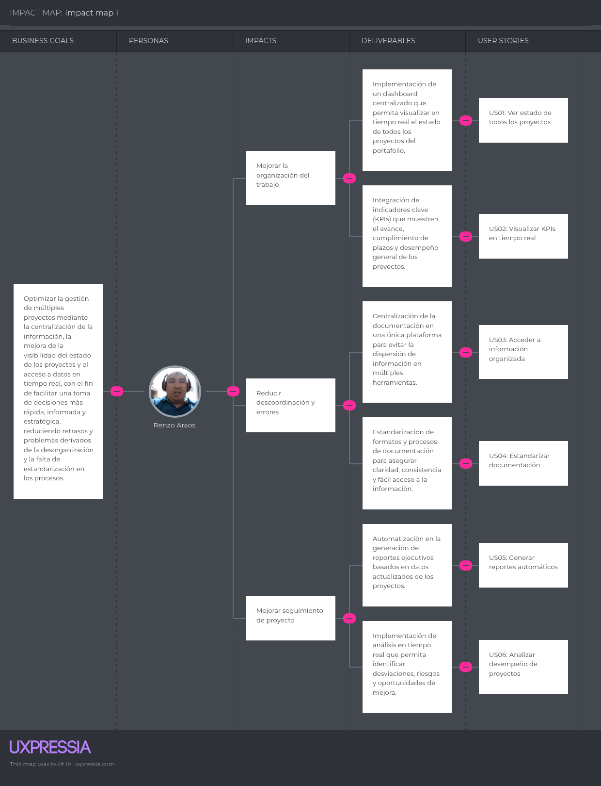
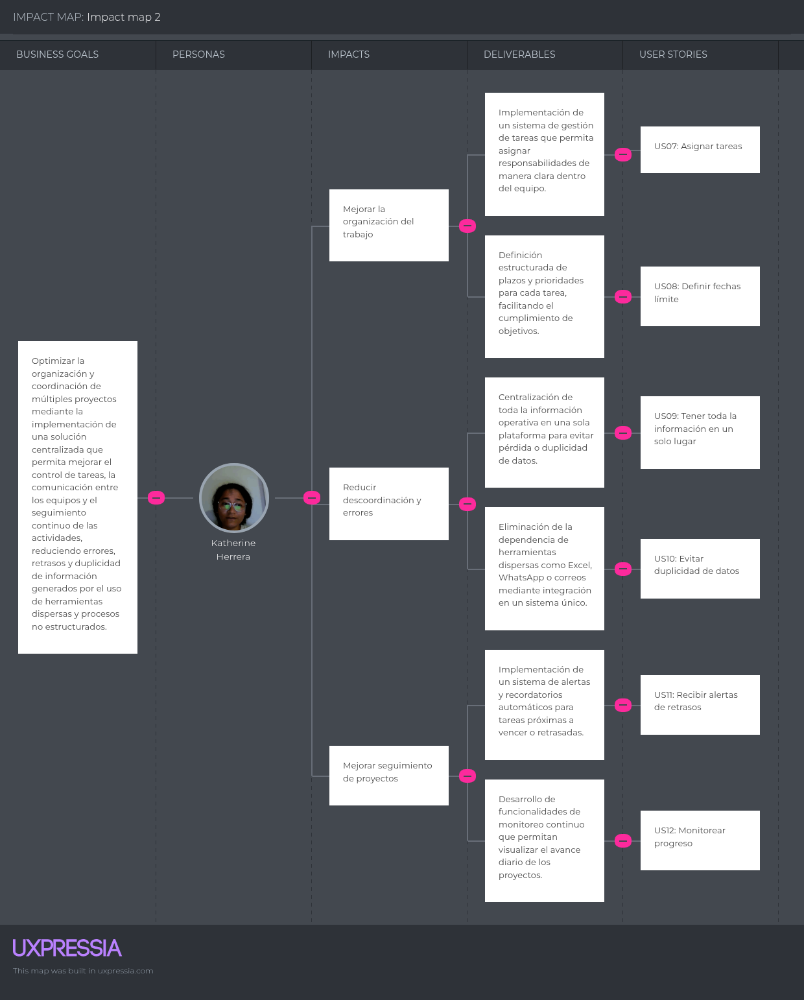

# Requirements Specification
## 3.1. User Stories
En esta sección se verán las historias de usuario que ayudarán en el desarrollo de la plataforma Vantage, enfocándonos en resolver la fragmentación de la información y mejorar el control estratégico.

## 1. Landing Page (Presentación y Conversión)
| ID | Título | Descripción | Criterios de Aceptación | Relacionado con |
| :--- | :--- | :--- | :--- | :--- |
| **US20** | Autenticación (Acceso) | **Como** usuario, **quiero** iniciar sesión **para** acceder a mis proyectos de forma segura. | **Dado que** el usuario ingresa credenciales, **cuando** son válidas, **entonces** se redirige al dashboard. | **EP07: User** |
| **US31** | Perfil de Empresa (Demo) | **Como** Emprendedor, **quiero** ver cómo se vería mi marca **para** convencerme de usar la plataforma. | **Dado que** el usuario está en la Landing, **cuando** ve la sección de personalización, **entonces** se muestra un preview. | **EP13: Custom** |
| **US02** | Visualización de Portafolio (Intro) | **Como** visitante, **quiero** entender cómo se listan los proyectos **para** saber si me sirve. | **Dado que** el usuario navega la landing, **cuando** llega a "Funciones", **entonces** ve un preview del portafolio. | **EP02: Portafolio** |
| **US37** | Notificaciones Push Landing | **Como** usuario, **quiero** aceptar notificaciones del navegador **para** recibir alertas de la plataforma. | **Dado que** el usuario entra al sitio, **cuando** aparece el prompt de permiso, **entonces** el sistema registra la suscripción. | **EP10: Alert** |
| **US37** | Notificaciones Push en la Landing | **Como** usuario, **quiero** aceptar notificaciones del navegador **para** recibir alertas de la plataforma. | **Dado que** el usuario entra al sitio, **cuando** aparece el prompt de permiso, **entonces** el sistema registra la suscripción. | **EP10: Alert** |

---

## 2. Web Application (Frontend Interactivo)
| ID | Título | Descripción | Criterios de Aceptación | Relacionado con |
| :--- | :--- | :--- | :--- | :--- |
| **US56** | Formulario Web | **Como** usuario, **quiero** llenar campos validados **para** no enviar errores al servidor. | **Dado que** el campo es obligatorio, **cuando** se deja vacío, **entonces** el botón "Guardar" se deshabilita. | **EP01: Project** |
| **US57** | UI Cards Proyectos | **Como** usuario, **quiero** ver tarjetas visuales **para** entender el portafolio de un vistazo. | **Dado que** se carga la página, **cuando** llegan los datos, **entonces** se renderizan componentes tipo Card. | **EP02: Portafolio** |
| **US33** | Tablero Kanban | **Como** usuario, **quiero** mover tareas entre columnas **para** gestionar mi flujo visualmente. | **Dado que** se arrastra una tarea, **cuando** se suelta en otra columna, **entonces** el estado cambia. | **EP03: Manager** |
| **US58** | Checkbox Click | **Como** usuario operativo, **quiero** marcar tareas con un clic **para** agilizar mi trabajo diario. | **Dado que** la tarea está pendiente, **cuando** se clickea, **entonces** la interfaz tacha el texto. | **EP03: Manager** |
| **US59** | Arrastrar y soltar (Subida de archivos) | **Como** usuario, **quiero** arrastrar archivos al navegador **para** subirlos de forma intuitiva. | **Dado que** el archivo está en el escritorio, **cuando** se suelta, **entonces** inicia la barra de progreso. | **EP04: Document** |
| **US61** | Barra de Progreso | **Como** Líder, **quiero** ver barras de progreso **para** medir el avance de los proyectos rápidamente. | **Dado que** la tarea es completada, **cuando** cambia el estado, **entonces** la barra aumenta. | **EP08: Dashboard** |
| **US62** | Chat/Comentarios UI | **Como** usuario, **quiero** ver el feed de comentarios **para** leer el historial de la conversación. | **Dado que** hay mensajes previos, **cuando** se abre la tarea, **entonces** se visualizan burbujas de texto. | **EP09: Status** |
| **US63** | Campanita Avisos | **Como** usuario, **quiero** un icono de notificaciones **para** ver alertas de vencimientos. | **Dado que** llega una alerta, **cuando** el usuario ve el header, **entonces** la campana muestra un punto rojo. | **EP10: Alert** |
| **US64** | Risk Table | **Como** Gerente, **quiero** una tabla con filas resaltadas **para** identificar los riesgos críticos. | **Dado que** el riesgo es crítico, **cuando** se renderiza la fila, **entonces** el fondo de la fila se pinta de rojo. | **EP12: Risk** |
| **US65** | Selector de Color | **Como** Emprendedor, **quiero** elegir mi color de marca **para** que el dashboard se adapte a mi empresa. | **Dado que** se abre configuración, **cuando** se elige un color, **entonces** los botones cambian de tono. | **EP13: Custom** |
| **US11** | Edición Visual | **Como** PM, **quiero** un botón de editar en cada proyecto **para** corregir datos desde la interfaz. | **Dado que** el usuario presiona "Editar", **cuando** guarda, **entonces** la UI se actualiza sin recargar. | **EP01: Project** |
| **US39** | Calendario Mensual | **Como** usuario, **quiero** ver un calendario interactivo **para** organizar mis fechas límite. | **Dado que** hay hitos registrados, **cuando** se abre el calendario, **entonces** aparecen eventos. | **EP06: Meeting** |
| **US60** | Login Minimalista | **Como** usuario, **quiero** una interfaz de login minimalista **para** reducir la fricción al entrar. | **Dado que** el usuario carga la URL, **cuando** no hay sesión, **entonces** ve un login centrado y limpio. | **EP07: User** |
| **US48** | Actualización de Estado UI | **Como** usuario, **quiero** actualizar el estado de una tarea con un solo clic **para** ser más eficiente. | **Dado que** el usuario está en la vista de lista, **cuando** hace clic en el estado, **entonces** se despliega el menú. | **EP03: Manager** |
| **US47** | UI Lista Proyectos | **Como** usuario, **quiero** una vista de lista compacta **para** ver más proyectos en una sola pantalla. | **Dado que** el usuario cambia la vista, **cuando** se activa "Lista", **entonces** las tarjetas se vuelven filas. | **EP02: Portafolio** |
| **US32** | Filtros Visuales | **Como** Líder, **quiero** botones de filtro rápido **para** ver proyectos por prioridad (Alta/Media/Baja). | **Dado que** hay proyectos, **cuando** se pulsa un filtro, **entonces** la vista se actualiza al instante. | **EP02: Portafolio** |

---

## 3. RESTful API (Backend & Lógica de Negocio)
| ID | Título | Descripción | Criterios de Aceptación| Relacionado con |
| :--- | :--- | :--- | :--- | :--- |
| **US41** | Auth JWT | **Como** Backend, **quiero** generar tokens JWT **para** asegurar todas las peticiones a la API. | **Dado que** el login es exitoso, **cuando** se responde, **entonces** se incluye un Bearer token válido. | **EP16: API** |
| **US42** | Swagger / Documentación | **Como** Frontend, **quiero** ver la documentación de la API **para** integrarme de forma autónoma. | **Dado que** el servidor corre, **cuando** se accede a /swagger, **entonces** se muestran los modelos. | **EP16: API** |
| **US43** | CRUD Proyectos API | **Como** Dev, **quiero** endpoints GET/POST/PUT/DELETE **para** la persistencia de proyectos. | **Dado que** se llama al endpoint, **cuando** el método es válido, **entonces** devuelve JSON 200/201. | **EP16: API** |
| **US44** | Paginación API | **Como** Frontend, **quiero** resultados paginados **para** optimizar el rendimiento. | **Dado que** hay registros, **cuando** se pide size=10, **entonces** se devuelve solo esa página. | **EP16: API** |
| **US45** | API de Subida de Archivos | **Como** Dev, **quiero** un endpoint multipart **para** subir archivos binarios a la nube. | **Dado que** se envía un binario, **cuando** se procesa, **entonces** devuelve una URL de acceso. | **EP16: API** |
| **US49** | Validador de Doc | **Como** motor de reglas, **quiero** verificar documentos **para** bloquear el cierre de hitos. | **Dado que** se evalúa el hito, **cuando** faltan documentos, **entonces** devuelve un error 400. | **EP04: Document** |
| **US51** | Cifrado de Contraseñas | **Como** seguridad, **quiero** cifrar contraseñas con BCrypt **para** proteger los datos. | **Dado que** se crea un usuario, **cuando** se guarda, **entonces** se almacena el hash del password. | **EP07: User** |
| **US52** | Cálculo de Salud | **Como** API, **quiero** calcular el % de retraso matemático **para** determinar el color de alerta. | **Dado que** se pide salud, **cuando** vencidas > 20%, **entonces** devuelve el estado "RED". | **EP08: Dashboard** |
| **US53** | Tarea Programada de Inactividad | **Como** proceso de fondo, **quiero** identificar proyectos estancados **para** disparar avisos. | **Dado que** es medianoche, **cuando** corre la tarea, **entonces** marca proyectos sin cambios. | **EP10: Alert** |
| **US54** | JSON a PDF | **Como** API, **quiero** estructurar un JSON de reporte **para** alimentar el motor de generación PDF. | **Dado que** se pide reporte, **cuando** se genera, **entonces** incluye datos agregados y costos. | **EP11: Report** |
| **US55** | Ordenamiento de Riesgos | **Como** servicio, **quiero** ordenar riesgos por impacto y probabilidad **para** el frontend. | **Dado que** se listan riesgos, **cuando** se aplica el sort, **entonces** los críticos aparecen primero. | **EP12: Risk** |
| **US50** | Limitación de Peticiones | **Como** Admin, **quiero** limitar peticiones por IP **para** evitar ataques DoS. | **Dado que** una IP supera el límite, **cuando** hace req, **entonces** devuelve status 429. | **EP16: API** |
| **US46** | Endpoint POST Proyecto | **Como** backend dev, **quiero** recibir datos de proyecto **para** validarlos y guardarlos en BD. | **Dado que** llega el JSON, **cuando** cumple el esquema, **entonces** se persiste en la base de datos SQL. | **EP01: Project** |
| **US38** | Exportación a Excel (API) | **Como** backend, **quiero** generar una descarga de Excel **para** que el usuario analice sus datos. | **Dado que** se solicita el archivo, **cuando** el sistema procesa los registros, **entonces** retorna un Blob de Excel. | **EP08: Dashboard** |

---

## 4. Requerimientos de Negocio Compartidos (Fullstack)
| ID | Título | Descripción | Criterios de Aceptación| Relacionado con |
| :--- | :--- | :--- | :--- | :--- |
| **US01** | Creación de Proyectos | **Como** PMO Lead, **quiero** crear proyectos asignando cliente y fechas **para** tener registro. | **Dado que** los datos son válidos, **cuando** se guarda, **entonces** aparece en el portafolio. | **EP01: Project** |
| **US03** | Estandarización | **Como** Líder, **quiero** usar plantillas predefinidas **para** asegurar el estándar. | **Dado que** se inicia un proyecto, **cuando** se elige plantilla, **entonces** se precargan tareas. | **EP02: Portafolio** |
| **US04** | Asignación de Tareas | **Como** Coordinadora, **quiero** asignar tareas a responsables **para** dar claridad. | **Dado que** se crea tarea, **cuando** se asigna usuario, **entonces** este recibe notificación. | **EP03: Manager** |
| **US05** | Adjuntar Documentos | **Como** miembro, **quiero** adjuntar archivos a tareas **para** centralizar la info. | **Dado que** se edita tarea, **cuando** se sube archivo, **entonces** queda disponible para descarga. | **EP11: Report** |
| **US06** | Comentarios | **Como** usuario, **quiero** dejar comentarios **para** mantener la comunicación fluida. | **Dado que** se visualiza tarea, **cuando** se envía mensaje, **entonces** se guarda con fecha y autor. | **EP09: Status** |
| **US07** | Salud del Portafolio | **Como** PMO Lead, **quiero** ver gráficos de salud **para** tomar decisiones preventivas. | **Dado que** hay retrasos, **cuando** se abre Dashboard, **entonces** el indicador cambia a Rojo. | **EP08: Dashboard** |
| **US08** | Reporte PDF | **Como** Gerente, **quiero** generar reportes PDF **para** presentarlos en reuniones. | **Dado que** se elige exportar, **cuando** procesa, **entonces** descarga el resumen ejecutivo. | **EP11: Report** |
| **US09** | Alerta Vencimiento | **Como** usuario, **quiero** alertas 24h antes del vencimiento **para** priorizar mi día. | **Dado que** faltan 24h, **cuando** corre el sistema, **entonces** el usuario recibe aviso. | **EP10: Alert** |
| **US10** | Alerta Inactividad | **Como** PMO Lead, **quiero** alertas si no hay cambios en 3 días **para** intervenir. | **Dado que** no hay logs en 72h, **cuando** valida, **entonces** marca alerta de estancamiento. | **EP10: Alert** |
| **US12** | Eliminación de Proyectos | **Como** PMO Lead, **quiero** eliminar proyectos innecesarios **para** organizar el sistema. | **Dado que** se confirma borrar, **cuando** se ejecuta, **entonces** desaparece de la vista activa. | **EP01: Project** |
| **US13** | Seguimiento Tareas | **Como** PM, **quiero** monitorear el estado de tareas **para** ver el avance del equipo. | **Dado que** se accede al panel, **cuando** se filtran tareas, **entonces** se muestra el % de progreso. | **EP03: Manager** |
| **US15** | Visualización Recursos | **Como** PMO Lead, **quiero** ver recursos disponibles **para** decidir nuevas asignaciones. | **Dado que** se entra al módulo, **cuando** se carga la lista, **entonces** muestra disponibilidad. | **EP05: Resource** |
| **US16** | Visualización KPIs | **Como** Stakeholder, **quiero** ver indicadores clave **para** evaluar el desempeño. | **Dado que** el dashboard está activo, **cuando** se consulta, **entonces** muestra tiempo y costo. | **EP08: Dashboard** |
| **US17** | Update Real Time | **Como** usuario, **quiero** que el dashboard se actualice solo **para** tener datos confiables. | **Dado que** hay cambio en BD, **cuando** ocurre, **entonces** la interfaz refleja el cambio. | **EP08: Dashboard** |
| **US18** | Reportes por Proyecto | **Como** PM, **quiero** reportes específicos **para** analizar rendimientos individuales. | **Dado que** se elige proyecto, **cuando** se solicita, **entonces** filtra solo sus datos. | **EP11: Report** |
| **US19** | Alerta Presupuesto | **Como** PMO Lead, **quiero** alertas de sobrecosto **para** tomar acciones correctivas. | **Dado que** gasto > presupuesto, **cuando** se registra costo, **entonces** dispara alerta. | **EP10: Alert** |
| **US22** | Validación en Hitos | **Como** PMO Lead, **quiero** validar documentos antes de hitos **para** asegurar calidad. | **Dado que** se intenta cerrar hito, **cuando** faltan docs, **entonces** bloquea el cambio. | **EP04: Document** |
| **US24** | Registro de Acuerdos | **Como** Líder, **quiero** registrar acuerdos específicos **para** asegurar seguimiento. | **Dado que** hay acta abierta, **cuando** se añade acuerdo, **entonces** genera entrada pendiente. | **EP06: Meeting** |
| **US26** | Update Estado Proyecto | **Como** usuario, **quiero** cambiar el estado del proyecto **para** reflejar avance real. | **Dado que** cambia fase, **cuando** se actualiza, **entonces** se guarda el log del cambio. | **EP09: Status** |
| **US27** | Historial de Estados | **Como** Stakeholder, **quiero** ver el historial de cambios **para** entender la evolución. | **Dado que** se consulta bitácora, **cuando** se despliega, **entonces** muestra autor y fecha. | **EP09: Status** |
| **US29** | Update de Riesgo | **Como** PM, **quiero** evolucionar el estado del riesgo **para** gestionarlo mejor. | **Dado que** se mitiga riesgo, **cuando** se actualiza, **entonces** disminuye el impacto en DB. | **EP12: Risk** |
| **US30** | Riesgos Críticos | **Como** Gerente, **quiero** visualizar riesgos críticos **para** priorizar acciones inmediatas. | **Dado que** severidad es alta, **cuando** se genera vista, **entonces** aparecen resaltados arriba. | **EP12: Risk** |
| **US34** | Roles y Permisos | **Como** Emprendedor, **quiero** asignar roles (Admin/Lector) **para** proteger mis datos. | **Dado que** se invita usuario, **cuando** se asigna rol, **entonces** se limitan sus acciones. | **EP07: User** |
| **US35** | Control Versiones Doc | **Como** Líder, **quiero** historial de archivos **para** no perder revisiones anteriores. | **Dado que** se sube duplicado, **cuando** se detecta, **entonces** crea nueva versión. | **EP04: Document** |
| **US36** | Registro de Gastos | **Como** Emprendedor, **quiero** anotar gastos de proyecto **para** ver rentabilidad real. | **Dado que** hay costo nuevo, **cuando** se registra, **entonces** se descuenta del presupuesto. | **EP10: Alert** |
| **US40** | Búsqueda Global | **Como** Líder, **quiero** buscar archivos por nombre **para** ahorrar tiempo localizando info. | **Dado que** se ingresa término, **cuando** se busca, **entonces** lista archivos de todo el sistema. | **EP04: Document** |
| **US14** | Asignación Recursos | **Como** PMO, **quiero** vincular miembros a proyectos **para** gestionar la carga. | **Dado que** se elige miembro, **cuando** se guarda, **entonces** API actualiza tabla intermedia. | **EP05: Resource** |
| **US23** | Actas de Reunión | **Como** PM, **quiero** registrar minutas de reuniones **para** trazabilidad. | **Dado que** finaliza sesión, **cuando** se guardan notas, **entonces** se vinculan al proyecto. | **EP06: Meeting** |
| **US25** | Acuerdos a Tareas | **Como** PM, **quiero** transformar acuerdo en tarea **para** asegurar ejecución. | **Dado que** existe acuerdo, **cuando** se pulsa "Convertir", **entonces** crea tarea automática. | **EP06: Meeting** |
| **US28** | Registro de Riesgos | **Como** PMO, **quiero** documentar riesgos potenciales **para** mitigarlos a tiempo. | **Dado que** se detecta amenaza, **cuando** se registra, **entonces** sistema calcula severidad. | **EP12: Risk** |
| **US21** | Documentos Oblig | **Como** PMO, **quiero** marcar qué archivos son indispensables **para** estandarizar. | **Dado que** se define proyecto, **cuando** se marca "Requerido", **entonces** bloquea hitos si falta. | **EP04: Document** |
---

### 3.2. Impact Mapping

El Impact Mapping es una herramienta que nos permitió estructurar y visualizar de manera clara la relación entre los objetivos del proyecto, los actores involucrados y las funcionalidades propuestas en la solución. A partir de la información recopilada en las entrevistas y el análisis de necesidades, se identificaron los principales problemas que enfrentan los usuarios.

## IMPACT MAPPING 1

## IMPACT MAPPING 2

### 3.3. Product Backlog

| # Orden | User Story Id | Título | Descripción | Story Points (1/2/3/5/8) |
| :--- | :--- | :--- | :--- | :--- |
| **1** | **US02** | Visualización de Portafolio (Landing) | **Como** visitante, **quiero** entender cómo se listan los proyectos **para** conocer la propuesta de valor. | 3 |
| **2** | **US31** | Perfil de Empresa (Landing) | **Como** Emprendedor, **quiero** ver un preview de personalización de marca **para** decidir el uso de la plataforma. | 5 |
| **3** | **US56** | Formulario de Nuevo Proyecto | **Como** usuario, **quiero** un formulario web con validaciones básicas **para** registrar mis proyectos iniciales. | 3 |
| **4** | **US57** | Interfaz de Tarjetas (Cards) | **Como** usuario, **quiero** visualizar mis proyectos en tarjetas dinámicas **para** una navegación intuitiva. | 2 |
| **5** | **US43** | Endpoint CRUD Proyectos | **Como** desarrollador, **quiero** una API para crear y listar proyectos **para** conectar el frontend con la base de datos. | 5 |
| **6** | **US01** | Registro de Cliente y Fechas | **Como** PMO Lead, **quiero** asignar datos maestros a cada proyecto **para** mantener el orden administrativo. | 2 |
| **7** | **US04** | Asignación de Responsables | **Como** Coordinadora, **quiero** asignar miembros a tareas **para** delegar responsabilidades. | 3 |
| **8** | **US14** | Vinculación de Recursos | **Como** PMO, **quiero** gestionar la carga laboral de los miembros **para** optimizar el equipo. | 5 |
| **9** | **US33** | Tablero Kanban Visual | **Como** usuario, **quiero** un tablero interactivo **para** gestionar el flujo de trabajo mediante drag-and-drop. | 8 |
| **10** | **US58** | Checkbox de Tareas | **Como** usuario, **quiero** marcar tareas completadas con un clic **para** actualizar el progreso diario. | 1 |
| **11** | **US26** | Actualización de Estado | **Como** usuario, **quiero** cambiar la fase del proyecto **para** reflejar el avance real ante los stakeholders. | 2 |
| **12** | **US61** | Barra de Progreso Visual | **Como** Líder, **quiero** ver indicadores gráficos de avance **para** monitorear el rendimiento sin leer tablas. | 3 |
| **13** | **US05** | Adjuntar Documentación | **Como** miembro, **quiero** subir archivos a mis tareas **para** centralizar las evidencias del proyecto. | 5 |
| **14** | **US59** | Carga Arrastrar y soltar | **Como** usuario, **quiero** arrastrar archivos a la interfaz **para** agilizar la subida de documentos. | 3 |
| **15** | **US45** | API de Almacenamiento | **Como** desarrollador, **quiero** un servicio de subida de archivos binarios **para** persistirlos en la nube. | 5 |
| **16** | **US21** | Definición de Obligatorios | **Como** PMO, **quiero** marcar documentos como requeridos **para** estandarizar los procesos de entrega. | 3 |
| **17** | **US49** | Validación Logística de Hitos | **Como** motor de reglas, **quiero** bloquear el cierre de hitos si faltan documentos **para** asegurar la calidad. | 5 |
| **18** | **US28** | Registro de Riesgos | **Como** PMO, **quiero** documentar amenazas potenciales **para** anticipar planes de mitigación. | 3 |
| **19** | **US64** | Visualización de Riesgos Críticos | **Como** Gerente, **quiero** una tabla resaltada con riesgos de alto impacto **para** priorizar mi atención. | 2 |
| **20** | **US55** | Ordenamiento de Riesgos | **Como** servicio, **quiero** clasificar los riesgos por severidad **para** facilitar el análisis de datos. | 3 |
| **21** | **US23** | Registro de Actas de Reunión | **Como** PM, **quiero** guardar minutas de sesiones **para** mantener la trazabilidad de los acuerdos. | 3 |
| **22** | **US25** | Conversión de Acuerdos a Tareas | **Como** PM, **quiero** crear tareas automáticamente desde actas **para** asegurar la ejecución de compromisos. | 5 |
| **23** | **US39** | Calendario de Hitos | **Como** usuario, **quiero** una vista de calendario global **para** evitar cruces de fechas entre proyectos. | 8 |
| **24** | **US06** | Comentarios en Tiempo Real | **Como** usuario, **quiero** dejar feedback en las tareas **para** mejorar la colaboración del equipo. | 5 |
| **25** | **US62** | Interfaz de Historial de Chat | **Como** usuario, **quiero** ver burbujas de texto cronológicas **para** entender el contexto de una tarea. | 3 |
| **26** | **US07** | Indicadores de Salud (Dashboard) | **Como** PMO Lead, **quiero** ver semáforos de salud del portafolio **para** identificar proyectos en crisis. | 5 |
| **27** | **US52** | Cálculo Matemático de Salud | **Como** API, **quiero** procesar el % de tareas vencidas **para** determinar el color del indicador. | 3 |
| **28** | **US08** | Generación de Reporte PDF | **Como** Gerente, **quiero** descargar un resumen ejecutivo en PDF **para** mis reuniones de directorio. | 8 |
| **29** | **US54** | Estructuración de Datos para Reporte | **Como** API, **quiero** consolidar información en JSON **para** alimentar el motor de reportes. | 5 |
| **30** | **US09** | Alerta de Vencimiento Próximo | **Como** usuario, **quiero** notificaciones 24h antes del límite **para** organizar mis prioridades. | 3 |
| **31** | **US63** | Icono de Notificaciones (UI) | **Como** usuario, **quiero** un indicador visual de alertas nuevas **para** no perder actualizaciones críticas. | 2 |
| **32** | **US10** | Alerta de Inactividad (72h) | **Como** PMO Lead, **quiero** saber si un proyecto se ha estancado **para** intervenir oportunamente. | 5 |
| **33** | **US53** | Job Programado de Inactividad | **Como** proceso de fondo, **quiero** escanear proyectos sin cambios **para** disparar alertas automáticas. | 3 |
| **34** | **US19** | Notificación de Presupuesto | **Como** PMO, **quiero** alertas de sobrecosto **para** mantener la rentabilidad del proyecto. | 3 |
| **35** | **US36** | Registro de Gastos Operativos | **Como** Emprendedor, **quiero** anotar egresos **para** comparar el gasto real vs el presupuesto. | 3 |
| **36** | **US65** | Selector de Colores (Customización) | **Como** Emprendedor, **quiero** elegir mi paleta de marca **para** personalizar mi entorno de trabajo. | 5 |
| **37** | **US20** | Inicio de Sesión (Login) | **Como** usuario, **quiero** autenticarme con mis credenciales **para** proteger mi información. | 3 |
| **38** | **US41** | Generación de Tokens JWT | **Como** Backend, **quiero** emitir tokens de sesión **para** asegurar que cada petición sea autorizada. | 5 |
| **39** | **US51** | Cifrado de Contraseñas | **Como** seguridad, **quiero** usar hashes (BCrypt) **para** evitar el almacenamiento de claves en texto plano. | 3 |
| **40** | **US34** | Gestión de Roles (RBAC) | **Como** Emprendedor, **quiero** asignar permisos de Admin o Lector **para** controlar el acceso a datos sensibles. | 8 |
| **41** | **US42** | Documentación Swagger | **Como** desarrollador frontend, **quiero** una interfaz de la API **para** realizar pruebas de integración de forma autónoma. | 2 |
| **42** | **US44** | Paginación de Listados | **Como** frontend, **quiero** recibir datos por bloques **para** mejorar la velocidad de carga en portafolios grandes. | 3 |
| **43** | **US50** | Rate Limiting | **Como** administrador, **quiero** limitar las peticiones por minuto **para** proteger la API de ataques de denegación de servicio. | 5 |
| **44** | **US35** | Control de Versiones Documental | **Como** Líder, **quiero** mantener el histórico de archivos **para** recuperar versiones anteriores en caso de error. | 8 |
| **45** | **US40** | Búsqueda Global de Archivos | **Como** usuario, **quiero** buscar por nombre en todos los proyectos **para** ahorrar tiempo localizando recursos. | 5 |
| **46** | **US32** | Filtros Avanzados de Portafolio | **Como** Líder, **quiero** segmentar por cliente y prioridad **para** obtener vistas personalizadas del negocio. | 3 |
| **47** | **US38** | Exportación a Excel | **Como** usuario, **quiero** descargar mis tareas en .xlsx **para** realizar análisis financieros externos. | 5 |
| **48** | **US11** | Edición de Proyectos | **Como** PM, **quiero** modificar descripciones y fechas **para** corregir errores de registro. | 2 |
| **49** | **US12** | Eliminación Lógica (Soft Delete) | **Como** PMO Lead, **quiero** desactivar proyectos **para** limpiar la vista sin perder la data histórica. | 3 |
| **50** | **US37** | Notificaciones Push de Navegador | **Como** usuario, **quiero** alertas de escritorio **para** enterarme de cambios urgentes sin estar en la pestaña. | 5 |
| **51** | **US13** | Seguimiento de Tareas Críticas | **Como** PM, **quiero** visualizar hitos en riesgo **para** priorizar el seguimiento diario. | 3 |
| **52** | **US15** | Panel de Disponibilidad | **Como** PMO, **quiero** ver quién tiene menos carga de trabajo **para** equilibrar las asignaciones. | 5 |
| **53** | **US16** | Visualización de KPIs de Desempeño | **Como** Stakeholder, **quiero** ver métricas de eficiencia **para** evaluar el éxito de los proyectos. | 5 |
| **54** | **US17** | Sincronización en Tiempo Real | **Como** usuario, **quiero** ver cambios de otros miembros al instante **para** evitar duplicidad de esfuerzos. | 8 |
| **55** | **US18** | Reportes de Rendimiento Individual | **Como** Líder, **quiero** ver el desempeño por recurso **para** dar feedback basado en datos. | 5 |
| **56** | **US22** | Validación de Documentos en Cierre | **Como** PMO, **quiero** una lista de chequeo final **para** asegurar que no falte nada al terminar un proyecto. | 3 |
| **57** | **US24** | Registro de Acuerdos Estratégicos | **Como** Líder, **quiero** resaltar decisiones clave en las actas **para** referencia futura. | 2 |
| **58** | **US27** | Bitácora de Cambios de Estado | **Como** Stakeholder, **quiero** ver quién cambió la fase del proyecto **para** mantener la transparencia. | 3 |
| **59** | **US29** | Evolución del Riesgo | **Como** PM, **quiero** actualizar la probabilidad de un riesgo **para** reflejar la mitigación actual. | 3 |
| **60** | **US30** | Dashboard de Riesgos para Gerencia | **Como** Gerente, **quiero** ver el valor monetario en riesgo **para** entender el impacto financiero global. | 5 |
| **61** | **US46** | Endpoint POST de Creación | **Como** backend, **quiero** recibir el JSON de proyecto **para** validarlo y guardarlo en la base de datos SQL. | 3 |
| **62** | **US47** | Endpoint GET de Portafolio | **Como** backend, **quiero** una consulta optimizada **para** devolver la lista de proyectos activos con sus KPIs básicos. | 3 |
| **63** | **US48** | Endpoint PATCH de Estado | **Como** backend, **quiero** un servicio que actualice campos parciales **para** no sobreescribir toda la entidad. | 2 |
| **64** | **US60** | Interfaz de Inicio de Sesión Limpia | **Como** usuario, **quiero** un login minimalista con mensajes de error claros **para** acceder sin fricciones. | 2 |
| **65** | **US50** | Configuración de Límites de API | **Como** admin, **quiero** ajustar los parámetros de seguridad **para** escalar el sistema según el tráfico. | 5 |

---