# Product Implementation, Validation & Deployment

## 5.1. Software Configuration Management
<a id="5-1-software-configuration-management"></a>

### 5.1.1. Software Development Environment Configuration
<a id="5-1-1-software-development-environment-configuration"></a>

A continuación, se listan las herramientas y estándares adoptados por el equipo para el desarrollo colaborativo del sistema:

| Actividad               | Herramienta / Guía | Propósito                                                                    | Tipo de acceso / Ruta     |
| ----------------------- | --------------------------------------------------------------------------------------------------------------------------------------------------------------------------------- | ----------------------------------------------------------------------------- | ------------------------------------------------------------------------------------------------------------------------------------------------------------------------------------------------------------------- |
| Project Management      | Trello Software   | Seguimiento de backlog, tareas y sprints.                                     | SaaS –[https://trello.com/](https://trello.com/software/jira)          |
| Requirements Management | Gherkin Conventions   | Escritura legible de requisitos con formato Given/When/Then.                  | [https://cucumber.io/docs/gherkin/](https://cucumber.io/docs/gherkin/)          |
| Product UX/UI Design    | Figma   | Prototipos y diseño responsive.                                              | SaaS –[https://figma.com](https://figma.com)     |
| Landing Page             | HTML, CSS, JavaScript, Vue     | Construcción de la interfaz web.                                             | [https://vuejs.org/guide/introduction.html](https://vuejs.org/guide/introduction.html)       |
| User Personas, Empathy Journey Mapping, Impact Mapping   | UXPressia                | Es una herramienta en línea para el mapeo de la trayectoria del cliente que crea mapas de impacto y personas.    | [https://uxpressia.com/](https://uxpressia.com/)        |
| Class Diagram and Database Diagram  | LucidChart | Organización y modelado de las tablas y entidades del proyecto.         | [https://www.lucidchart.com/](https://www.lucidchart.com/)                                                                            |
| Code Standards          | Google HTML/CSS Style Guide, Vue Style Guide, MDN Guidelines, W3C JavaScript Style Guide, Google JavaScript Style Guide, C# Coding Conventions, Microsoft ASP.NET Core Guidelines | Aplicación de buenas prácticas de desarrollo en frontend y backend.         | [https://developer.mozilla.org/](https://developer.mozilla.org/) / [https://learn.microsoft.com/en-us/dotnet/csharp/fundamentals/coding-style](https://learn.microsoft.com/en-us/dotnet/csharp/fundamentals/coding-style) |
| Version Control         | Git + GitHub     | Control de versiones y trabajo colaborativo.                                  | SaaS –[https://github.com](https://github.com)  |
| Software Deployment     | Github pages   | Despliegue continuo de la aplicación para ambientes de prueba y validación. | SaaS –[https://railway.app](https://railway.app) / [https://render.com](https://render.com)  |
| Upgrade of Branches and Commits | Visual Studio Code | Optimización y documentación del proyecto asimismo el trabajo colaborativo. |[https://code.visualstudio.com/](https://code.visualstudio.com/)  |
| EventStorming | Miro | Herramienta colaborativa grupal que permitio diseñar mejor algunos puntos del trabajo. |[https://miro.com/es/](https://miro.com/es/)  |

<div style="text-align: left; max-width: 900px; margin: 0 auto;">

### 5.1.2. Source Code Management
<a id="5-1-2-source-code-management"></a>

Para la gestión del código del proyecto, el equipo adoptó una estrategia simplificada en lugar de implementar completamente el modelo Git Flow. Se trabajó principalmente sobre una rama principal (main), la cual contiene la versión estable y actual del sistema en desarrollo. 

Adicionalmente, se crearon algunas ramas específicas organizadas por capítulos del proyecto. Estas ramas permitieron desarrollar avances de manera más ordenada antes de integrarlos a la rama principal, sin llegar a una estructura compleja de múltiples ramas por funcionalidades o versiones. 

Todas las funcionalidades y mejoras fueron finalmente integradas en la rama main, asegurando que esta siempre represente el estado más actualizado del proyecto. Este enfoque, aunque más sencillo que Git Flow, resultó adecuado para el alcance del trabajo, ya que facilitó el control del progreso sin generar una sobrecarga en la gestión de ramas.

 Por otro lado, se utilizó GitHub como repositorio central del proyecto, aprovechando también herramientas como GitHub Pages para la visualización del Landing Page. Esto permitió desplegar rápidamente los avances en formato web y contar con una versión accesible del sistema de manera ágil y eficiente.

---

**Landing Page — GitHub Pages**

Enlace de despliegue: 


**Landing Page — Repositorio GitHub**

Enlace del repositorio: https://github.com/BL-Aplicaciones-Web-1ASI0730-2610-12158/Vantage-PMO-Business-Web-Page


### Versionado Semántico

Se aplicará el esquema de **Semantic Versioning 2.0.0**, con el siguiente formato:

- **MAJOR**: Incompatibilidades en la API.
- **MINOR**: Nuevas funcionalidades sin romper compatibilidad.
- **PATCH**: Correcciones de errores menores y ajustes sin afectar funcionalidades.

_Ejemplo de versión:_ `v1.3.4`

### Convenciones de Commits

Se adoptará el estándar de **Conventional Commits** para la redacción de los mensajes de commit, lo cual permitirá estructurar mejor los cambios realizados. Este enfoque facilita la automatización de procesos como la integración continua y la generación de historiales de cambios (changelogs).

**Ejemplos:**

- `feat: add project creation form`
- `fix: resolve error in task assignment module`
- `docs: update user stories and diagrams`
- `chore: update dependencies`
### 5.1.3. Source Code Style Guide & Conventions
<a id="5-1-3-source-code-style-guide-conventions"></a>

El código desarrollado por los miembros del equipo esté completamente redactado en inglés.

## **HTML**

* **Use Lowercase Element Names**: Se recomienda utilizar minúsculas para todos los elementos HTML.
```html
<section class="hero">
<h1>Centralize your projects</h1>
</section>

**Close All HTML Elements**: Todos los elementos deben cerrarse correctamente para evitar errores de renderizado.
```html
<p>Centralize your projects, control your future.</p>

<a href="#Contact">Solicitar demo</a>
```

**Use Lowercase Attribute Names**: Los atributos deben escribirse en minúsculas.

```html
<input type="email" placeholder="tu@correo.com" id="fe"/>
```
**Use Semantic HTML Elements**: Se deben utilizar etiquetas semánticas para mejorar la estructura y accesibilidad.

```html
<nav>...</nav>
<section id="funciones">...</section>
<footer>...</footer>
```

**Use Descriptive IDs and Classes**: Los nombres deben ser claros y representar su función.
```html
<section id="contact">
  <div class="contact-form">
```
## **CSS**

**Use Kebab-Case for Class Names**: Las clases deben escribirse en minúsculas separadas por guiones.
```css
.contact-form {
  display: flex;
}
```
**Use CSS Variables for Colors**: Se deben definir colores reutilizables en :root.
```css
:root {
  --blue: #1E40AF;
  --navy: #0F172A;
}
```
**Group Styles by Sections**: El código CSS debe organizarse por secciones del sitio.
```css
/* NAV */
nav { ... }
/* HERO */
.hero { ... }
/* FOOTER */
footer { ... }
```
**Use Consistent Spacing**: Se debe mantener consistencia en márgenes, padding y alineación.
```css
.section {
  padding: 6rem 2rem;
}
```
**Responsive Design with Media Queries**: Se deben usar breakpoints para adaptar la interfaz.
```css
@media (max-width: 600px) {
  .hero {
    padding: 4rem 1rem;
  }
}
```
## **JavaScript**

**Use CamelCase for Variables and Functions**: Las variables y funciones deben usar camelCase.
```js
function sendForm() {
  const userName = document.getElementById('fn').value;
}
```
**Keep Functions Simple and Clear**: Las funciones deben ser cortas y fáciles de entender.
```js
if (!n || !e) {
  alert('Por favor completa tu nombre y correo.');
  return;
}
```

**Use Meaningful Variable Names**: Los nombres deben representar su propósito.
```js
const navLinks = document.getElementById('navLinks');
const hamburger = document.getElementById('hamburger');
```
**Avoid Inline JavaScript**: Se recomienda mantener la lógica separada del HTML.
```js
< button onclick="sendForm()">Enviar</ button>
```
### 5.1.4. Software Deployment Configuration

<a id="5-1-4-software-deployment-configuration"></a>

Para la Landing Page desarrollada en HTML, CSS y JavaScript, la configuración del despliegue en GitHub Pages se define de la siguiente manera:

Repositorio de Código Fuente

Se debe crear un repositorio en GitHub y subir todos los archivos del proyecto (HTML, CSS, JS). Es obligatorio que el archivo index.html esté ubicado en la raíz del repositorio para poder realizar el despliegue correctamente.


## 5.2. Landing Page, Services & Applications Implementation.
<a id="5-2-landing-page-services-applications-implementation"></a>
### 5.2.1. Sprint 1
<a id="5-2-1-sprint-1"></a>
##### 5.2.1.1. Sprint Planning 1
<a id="5-2-1-1-sprint-planning-1"></a>
En esta sección, se presentará la planificación de nuestro Sprint 1.

| **Sprint #** |                 **Sprint 1**              |
|--------------|-------------------------------------------|
|**Sprint Planning Background**                            |
| Date         | 2026/04/15                                |
| Time         | 16:00 pm                                  |
| Location     | Reunión virtual mediante discord          |
| Prepared By  | Esquicha Alcántara, Diego Alonso          |
| Attendees    |Rocha Cotrina, Alvaro / Esquicha Alcántara, Diego Alonso / Quispe llacsahuanga, César Agusto / Guillen Giraldo, Mike Dylan / Teran Zavala, Mauricio Alejandro|
| Sprint n-1 Review Summary |  No aplica                   |
| Sprint n-1 Retrospective Summary |  No aplica            |
| **Sprint Goal & User Stories**                           |
|**Sprint 1**  |Nos enfocamos en implementar la estructura principal y las funcionalidades clave de la plataforma de presentación y acceso de Vantage PMO. Creemos que esto aportará una percepción más sólida del producto y despertará un mayor interés entre los líderes de proyectos y empresarios corporativos, al comunicar de forma clara el valor de la gestión centralizada y la gobernanza de portafolios. Esto se confirmará cuando los usuarios potenciales puedan navegar de manera fluida por la interfaz inicial, comprendan fácilmente cómo la solución optimiza la supervisión de múltiples proyectos y muestren una clara intención de interactuar con el sistema o gestionar sus credenciales de acceso.|
| Sprint 1 Velocity   | 18  Story Points                   |
| Sum of Story Points | 18  Story Points                   |

##### 5.2.1.2. Aspect Leaders and Collaborators
<a id="5-2-1-2-aspect-leaders-and-collaborators"></a>
En el marco del Sprint 1, se han priorizado los componentes fundamentales del sistema, centrando los esfuerzos en la entrega de funcionalidades críticas: la visualización de información estratégica, una arquitectura de navegación intuitiva, el diseño responsivo de la interfaz y el flujo de seguridad para la autenticación de usuarios.

A fin de garantizar la trazabilidad y una ejecución coordinada, se ha implementado la Matriz de Liderazgo y Colaboración (LACX). En esta herramienta de gestión, se han designado responsables de liderazgo (L) y equipos de apoyo (C) para cada área técnica, optimizando así la sinergia y la calidad de los entregables

| Team Member (Last Name, First Name) | GitHub Username    | Hero | Pillars | Platform  | Features | Ai | About | Onboarding | Testimonials | Blog
| :---------------------------------- | :----------------- | :--------------------- | :------- | :------- | :----------- | :------------------- | :---------------- | :---------------- | :---------------- | :------------------
| Rocha Cotrina, Alvaro | alvarorc24     | L                      | C        | C        | C            | L                   | C | C   | C| C
| Esquicha Alcántara, Diego Alonso    | DiegoEsquich          | C                      | L        | C        | C            | C                   | L   | C| C| C
| Quispe llacsahuanga, César Agusto | user20-bit        | C                      | C        | L        | C            |    C   | C| L| C| C                  |
| Guillen Giraldo, Mike Dylan       | FulLHous          | C                      | C        | C        | L            | C                    |C| C| L| C  
| Teran Zavala, Mauricio Alejandro    | mau-tz | C                      | C        | C        | C            | L                    |C| C| C| L

##### 5.2.1.3. Sprint Backlog 1
<a id="5-2-1-3-sprint-backlog-1"></a>

El objetivo principal de este sprint consiste en establecer el núcleo funcional y de confianza de la plataforma Vantage PMO, transformando la Landing Page de un sitio informativo en una herramienta interactiva, segura y profesional. Para lograrlo, el equipo se enfocará en consolidar un sistema de autenticación robusto que no solo gestione el acceso, sino que cumpla estrictamente con los estándares legales de privacidad e internacionalización (i18n), eliminando barreras de entrada para mercados globales. Asimismo, se busca potenciar el compromiso del usuario mediante la implementación de un simulador de marca interactivo y un dashboard de portafolio dinámico, desarrollados bajo principios avanzados de UX y Branding para tangibilizar el valor del producto a través de recursos multimedia y micro-interacciones. Finalmente, se garantizará una experiencia de navegación omnicanal y de alto rendimiento mediante un diseño responsivo impecable y la integración de un sistema de notificaciones push, asegurando una comunicación persistente y una transición fluida hacia el ecosistema interno de gestión de proyectos.

**Screenshot del Board**


*Trello:* https://trello.com/b/9yf99IHI/vantage-pmo-sprint-backlog

<table border="1" cellspacing="0" cellpadding="5">
  <tr>
    <th>Sprint #</th>
    <th>Sprint 01</th>
    <th colspan="7"></th>
  </tr>
  <tr>
    <th colspan="2">User Story</th>
    <th colspan="2">Work-item / Task</th>
    <th colspan="5"></th>
  </tr>
  <tr>
    <th>Id</th>
    <th>Title</th>
    <th>Id</th>
    <th>Title</th>
    <th>Description</th>
    <th>Estimation (hours)</th>
    <th>Assigned To</th>
    <th>Status</th>
  </tr>

  <!-- US-020 -->
  <tr>
    <td>US-020</td>
    <td>Autenticación</td>
    <td>T001</td>
    <td>Formulario de inicio de sesión</td>
    <td>Permite iniciar sesión mediante un formulario con validación de credenciales y estados de carga/error.</td>
    <td>2h</td>
    <td>Alvaro Rocha</td>
    <td>Done</td>
  </tr>
  <tr>
    <td></td><td></td>
    <td>T002</td>
    <td>Integración con proveedor de autenticación</td>
    <td>Permite la conexión con el proveedor de Auth (Firebase/Auth0/JWT) e implementa la redirección segura.</td>
    <td>2h</td>
    <td>Diego Esquicha</td>
    <td>Done</td>
  </tr>
  <tr>
    <td></td><td></td>
    <td>T003</td>
    <td>Protección de rutas del dashboard</td>
    <td>Permite proteger las rutas del dashboard mediante middleware, redirigiendo usuarios no autorizados.</td>
    <td>1.5h</td>
    <td>Diego Esquicha</td>
    <td>Done</td>
  </tr>
  <tr>
    <td></td><td></td>
    <td>T004</td>
    <td>Soporte multi-idioma (i18n)</td>
    <td>Permite la localización (i18n) de etiquetas y mensajes de error para una experiencia multi-idioma.</td>
    <td>1h</td>
    <td>Dylan Guillen</td>
    <td>Done</td>
  </tr>
  <tr>
    <td></td><td></td>
    <td>T005</td>
    <td>Integración de privacidad y consentimiento</td>
    <td>Permite cumplir con el soporte legal integrando vínculos de privacidad y consentimiento en el acceso.</td>
    <td>1h</td>
    <td>Dylan Guillen</td>
    <td>Done</td>
  </tr>

  <!-- US-031 -->
  <tr>
    <td>US-031</td>
    <td>Perfil de Empresa</td>
    <td>T001</td>
    <td>Preview interactivo de marca</td>
    <td>Permite previsualizar en tiempo real el nombre y colores de la marca en un widget interactivo de demo.</td>
    <td>2.5h</td>
    <td>Alvaro Rocha</td>
    <td>Done</td>
  </tr>
  <tr>
    <td></td><td></td>
    <td>T002</td>
    <td>Carga local de logos</td>
    <td>Permite cargar y visualizar logos localmente para la demostración sin requerir persistencia en base de datos.</td>
    <td>1.5h</td>
    <td>Mauricio Teran</td>
    <td>Done</td>
  </tr>
  <tr>
    <td></td><td></td>
    <td>T003</td>
    <td>Mejoras UX y micro-interacciones</td>
    <td>Permite mejorar el UX y Branding mediante micro-interacciones y transiciones fluidas en el simulador.</td>
    <td>1h</td>
    <td>Dylan Guillen</td>
    <td>Done</td>
  </tr>
  <tr>
    <td></td><td></td>
    <td>T004</td>
    <td>Optimización de recursos multimedia</td>
    <td>Permite optimizar el rendimiento multimedia mediante la compresión y carga eficiente de activos visuales.</td>
    <td>1.5h</td>
    <td>Alvaro Rocha</td>
    <td>Done</td>
  </tr>

  <!-- US-002 -->
  <tr>
    <td>US-002</td>
    <td>Visión de Portafolio</td>
    <td>T001</td>
    <td>Galería de funciones con progreso</td>
    <td>Permite visualizar la galería de funciones con estados de proyectos y barras de progreso dinámicas.</td>
    <td>2h</td>
    <td>Mauricio Teran</td>
    <td>Done</td>
  </tr>
  <tr>
    <td></td><td></td>
    <td>T002</td>
    <td>Animaciones de scroll</td>
    <td>Permite una navegación visual atractiva mediante animaciones de scroll para revelar las funciones clave.</td>
    <td>1h</td>
    <td>Alvaro Rocha</td>
    <td>Done</td>
  </tr>
  <tr>
    <td></td><td></td>
    <td>T003</td>
    <td>Diseño responsive</td>
    <td>Permite una navegación fluida en cualquier dispositivo gracias al diseño responsive optimizado para móvil y tablet.</td>
    <td>2h</td>
    <td>Cesar Quispe</td>
    <td>Done</td>
  </tr>

  <!-- US-037 -->
  <tr>
    <td>US-037</td>
    <td>Notificaciones Push</td>
    <td>T001</td>
    <td>Configuración de Service Workers</td>
    <td>Permite la suscripción a alertas mediante la configuración de Service Workers y sincronización en segundo plano.</td>
    <td>2h</td>
    <td>Dylan Guillen</td>
    <td>Done</td>
  </tr>
  <tr>
    <td></td><td></td>
    <td>T002</td>
    <td>Gestión de consentimiento</td>
    <td>Permite gestionar el consentimiento del usuario mediante un modal de "soft-prompt" con propuesta de valor.</td>
    <td>1h</td>
    <td>Cesar Quispe</td>
    <td>Done</td>
  </tr>
  <tr>
    <td></td><td></td>
    <td>T003</td>
    <td>Almacenamiento de tokens</td>
    <td>Permite el almacenamiento seguro de los tokens de suscripción en el backend para el envío de notificaciones.</td>
    <td>1.5h</td>
    <td>Cesar Quispe</td>
    <td>Done</td>
  </tr>
  <tr>
    <td></td><td></td>
    <td>T004</td>
    <td>Cumplimiento legal de notificaciones</td>
    <td>Permite garantizar el cumplimiento legal y la gestión de privacidad en el sistema de alertas del sitio.</td>
    <td>1h</td>
    <td>Dylan Guillen</td>
    <td>Done</td>
  </tr>
</table>

##### 5.2.1.4. Development Evidence for Sprint Review
<a id="5-2-1-4-development-evidence-for-sprint-review"></a>

En esta sección se presentan los avances obtenidos durante la fase de implementación, considerando los productos definidos dentro del alcance del Sprint. En este caso, se analizará específicamente el Sprint Backlog 01, el cual está enfocado exclusivamente en el desarrollo de la Landing Page.

Se describen las funcionalidades implementadas y el progreso alcanzado en relación con los requerimientos establecidos para este sprint. Asimismo, se incluye una tabla que detalla la información correspondiente a los repositorios utilizados, donde se evidencian los commits realizados como parte del desarrollo, permitiendo así un seguimiento claro de los cambios y aportes efectuados durante el proceso.

<table border="1" cellspacing="0" cellpadding="5">
  <tr>
    <th>Repository</th>
    <th>Branch</th>
    <th>Commit Id</th>
    <th>Commit Message</th>
    <th>Commit Message Body</th>
    <th>Commited on (Date)</th>
  </tr>

  <tr>
    <td>FulLHous/Vantage-PMO-Business-Web-Page</td>
    <td>develop</td>
    <td>24a5c23</td>
    <td>feat: add products and ai sections with carousel.</td>
    <td>Permite visualizar el producto mediante un carrusel interactivo, al igual que la informacion de la ia.</td>
    <td>22/04/2026</td>
  </tr>
  <tr>
    <td>FulLHous/Vantage-PMO-Business-Web-Page</td>
    <td>develop</td>
    <td>fba762b</td>
    <td>feat: add client side i18n module (en/es)</td>
    <td>Permite incorporar un modulo de internacionalizacion del lado del cliente para alternar el contenido de la landing page entre espanol e ingles.</td>
    <td>21/04/2026</td>
  </tr>
  <tr>
    <td>FulLHous/Vantage-PMO-Business-Web-Page</td>
    <td>develop</td>
    <td>eb71d2f9f</td>
    <td>feat: add main and nav javascript modules.</td>
    <td>Permite modularizar la logica principal y la navegacion del sitio para mejorar la interaccion del usuario y la organizacion del codigo.</td>
    <td>21/04/2026</td>
  </tr>
  <tr>
    <td>mau-tz/Vantage-PMO-Business-Web-Page</td>
    <td>develop</td>
    <td>104b71f</td>
    <td>feat: add team section with assets, i18n & styles</td>
    <td>Permite agregar la section del equipo(team) con estilos y se le adiciona esa section a la internalización en español e ingles.</td>
    <td>25/04/2026</td>
  </tr>
  <tr>
    <td>mau-tz/Vantage-PMO-Business-Web-Page</td>
    <td>develop</td>
    <td>fbd6077</td>
    <td>feat: update team roles and spanish heading</td>
    <td>Permite actualizar los roles del equipo y corregir el encabezado en español para mantener la consistencia del contenido mostrado en la landing page.</td>
    <td>25/04/2026</td>
  </tr>
</table>

##### 5.2.1.5. Execution Evidence for Sprint Review
<a id="5-2-1-5-execution-evidence-for-sprint-review"></a>

Durante el presente Sprint, se ha logrado la transición de una interfaz estática a un ecosistema interactivo y funcional, cumpliendo con el objetivo de establecer el núcleo de acceso y la propuesta de valor visual de Vantage PMO. Los hitos alcanzados se centran en la implementación de un sistema de seguridad robusto, la personalización dinámica de la identidad de marca y la optimización de la experiencia de usuario a través de múltiples dispositivos y lenguajes.

**Resumen de Logros:**

- Seguridad y Acceso: Se ha desplegado un módulo de autenticación completo que integra proveedores de identidad modernos, garantizando un flujo de inicio de sesión seguro, validado y alineado con normativas legales de privacidad.

- Interactividad y Demostración: Se implementó un motor de previsualización en tiempo real que permite a los potenciales clientes interactuar con la plataforma, personalizando elementos de branding y visualizando la capacidad del dashboard de portafolio sin fricciones técnicas.

- Accesibilidad y Alcance Global: Gracias a la implementación de internacionalización (i18n) y un diseño estrictamente responsivo, la plataforma es ahora capaz de ofrecer una navegación coherente y profesional tanto en entornos de escritorio como en dispositivos móviles, eliminando barreras de idioma y formato.

- Comunicación Persistente: Se estableció la infraestructura de notificaciones push, permitiendo una conexión directa con el usuario y mejorando los índices de retención mediante alertas del sistema optimizadas.

A continuación, se presentan las evidencias gráficas de las vistas implementadas y el recurso audiovisual que detalla el flujo de navegación alcanzado:

Video de Demostración y Navegación: https://upcedupe-my.sharepoint.com/:v:/g/personal/u202411243_upc_edu_pe/IQBeKxnUoQKmRYT2cJBc8WMKAXQ7spnUE5tnzJIMjm1vmfU?nav=eyJyZWZlcnJhbEluZm8iOnsicmVmZXJyYWxBcHAiOiJTdHJlYW1XZWJBcHAiLCJyZWZlcnJhbFZpZXciOiJTaGFyZURpYWxvZy1MaW5rIiwicmVmZXJyYWxBcHBQbGF0Zm9ybSI6IldlYiIsInJlZmVycmFsTW9kZSI6InZpZXcifX0%3D&e=epsV7Q

Screenshots de la Implementación:


##### 5.2.1.6. Services Documentation Evidence for Sprint Review
<a id="5-2-1-6-services-documentation-evidence-for-sprint-review"></a>

Durante este sprint se llevó a cabo el desarrollo y la implementación completa del Landing Page del sistema, el cual representa el primer punto de contacto para los usuarios y funciona como acceso inicial a la plataforma.

En este sprint no se desarrollaron endpoints REST tradicionales; sin embargo, se incluye la documentación correspondiente a la URL donde se encuentra desplegado el recurso, junto con evidencias del despliegue, la interacción del usuario y los commits asociados al proceso de desarrollo.

**Descripción del logro:**

- Desarrollo e implementación del Landing Page estático.
- Despliegue del Landing Page en un entorno accesible.

<table border="1" cellspacing="0" cellpadding="5">
  <tr>
    <th>Recurso</th>
    <th>Acción implementada</th>
    <th>HTTP</th>
    <th>URL / Endpoint</th>
    <th>Link de repositorio</th>
  </tr>
  <tr>
    <td>Landig Page</td>
    <td>Vista inicial</td>
    <td>GET</td>
    <td><a href="https://bl-aplicaciones-web-1asi0730-2610-12158.github.io/Vantage-PMO-Business-Web-Page/">https://bl-aplicaciones-web-1asi0730-2610-12158.github.io/Vantage-PMO-Business-Web-Page/</a></td>
    <td><a href="https://github.com/BL-Aplicaciones-Web-1ASI0730-2610-12158/Vantage-PMO-Business-Web-Page">https://github.com/BL-Aplicaciones-Web-1ASI0730-2610-12158/Vantage-PMO-Business-Web-Page</a></td>
  </tr>
</table>

##### 5.2.1.7. Software Deployment Evidence for Sprint Review
<a id="5-2-1-7-software-deployment-evidence-for-sprint-review"></a>

En este Sprint se ejecutaron las tareas necesarias para publicar la Landing Page, haciendo uso de GitHub Pages como servicio de alojamiento web. A continuación, se presentan las actividades desarrolladas durante este proceso:


##### 5.2.1.8. Team Collaboration Insights during Sprint
<a id="5-2-1-8-team-collaboration-insights-during-sprint"></a>

La finalización de este Sprint es el resultado de un esfuerzo coordinado para transformar los requerimientos de Vantage PMO en componentes de software funcionales. El equipo adoptó un flujo de trabajo ágil y riguroso, caracterizado por los siguientes puntos clave:

- La carga de trabajo se distribuyó estratégicamente, permitiendo que cada desarrollador liderara áreas críticas según su especialidad, desde la lógica de internacionalización hasta la optimización del diseño responsivo y multimedia.

- La evolución del proyecto se documentó a través de un historial de cambios continuo y granular. La unión de los módulos se realizó mediante procesos de Pull Request hacia la rama de integración, asegurando que cada nueva funcionalidad cumpliera con los estándares del proyecto antes de ser consolidada.

- Mantuvimos un canal de comunicación técnica constante para gestionar la integración de APIs y estilos, logrando resolver discrepancias de diseño o lógica de manera inmediata y colaborativa.

- El éxito de la entrega se fundamentó en la aplicación de buenas prácticas de desarrollo, asegurando un código limpio, mantenible y alineado con los objetivos de negocio de la plataforma.

- Este enfoque metodológico no solo permitió cumplir con el Sprint Goal, sino que garantizó una contribución equilibrada y de alto impacto por parte de todos los miembros del equipo en la construcción de la Landing Page.

**Métricas de Actividad en el Repositorio**

Como evidencia del dinamismo y la colaboración técnica, se adjuntan los indicadores de actividad (commits, merges y contribuciones) extraídos de GitHub:

### Analíticos de GitHub — Report


#### Analíticos de GitHub — Landing Page
 
<p align="center">
  
</p>
Se evidencia la participación plena de los cinco integrantes en el desarrollo de la Landing Page. La distribución de las contribuciones técnicas valida una colaboración equitativa y constante por parte de todo el equipo durante el ciclo de trabajo inicial.

| Integrante | Usuario GitHub | Commits |
|---|---|---|
| Bautista Rivera, Jose Diego | `mau-tz` | 25 |
| Guillen Giraldo, Mike Dylan| `FulLHous` | 22 |
| Quispe Llacsahuanga, César Agusto | `user20-bit` | 12 |
| Esquicha Alcántara, Diego Alonso | `DiegoEsquich` | 10 |
| Rocha Cotrina, Alvaro | `alvarorc24` | 16 |

Se evidencia la colaboración constante y la sinergia grupal mediante la trazabilidad de los aportes individuales. Cada integrante sumó valor en áreas críticas del desarrollo, garantizando no solo el avance técnico del sistema, sino también el cumplimiento de los acuerdos establecidos durante la planificación del ciclo de trabajo.

</div>


### 5.2.2. Sprint 2
<a id="5-2-2-sprint-2"></a>

#### 5.2.2.1. Sprint Planning 2
<a id="5-2-2-1-sprint-planning-2"></a>

En esta sección se presenta la planificación correspondiente al Sprint 2, enfocado en el desarrollo de las funcionalidades interactivas del entorno interno de gestión de proyectos.

| Campo | Detalle |
| :--- | :--- |
| **Sprint #** | Sprint 2 |
| **Sprint Planning Background** | |
| **Date** | 2026/05/02 |
| **Time** | 22:00 pm |
| **Location** | Reunión virtual mediante Discord |
| **Prepared By** | Guillen Giraldo, Mike Dylan |
| **Attendees** | Rocha Cotrina, Alvaro / Esquicha Alcántara, Diego Alonso / Quispe Llacsahuanga, César Agusto / Guillen Giraldo, Mike Dylan / Teran Zavala, Mauricio Alejandro |
| **Sprint n-1 Review Summary** | Se completó exitosamente el desarrollo y despliegue de la Landing Page institucional, incluyendo autenticación visual, internacionalización, responsive design y notificaciones push. |
| **Sprint n-1 Retrospective Summary** | Se identificó la necesidad de mejorar la integración entre componentes frontend y backend, además de reforzar la validación de formularios y la consistencia visual entre módulos. |
| **Sprint Goal & User Stories** | **Sprint 2**: Nos enfocamos en implementar las funcionalidades operativas e interactivas principales. Creemos que esto permitirá a líderes de proyectos y equipos empresariales gestionar tareas, visualizar proyectos, monitorear avances y centralizar la colaboración dentro de una plataforma intuitiva. Esto se confirmará cuando los usuarios puedan interactuar con tableros Kanban, dashboards visuales, comentarios, filtros y estados dinámicos sin fricciones técnicas, logrando una experiencia de gestión fluida y mas precisa. |
| **Sprint 2 Velocity** | 26 Story Points |
| **Sum of Story Points** | 26 Story Points |

#### 5.2.2.2. Aspect Leaders and Collaborators.
<a id="5-2-2-2-aspect-leaders-and-collaborators"></a>
Durante el Sprint 2, el equipo priorizó el desarrollo de los módulos centrales en la dirije la gestión visual de proyectos, interacción de tareas, dashboards operativos y componentes de experiencia de usuario avanzada. El objetivo principal fue dar una experiencia funcional similar a un entorno PMO real, integrando componentes frontend reutilizables.

Para asegurar una correcta coordinación y distribución de responsabilidades, se implementó nuevamente la matriz de liderazgo y colaboración (LACX), asignando líderes técnicos y colaboradores según la especialidad de cada integrante del equipo.

| Team Member (Last Name, First Name) | GitHub Username | Dashboard | Kanban | API | Auth | Notifications | Reports | Risks | Calendar | UI/UX |
| :--- | :--- | :---: | :---: | :---: | :---: | :---: | :---: | :---: | :---: | :---: |
| Rocha Cotrina, Alvaro | alvarorc24 | L | C | C | C | C | L | C | C | C |
| Esquicha Alcántara, Diego Alonso | DiegoEsquich | C | C | L | L | C | C | C | C | C |
| Quispe Llacsahuanga, César Agusto | user20-bit | C | L | C | C | L | C | C | C | L |
| Guillen Giraldo, Mike Dylan | FulLHous | C | C | C | C | C | C | L | C | L |
| Teran Zavala, Mauricio Alejandro | mau-tz | C | C | C | C | C | C | C | L | C |

*Leyenda: L = Lead (Líder), C = Collaborator (Colaborador)*

#### 5.2.2.3. Sprint Backlog 2.
<a id="5-2-2-3-sprint-backlog-2"></a>

El Sprint 2 se ven las funcionalidades operativas mediante la implementación de componente y herramientas de monitoreo visual. El equipo trabajó en la integración de tableros Kanban, dashboards de seguimiento, comentarios colaborativos, filtros dinámicos, autenticación segura y generación de reportes, permitiendo transformar la plataforma en un entorno funcional para la gestión de proyectos.

### Screenshot del Board
<div style="text-align:center;">
  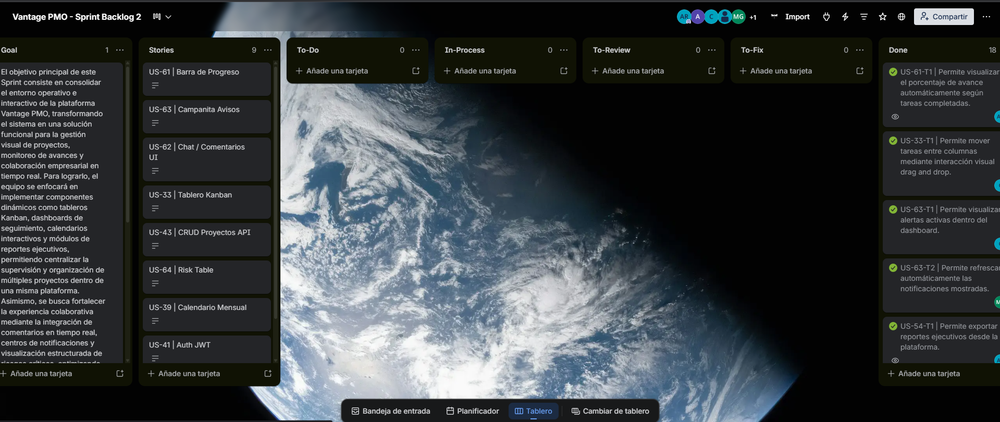
</div>

**Trello:** [Trello Sprint 2](https://trello.com/b/X2pD5igT/vantage-pmo-sprint-backlog-2) [https://trello.com/b/X2pD5igT/vantage-pmo-sprint-backlog-2]

### Sprint Backlog #02

| User Story Id | Title | Task Id | Task Title | Description | Est. (h) | Assigned To | Status |
| :--- | :--- | :--- | :--- | :--- | :---: | :--- | :---: |
| **US-033** | Tablero Kanban | T001 | Implementación drag & drop | Permite mover tareas entre columnas mediante interacción visual drag and drop. | 3h | Cesar Quispe | Done |
| | | T002 | Persistencia de estados | Permite actualizar el estado de tareas en tiempo real mediante conexión API. | 2h | Diego Esquicha | Done |
| | | T003 | Renderizado dinámico de tareas | Permite visualizar tareas dinámicamente dentro del tablero Kanban. | 1h | Alvaro Rocha | Done |
| **US-061** | Barra de Progreso | T001 | Cálculo dinámico de avance | Permite visualizar el porcentaje de avance automáticamente según tareas completadas. | 2h | Alvaro Rocha | Done |
| | | T002 | Actualización visual de progreso | Permite refrescar dinámicamente la barra de progreso en pantalla. | 1h | Mauricio Teran | Done |
| **US-062** | Chat / Comentarios UI | T001 | Feed de comentarios | Permite visualizar mensajes y comentarios asociados a tareas del proyecto. | 2h | Mauricio Teran | Done |
| | | T002 | Diseño de burbujas de conversación | Permite mejorar la experiencia visual de interacción colaborativa. | 1h | Dylan Guillen | Done |
| | | T003 | Renderizado dinámico de mensajes | Permite mostrar mensajes dinámicamente dentro del chat colaborativo. | 1h | Cesar Quispe | Done |
| **US-063** | Campanita Avisos | T001 | Centro de notificaciones | Permite visualizar alertas activas dentro del dashboard. | 2h | Cesar Quispe | Done |
| | | T002 | Actualización de avisos | Permite refrescar automáticamente las notificaciones mostradas. | 1h | Alvaro Rocha | Done |
| **US-064** | Risk Table | T001 | Tabla de riesgos críticos | Permite resaltar riesgos críticos mediante colores y prioridades. | 2h | Dylan Guillen | Done |
| | | T002 | Renderizado de riesgos | Permite visualizar dinámicamente riesgos registrados en el sistema. | 1h | Diego Esquicha | Done |
| **US-039** | Calendario Mensual | T001 | Calendario interactivo | Permite visualizar hitos y eventos importantes del proyecto. | 2h | Mauricio Teran | Done |
| | | T002 | Navegación entre meses | Permite cambiar de mes mediante controles interactivos. | 1h | Cesar Quispe | Done |
| **US-041** | Auth JWT | T001 | Generación de tokens | Permite asegurar las peticiones mediante autenticación JWT. | 2h | Diego Esquicha | Done | 
| **US-043** | CRUD Proyectos API | T001 | Endpoints REST | Permite crear, listar, editar y eliminar proyectos desde la API. | 4h | Diego Esquicha | Done |
| | | T002 | Serialización de respuestas JSON | Permite estructurar respuestas JSON para comunicación con frontend. | 1h | Alvaro Rocha | Done |
| **US-054** | JSON a PDF | T001 | Generación de reportes PDF | Permite exportar reportes ejecutivos desde la plataforma. | 2h | Alvaro Rocha | Done |
|

#### 5.2.2.4. Development Evidence for Sprint Review.
<a id="5-2-2-4-development-evidence-for-sprint-review"></a>

En esta sección se presentan los avances obtenidos durante la fase de implementación correspondientes al Sprint Backlog 02, enfocado en el desarrollo de funcionalidades interactivas y componentes principales del sistema de gestión de proyectos.

Durante este sprint se implementaron funcionalidades relacionadas con el tablero Kanban, autenticación mediante JWT, visualización de progreso, sistema de comentarios colaborativos, gestión de riesgos, calendario mensual, generación de reportes PDF y consumo de endpoints REST para la administración de proyectos.

<table border="1" cellspacing="0" cellpadding="5">
  <tr>
    <th>Repository</th>
    <th>Branch</th>
    <th>Commit Id</th>
    <th>Commit Message</th>
    <th>Commit Message Body</th>
    <th>Commited on (Date)</th>
  </tr>

  <tr>
    <td>DiegoEsquich/Vantage-PMO-Front-End</td>
    <td>develop</td>
    <td>a12f4d2</td>
    <td>feat(task-collaboration): implement kanban board ui and task workflow logic</td>
    <td>Permite implementar la interfaz del tablero Kanban y la lógica de flujo colaborativo de tareas.</td>
    <td>12/05/2026</td>
  </tr>

  <tr>
    <td>DiegoEsquich/Vantage-PMO-Front-End</td>
    <td>develop</td>
    <td>b82ac14</td>
    <td>feat(task-collaboration): add task collaboration endpoint, data, and route</td>
    <td>Permite implementar endpoints y rutas para la colaboración y gestión de tareas.</td>
    <td>12/05/2026</td>
  </tr>

  <tr>
    <td>alvarorc24/Vantage-PMO-Front-End</td>
    <td>develop</td>
    <td>c73de91</td>
    <td>feat(reports): implement api, store, view, entity</td>
    <td>Permite implementar la estructura de reportes mediante API, vistas, entidades y almacenamiento.</td>
    <td>12/05/2026</td>
  </tr>

  <tr>
    <td>alvarorc24/Vantage-PMO-Front-End</td>
    <td>develop</td>
    <td>d42cb66</td>
    <td>feat(reports): api config, mock data and route</td>
    <td>Permite configurar rutas y datos simulados para la gestión de reportes.</td>
    <td>12/05/2026</td>
  </tr>

  <tr>
    <td>mau-tz/Vantage-PMO-Front-End</td>
    <td>develop</td>
    <td>e91bd72</td>
    <td>feat(project): active projects view with styles</td>
    <td>Permite visualizar proyectos activos mediante una interfaz estilizada e interactiva.</td>
    <td>13/05/2026</td>
  </tr>

  <tr>
    <td>mau-tz/Vantage-PMO-Front-End</td>
    <td>develop</td>
    <td>f25da18</td>
    <td>feat(project): add milestone timeline and enhance project styles</td>
    <td>Permite implementar una línea de tiempo de hitos y mejorar la visualización de proyectos.</td>
    <td>13/05/2026</td>
  </tr>

  <tr>
    <td>user20-bit/Vantage-PMO-Front-End</td>
    <td>develop</td>
    <td>g66ae42</td>
    <td>feat(system-administration): integrate admin panel with branding, security and notification settings</td>
    <td>Permite integrar configuraciones de seguridad y notificaciones dentro del panel administrativo.</td>
    <td>13/05/2026</td>
  </tr>

  <tr>
    <td>user20-bit/Vantage-PMO-Front-End</td>
    <td>develop</td>
    <td>h87ef24</td>
    <td>feat(system-administration): redesign admin module with enterprise settings workspace UI</td>
    <td>Permite rediseñar el módulo administrativo mediante una interfaz de configuración empresarial.</td>
    <td>13/05/2026</td>
  </tr>

  <tr>
    <td>FulLHous/Vantage-PMO-Front-End</td>
    <td>develop</td>
    <td>i53bc74</td>
    <td>feat(ui): implement schedule calendar view component</td>
    <td>Permite visualizar actividades y eventos mediante un calendario interactivo mensual.</td>
    <td>14/05/2026</td>
  </tr>

  <tr>
    <td>FulLHous/Vantage-PMO-Front-End</td>
    <td>develop</td>
    <td>j42da55</td>
    <td>feat(meetings): implement entity, API service, assembler, and store</td>
    <td>Permite implementar la gestión de reuniones mediante entidades, servicios API y almacenamiento.</td>
    <td>14/05/2026</td>
  </tr>

  <tr>
    <td>FulLHous/Vantage-PMO-Front-End</td>
    <td>develop</td>
    <td>k92ca11</td>
    <td>feat(ui): add meetings management view and export report dialog</td>
    <td>Permite gestionar reuniones y exportar reportes mediante ventanas de diálogo interactivas.</td>
    <td>14/05/2026</td>
  </tr>

  <tr>
    <td>FulLHous/Vantage-PMO-Front-End</td>
    <td>develop</td>
    <td>l52fe90</td>
    <td>feat(ui): add responsive CSS layouts for support and task views</td>
    <td>Permite adaptar las vistas de soporte y tareas mediante estilos responsive.</td>
    <td>15/05/2026</td>
  </tr>

  <tr>
    <td>FulLHous/Vantage-PMO-Front-End</td>
    <td>develop</td>
    <td>m81df63</td>
    <td>feat(auth): improve forms with password visibility toggles and robust validation</td>
    <td>Permite mejorar la autenticación mediante validaciones robustas y visualización de contraseñas.</td>
    <td>15/05/2026</td>
  </tr>

  <tr>
    <td>FulLHous/Vantage-PMO-Front-End</td>
    <td>develop</td>
    <td>n22bc84</td>
    <td>feat(auth): add forgot and reset password routes</td>
    <td>Permite implementar recuperación y restablecimiento de contraseña mediante rutas de autenticación.</td>
    <td>15/05/2026</td>
  </tr>

</table>

#### 5.2.2.5. Execution Evidence for Sprint Review.
<a id="5-2-2-5-execution-evidence-for-sprint-review"></a>
Durante el Sprint 2 se logró consolidar el entorno interactivo principal, integrando módulos funcionales orientados a la gestión operativa de proyectos y colaboración entre equipos.

### Resumen de Logros:

*   **Gestión Visual de Proyectos:** Se implementó un tablero Kanban completamente interactivo con actualización dinámica de estado.
*   **Dashboard Ejecutivo:** Se integraron barras de progreso, indicadores visuales y métricas estratégicas para el monitoreo continuo de proyectos.
*   **Seguridad** Se desarrolló un sistema de autenticación para proyectos, asegurando una comunicación estructurada entre frontend.
*   **Comunicación y Riesgos:** Se añadieron módulos de comentarios colaborativos, centro de notificaciones y tabla de riesgos críticos para fortalecer la coordinación entre equipos.
*   **Reportes y Seguimiento:** Se incorporó la generación de reportes PDF y un calendario interactivo para visualizar hitos y actividades relevantes.

### Video de Demostración y Navegación
Puedes acceder al video de la demostración funcional en el siguiente enlace:
[Enlace a Video de Demostración: https://upcedupe-my.sharepoint.com/:v:/g/personal/u202411799_upc_edu_pe/IQB9_MnQmbOJQ4bIrihqyoPJAf8ovP4aL_gm3Tv7x9twqk8?nav=eyJyZWZlcnJhbEluZm8iOnsicmVmZXJyYWxBcHAiOiJPbmVEcml2ZUZvckJ1c2luZXNzIiwicmVmZXJyYWxBcHBQbGF0Zm9ybSI6IldlYiIsInJlZmVycmFsTW9kZSI6InZpZXciLCJyZWZlcnJhbFZpZXciOiJNeUZpbGVzTGlua0NvcHkifX0&e=hJb0Ta

### Screenshots de la Implementación

<div style="text-align:center;">
  
</div>

<div style="text-align:center;">
  
</div>

#### 5.2.2.6. Services Documentation Evidence for Sprint Review.
<a id="5-2-2-6-services-documentation-evidence-for-sprint-review"></a>
En este Sprint se ejecutaron actividades de despliegue relacionadas con el frontend. Se utilizaron entornos cloud para garantizar la accesibilidad y estabilidad del sistema.

**Las actividades realizadas incluyen:**

* **Frontend Deployment:** Despliegue del frontend en entorno web.
* **Environment Configuration:** Configuración de variables de entorno y autenticación JWT.

### Detalle de Entornos de Despliegue

| Componente | Plataforma / Herramienta | Estado | URL / Acceso |
| :--- | :--- | :---: | :--- |
| **Frontend Web** | Vercel / Netlify | `Live` | [https://vantagepmo-297ec.web.app] |
| **Fake API**.    | Render | `Live` | [https://json-server-2mq3.onrender.com]
| **Documentación** | Swagger UI | `Public` | `/api/docs` |

---

#### 5.2.2.7. Software Deployment Evidence for Sprint Review.
<a id="5-2-2-7-software-deployment-evidence-for-sprint-review"></a>

- Evidencia del despliegue en FireBase
<div style="text-align:center;">
  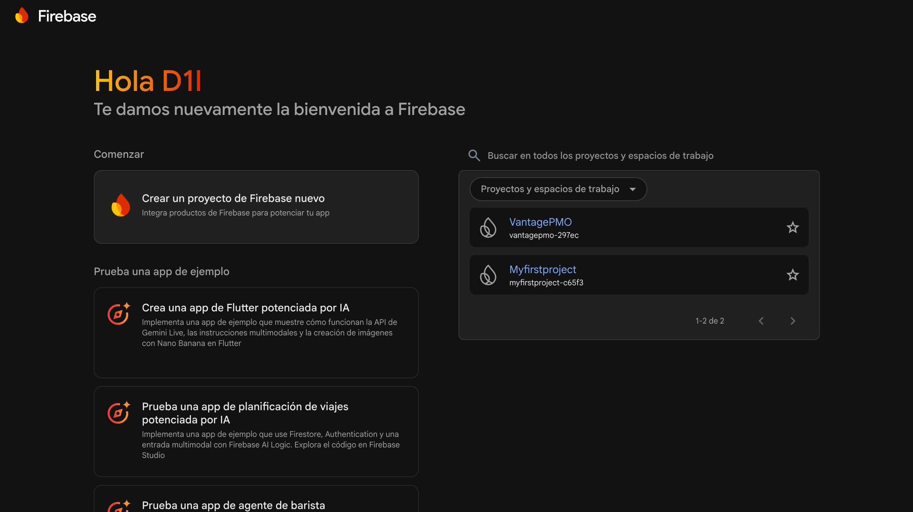
</div>

<div style="text-align:center;">
  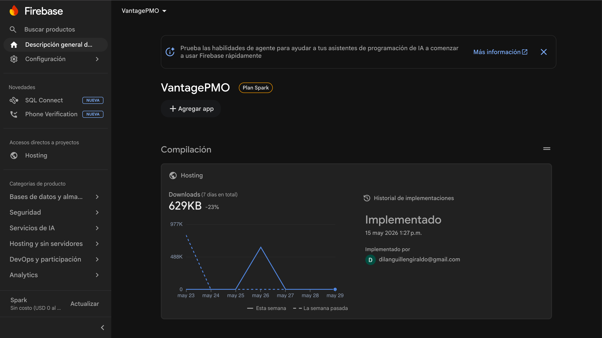
</div>

- Desarrollo e implementación del front-end.
<div style="text-align:center;">
  
</div>

- Registro y visualizacion de opciones del front-end.
<div style="text-align:center;">
  
</div>

- Evidencia del despliegue en Render.
<div style="text-align:center;">
  
</div>

#### 5.2.2.8.Team Collaboration Insights during Sprint.

<a id="5-2-2-8-team-collaboration-insights-during-sprint"></a>

La ejecución del Sprint 2 permitió integrar múltiples componentes frontend dentro de la arquitectura funcional y colaborativa. El trabajo del equipo se caracterizó por los siguientes aspectos:

*   **Sinergia Técnica:** Se fortaleció la colaboración entre frontend mediante integraciones continuas y validaciones cruzadas entre módulos visuales y servicios REST.
*   **Gestión de Control de Versiones:** El uso de ramas de desarrollo y Pull Requests permitió mantener orden de integración estable, evitando conflictos y asegurando la calidad del código entregado.
*   **Consistencia Visual y Funcional:** La coordinación grupal ayudo a mantener consistencia entre dashboards, componentes UI y lógica de negocio, especialmente en funcionalidades como Kanban, comentarios y notificaciones.
*   **Cultura de Calidad:** Se aplicaron buenas prácticas de desarrollo ágil, incluyendo revisiones semanales, commits y pruebas funcionales constantes.
*   **Comunicación Efectiva:** El equipo mantuvo la comunicación ante cambios mediante Discord y GitHub, logrando resolver rápidamente problemas de integración y dependencias entre servicios.

### Analíticos de GitHub — Sprint 2
**Analíticos de GitHub — Plataforma Interna**

<p align="center">
  
</p>

| Integrante | Usuario GitHub | Commits |
| :--- | :--- | :---: |
| Guillen Giraldo, Mike Dylan | FulLHous | 51 |
| Quispe Llacsahuanga, César Agusto | user20-bit | 9 |
| Esquicha Alcántara, Diego Alonso | DiegoEsquich | 5 |
| Rocha Cotrina, Alvaro | alvarorc24 | 3 |
| Teran Zavala, Mauricio Alejandro | mau-tz | 3|

Se evidencia una participación activa y equilibrada de todos los integrantes del equipo durante el Sprint 2, reflejando un trabajo colaborativo de la plataforma Vantage PMO.

<div style="text-align: left;">

### 5.2.3. Sprint 3
<a id="5-2-3-sprint-3"></a>

#### 5.2.3.1. Sprint Planning 3
<a id="5-2-3-1-sprint-planning-3"></a>

Durante el Sprint 3 se desarrollará la primera versión funcional del backend de Vantage, permitiendo la implementación de servicios REST necesarios para la gestión de proyectos, autenticación e integración con la interfaz web. Asimismo, se continuará mejorando la experiencia de usuario mediante la implementación de nuevas vistas para los distintos roles del sistema y el perfeccionamiento de funcionalidades desarrolladas en sprints anteriores.

El objetivo principal de este sprint es establecer la comunicación entre frontend y backend, permitiendo que la aplicación evolucione desde una interfaz estática hacia una plataforma con persistencia de datos y lógica de negocio.

Las actividades contempladas incluyen la implementación de endpoints para proyectos, autenticación mediante JWT, documentación de la API, mejoras visuales en la aplicación web, corrección de componentes existentes y desarrollo de nuevas interfaces orientadas a los perfiles de usuario definidos dentro del sistema.


| Campo | Detalle |
| :--- | :--- |
| **Sprint #** | Sprint 3 |
| **Sprint Planning Background** | |
| **Date** | 2026/06/20 |
| **Time** | 10:00 AM |
| **Location** | Reunión virtual mediante Discord |
| **Prepared By** | Esquicha Alcántara, Diego Alonso |
| **Attendees** | Rocha Cotrina, Alvaro / Esquicha Alcántara, Diego Alonso / Quispe Llacsahuanga, César Agusto / Guillen Giraldo, Mike Dylan / Teran Zavala, Mauricio Alejandro |
| **Sprint n-3 Review Summary** | Se completó la implementación de los principales componentes frontend de la plataforma, incluyendo dashboard, tablero Kanban, sistema de comentarios, gestión de riesgos, calendario interactivo y generación de reportes. |
| **Sprint n-3 Retrospective Summary** | Se identificó la necesidad de fortalecer la capa de servicios, centralizar la lógica de negocio y mejorar la persistencia de datos mediante una arquitectura backend más robusta. |
| **Sprint Goal & User Stories** | **Sprint 3:** Nos enfocamos en implementar la capa backend de la plataforma Vantage PMO. Creemos que esto permitirá consolidar la persistencia de información, la gestión de entidades del sistema y la comunicación segura entre frontend y backend. Esto se confirmará cuando los usuarios puedan interactuar con datos almacenados y gestionados mediante servicios centralizados, logrando una experiencia más estable, escalable y consistente. |
| **Sprint 3 Velocity** | 21 Story Points |
| **Sum of Story Points** | 24 Story Points |

#### 5.2.3.2. Aspect Leaders and Collaborators.
<a id="5-2-3-2-aspect-leaders-and-collaborators"></a>

Durante el Sprint 3, el equipo priorizó la integración de servicios backend, autenticación, gestión de proyectos y mejoras de experiencia de usuario. Además, se realizaron ajustes sobre módulos previamente desarrollados con el objetivo de incrementar la estabilidad funcional y la consistencia visual de la plataforma.

Para asegurar una correcta coordinación y distribución de responsabilidades, se implementó nuevamente la matriz de liderazgo y colaboración (LACX), asignando líderes técnicos y colaboradores según la especialidad de cada integrante del equipo.


| Team Member (Last Name, First Name) | GitHub Username | Backend API | Database | Authentication | Integrations | Reports | Deployment | Testing | Frontend Improvements | Documentation |
| :--- | :--- | :---: | :---: | :---: | :---: | :---: | :---: | :---: | :---: | :---: |
| Rocha Cotrina, Alvaro | alvarorc24 | C | C | C | C | L | C | C | L | C |
| Esquicha Alcántara, Diego Alonso | DiegoEsquich | L | C | L | L | C | C | C | C | C |
| Quispe Llacsahuanga, César Agusto | user20-bit | C | L | C | C | C | C | L | C | C |
| Guillen Giraldo, Mike Dylan | FulLHous | C | C | C | C | C | L | C | L | C |
| Teran Zavala, Mauricio Alejandro | mau-tz | C | C | C | C | C | C | C | C | L |

*Leyenda: L = Lead (Líder), C = Collaborator (Colaborador)*

#### 5.2.3.3. Sprint Backlog 3.
<a id="5-2-3-3-sprint-backlog-3"></a>

El Sprint 3 tiene como objetivo consolidar la evolución de Vantage PMO mediante la integración progresiva entre los componentes frontend desarrollados en los sprints anteriores y los servicios backend necesarios para soportar la persistencia y gestión de la información de la plataforma.

El equipo trabajará en la implementación de funcionalidades relacionadas con autenticación, gestión de proyectos y consumo de servicios API, fortaleciendo la comunicación entre frontend y backend para garantizar una experiencia más consistente y alineada con los requerimientos funcionales definidos en el Product Backlog.

Asimismo, se desarrollarán nuevas vistas orientadas a los distintos perfiles de usuario de la plataforma, incluyendo mejoras en la experiencia del emprendedor, la selección de roles dentro del flujo de incorporación al sistema y la integración de espacios colaborativos como ChatHub. También se realizarán correcciones y optimizaciones sobre componentes previamente desarrollados, como la vista de perfil y los módulos de configuración y personalización visual.

Adicionalmente, se continuará fortaleciendo la experiencia de usuario mediante mejoras en la navegación, consistencia visual, modo oscuro, validaciones de formularios y reutilización de componentes, buscando ofrecer una plataforma más estable, intuitiva y preparada para futuras integraciones.

Este sprint permitirá avanzar desde una aplicación principalmente centrada en la interfaz de usuario hacia una solución más integrada, capaz de conectar funcionalidades visuales con servicios backend, sentando las bases para la gestión de información persistente y el crecimiento progresivo de las capacidades de la plataforma.

### Screenshot del Board

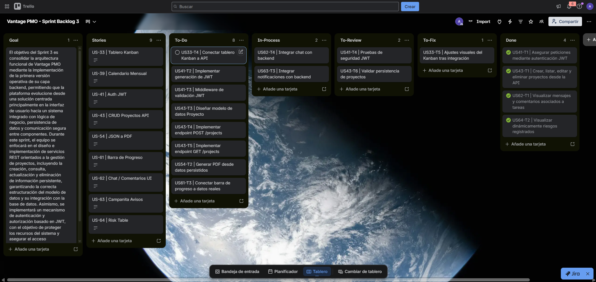

*Trello:* https://trello.com/b/OYqRnZWb/vantage-pmo-sprint-backlog-3

### Sprint Backlog #03

| User Story Id | Title | Task Id | Task Title | Description | Est. (h) | Assigned To | Status |
| :--- | :--- | :--- | :--- | :--- | :---: | :--- | :---: |
| US-039 | Calendario Mensual | T003 | Eventos desde backend | Permite cargar eventos del proyecto desde API. | 4h | Mauricio Teran | To-Do |
| US-041 | Auth JWT | T002 | Middleware validación JWT | Permite proteger endpoints y validar tokens JWT en backend. | 5h | Diego Esquicha | In-Progress |
| | | T003 | Pruebas de autenticación | Permite validar flujos de acceso autorizado y errores. | 4h | César Quispe | To-Review |
| US-043 | CRUD Proyectos API | T003 | Integración API–Frontend | Permite consumir endpoints de proyectos desde frontend. | 6h | Alvaro Rocha | In-Progress |
| US-054 | JSON a PDF | T002 | Integración con datos reales | Permite generar PDF usando información persistida. | 5h | Mauricio Teran | In-Progress |
| | | T004 | Manejo de errores API | Permite manejar errores y respuestas inválidas. | 4h | Mauricio Teran | To-Do |
| US-061 | Barra de Progreso | T003 | Sincronización con backend | Permite actualizar progreso usando datos persistidos. | 4h | Alvaro Rocha | To-Do |
| US-062 | Chat / Comentarios UI | T004 | Integración Chat con backend | Permite persistir mensajes usando servicios backend. | 6h | Dylan Guillen | In-Progress |
| | | T005 | Almacenamiento de mensajes | Permite guardar mensajes en base de datos. | 5h | César Quispe | To-Do |
| US-063 | Campanita Avisos | T003 | Persistencia de avisos | Permite almacenar notificaciones en backend. | 4h | César Quispe | To-Do |
| US-064 | Risk Table | T003 | Consumo de riesgos desde API | Permite obtener riesgos desde backend. | 4h | Diego Esquicha | To-Do |
| | | T004 | Validación de severidad | Permite validar prioridades y estados de riesgo. | 4h | Alvaro Rocha | To-Do |

#### 5.2.3.4. Development Evidence for Sprint Review.
<a id="5-2-3-4-development-evidence-for-sprint-review"></a>

En esta sección se presentarán los avances obtenidos durante la fase de implementación correspondientes al Sprint Backlog 03, enfocado en la consolidación de la integración entre frontend y backend, así como en la ampliación de funcionalidades clave de la plataforma.

Durante este sprint se documentarán las actividades relacionadas con el desarrollo de servicios backend, persistencia de datos, autenticación y autorización, consumo de APIs REST e integración de módulos previamente implementados.

Asimismo, se registrarán las mejoras realizadas sobre la interfaz de usuario, incluyendo la implementación del módulo de comunicación ChatHub, la creación de proyectos, el desarrollo de nuevas vistas para emprendedores, la selección de sectores dentro del proceso IAM, la corrección del módulo de perfil de usuario y la optimización del modo oscuro.

Finalmente, se incluirá una tabla con la evidencia de desarrollo obtenida desde los repositorios del proyecto, permitiendo identificar los commits realizados, los cambios implementados y los responsables de cada funcionalidad desarrollada durante el Sprint 3.

<table border="1" cellspacing="0" cellpadding="5">
  <tr>
    <th>Repository</th>
    <th>Branch</th>
    <th>Commit Id</th>
    <th>Commit Message</th>
    <th>Commit Message Body</th>
    <th>Commited on (Date)</th>
  </tr>

  <tr>
    <td>user20-bit/Vantage-PMO-Front-End</td>
    <td>main</td>
    <td>f67572a</td>
    <td>script: add chathub</td>
    <td>Agrega el módulo ChatHub inicial mediante scripts.</td>
    <td>2026-06-01</td>
  </tr>

  <tr>
    <td>user20-bit/Vantage-PMO-Front-End</td>
    <td>main</td>
    <td>9d76336</td>
    <td>Merge pull request #5 from BL-Aplicaciones-Web-1ASI0730-2610-12158/ChatBot</td>
    <td>Integra al branch principal los cambios desarrollados para el módulo ChatBot.</td>
    <td>2026-06-01</td>
  </tr>

  <tr>
    <td>mau-tz/Vantage-PMO-Front-End</td>
    <td>main</td>
    <td>3c46d92</td>
    <td>feat(create-project): add create project button with styles</td>
    <td>Agrega el botón de creación de proyectos con estilos visuales definidos.</td>
    <td>2026-06-01</td>
  </tr>

  <tr>
    <td>mau-tz/Vantage-PMO-Front-End</td>
    <td>main</td>
    <td>c957996</td>
    <td>Merge pull request #6 from BL-Aplicaciones-Web-1ASI0730-2610-12158/feat/create-project</td>
    <td>Integra al branch principal la funcionalidad de creación de proyectos.</td>
    <td>2026-06-01</td>
  </tr>

  <tr>
    <td>mau-tz/Vantage-PMO-Front-End</td>
    <td>main</td>
    <td>68cb135</td>
    <td>fix: refactor button texts in system administration</td>
    <td>Corrige y estandariza los textos de botones en el módulo de administración del sistema.</td>
    <td>2026-06-02</td>
  </tr>

  <tr>
    <td>user20-bit/Vantage-PMO-Front-End</td>
    <td>main</td>
    <td>19addb8</td>
    <td>scripts. add new chathub</td>
    <td>Agrega una nueva implementación inicial del ChatHub mediante scripts.</td>
    <td>2026-06-05</td>
  </tr>

  <tr>
    <td>mau-tz/Vantage-PMO-Front-End</td>
    <td>main</td>
    <td>0d3f921</td>
    <td>refactor: enhance infrastructure for both segments</td>
    <td>Mejora la infraestructura base del frontend para soportar ambos segmentos de usuarios.</td>
    <td>2026-06-05</td>
  </tr>
  <tr>
    <td>user20-bit/Vantage-PMO-Front-End</td>
    <td>main</td>
    <td>02e8811</td>
    <td>refactor: structure view2 supports and chathub</td>
    <td>Reestructura los archivos de soporte de la vista 2 y el módulo de ChatHub para mejorar mantenibilidad y orden del código.</td>
    <td>2026-06-06</td>
  </tr>

  <tr>
    <td>alvarorc24/Vantage-PMO-Front-End</td>
    <td>main</td>
    <td>a475852</td>
    <td>refactor(view-2): clean up layout and home views, i18n, and stores</td>
    <td>Limpia y optimiza layouts, vistas principales, internacionalización y stores para una arquitectura más clara.</td>
    <td>2026-06-06</td>
  </tr>

  <tr>
    <td>alvarorc24/Vantage-PMO-Front-End</td>
    <td>main</td>
    <td>df24412</td>
    <td>feat(view-2): add portfolio routes and layout</td>
    <td>Agrega nuevas rutas y layout para la visualización de portafolios dentro del sistema.</td>
    <td>2026-06-06</td>
  </tr>
  <tr>
    <td>alvarorc24/Vantage-PMO-Front-End</td>
    <td>main</td>
    <td>f46a14a</td>
    <td>feat(view-2): update home.vue layout and styles</td>
    <td>Actualiza la estructura visual y estilos del home de la vista 2 para mejorar la experiencia de usuario.</td>
    <td>2026-06-06</td>
  </tr>

  <tr>
    <td>alvarorc24/Vantage-PMO-Front-End</td>
    <td>main</td>
    <td>e2631f3</td>
    <td>feat(view-2): add layout, home, 404 and language switcher</td>
    <td>Incorpora layouts base, vista home, página 404 y selector de idioma para la vista 2.</td>
    <td>2026-06-06</td>
  </tr>

  <tr>
    <td>alvarorc24/Vantage-PMO-Front-End</td>
    <td>main</td>
    <td>2ab6de2</td>
    <td>feat(view-2): add layout, components and views structure</td>
    <td>Define la estructura inicial de layouts, componentes y vistas para la vista 2 del sistema.</td>
    <td>2026-06-06</td>
  </tr>

  <tr>
    <td>mau-tz/Vantage-PMO-Front-End</td>
    <td>main</td>
    <td>a457897</td>
    <td>add bounded contexts folders for view2</td>
    <td>Crea carpetas de bounded contexts para organizar modularmente la vista 2.</td>
    <td>2026-06-06</td>
  </tr>

  <tr>
    <td>mau-tz/Vantage-PMO-Front-End</td>
    <td>main</td>
    <td>d5dc87b</td>
    <td>refactor: bounded context routes</td>
    <td>Refactoriza las rutas para alinearlas con la arquitectura de bounded contexts.</td>
    <td>2026-06-06</td>
  </tr>

  <tr>
    <td>mau-tz/Vantage-PMO-Front-End</td>
    <td>main</td>
    <td>86c3cf2</td>
    <td>fix: route in presentation for view1</td>
    <td>Corrige el ruteo de presentación para evitar errores de navegación en la vista 1.</td>
    <td>2026-06-06</td>
  </tr>

  <tr>
    <td>mau-tz/Vantage-PMO-Front-End</td>
    <td>main</td>
    <td>de8824d</td>
    <td>fix: move shared out of view 1</td>
    <td>Mueve componentes compartidos fuera de la vista 1 para mejorar reutilización.</td>
    <td>2026-06-06</td>
  </tr>

  <tr>
    <td>mau-tz/Vantage-PMO-Front-End</td>
    <td>main</td>
    <td>2f02c20</td>
    <td>feat(project): update project status and calculate progress bar</td>
    <td>Permite actualizar el estado del proyecto y calcular dinámicamente la barra de progreso.</td>
    <td>2026-06-06</td>
  </tr>

  <tr>
    <td>mau-tz/Vantage-PMO-Front-End</td>
    <td>main</td>
    <td>14bc171</td>
    <td>feat(project): add update option in projects</td>
    <td>Agrega la opción de actualización de proyectos desde la interfaz.</td>
    <td>2026-06-06</td>
  </tr>

  <tr>
    <td>mau-tz/Vantage-PMO-Front-End</td>
    <td>main</td>
    <td>f4ad6a9</td>
    <td>feat: add files md for view2</td>
    <td>Agrega archivos de documentación markdown asociados a la vista 2.</td>
    <td>2026-06-06</td>
  </tr>

  <tr>
    <td>user20-bit/Vantage-PMO-Front-End</td>
    <td>main</td>
    <td>947a325</td>
    <td>chathub correction</td>
    <td>Corrige errores funcionales y visuales detectados en el módulo ChatHub.</td>
    <td>2026-06-06</td>
  </tr>

  <tr>
    <td>user20-bit/Vantage-PMO-Front-End</td>
    <td>main</td>
    <td>f57f9fe</td>
    <td>scripts: finall version chathub designs</td>
    <td>Incluye la versión final de los diseños del ChatHub mediante scripts.</td>
    <td>2026-06-06</td>
  </tr>

  <tr>
    <td>user20-bit/Vantage-PMO-Front-End</td>
    <td>main</td>
    <td>9be8b44</td>
    <td>scripts: finall version chathub designs</td>
    <td>Refuerza y ajusta los scripts finales de diseño del ChatHub.</td>
    <td>2026-06-06</td>
  </tr>

  <tr>
    <td>alvarorc24/Vantage-PMO-Front-End</td>
    <td>main</td>
    <td>da618d1</td>
    <td>feat(view-2): add context parameter to dashboard fetch and apis</td>
    <td>Incorpora el parámetro de contexto en las llamadas al dashboard y APIs para soportar múltiples entornos.</td>
    <td>2026-06-06</td>
  </tr>

  <tr>
    <td>mau-tz/Vantage-PMO-Front-End</td>
    <td>main</td>
    <td>83d5645</td>
    <td>feat(workspace): add workspace selection</td>
    <td>Implementa la funcionalidad de selección de workspace.</td>
    <td>2026-06-07</td>
  </tr>

  <tr>
    <td>mau-tz/Vantage-PMO-Front-End</td>
    <td>main</td>
    <td>2c81c0b</td>
    <td>delete file.md</td>
    <td>Se eliminó un archivo markdown que ya no era necesario.</td>
    <td>2026-06-08</td>
  </tr>

  <tr>
    <td>mau-tz/Vantage-PMO-Front-End</td>
    <td>main</td>
    <td>e12b806</td>
    <td>feat(analytics): add files for analytics</td>
    <td>Se añadieron archivos base para el módulo de analíticas.</td>
    <td>2026-06-08</td>
  </tr>

  <tr>
    <td>DiegoEsquich/Vantage-PMO-Front-End</td>
    <td>main</td>
    <td>f0d26e0</td>
    <td>feat(view-2): add director user to mock db</td>
    <td>Se agregó un usuario director al mock de base de datos.</td>
    <td>2026-06-08</td>
  </tr>

  <tr>
    <td>alvarorc24/Vantage-PMO-Front-End</td>
    <td>main</td>
    <td>d1a6f2a</td>
    <td>feat(view-2): add resource planning feature scaffold</td>
    <td>Se creó la estructura base para la funcionalidad de planificación de recursos.</td>
    <td>2026-06-10</td>
  </tr>

  <tr>
    <td>alvarorc24/Vantage-PMO-Front-End</td>
    <td>main</td>
    <td>ac07755</td>
    <td>Revert "Merge pull request #9"</td>
    <td>Se revirtieron cambios del merge anterior por inconsistencias detectadas.</td>
    <td>2026-06-10</td>
  </tr>

  <tr>
    <td>alvarorc24/Vantage-PMO-Front-End</td>
    <td>main</td>
    <td>44998e4</td>
    <td>Merge branch 'main' into feat/view-2</td>
    <td>Se sincronizó la rama principal con la rama de desarrollo view-2.</td>
    <td>2026-06-10</td>
  </tr>

  <tr>
    <td>alvarorc24/Vantage-PMO-Front-End</td>
    <td>main</td>
    <td>947f30f</td>
    <td>Merge pull request #9 from feat/view-2</td>
    <td>Se integraron funcionalidades iniciales de la vista 2.</td>
    <td>2026-06-10</td>
  </tr>

  <tr>
    <td>mau-tz/Vantage-PMO-Back-End</td>
    <td>main</td>
    <td>78e8671</td>
    <td>chore: add new dependencies</td>
    <td>Se incorporaron nuevas dependencias requeridas por funcionalidades recientes.</td>
    <td>2026-06-11</td>
  </tr>

  <tr>
    <td>mau-tz/Vantage-PMO-Back-End</td>
    <td>main</td>
    <td>d7470ab</td>
    <td>refactor: enhance appsettings files</td>
    <td>Se refactorizaron los archivos de configuración para mejorar claridad y mantenimiento.</td>
    <td>2026-06-11</td>
  </tr>

  <tr>
    <td>mau-tz/Vantage-PMO-Front-End</td>
    <td>main</td>
    <td>481de8e</td>
    <td>refactor: delete unnecesary files and buttons for view 1</td>
    <td>Se eliminaron archivos y botones innecesarios para simplificar la vista 1.</td>
    <td>2026-06-11</td>
  </tr>

  <tr>
    <td>FulLHous/Vantage-PMO-Front-End</td>
    <td>main</td>
    <td>fe89e00</td>
    <td>Merge pull request #11 from feature/risk</td>
    <td>Se integraron a main los cambios completos del módulo de riesgos.</td>
    <td>2026-06-11</td>
  </tr>

  <tr>
    <td>FulLHous/Vantage-PMO-Front-End</td>
    <td>main</td>
    <td>ad774c8</td>
    <td>feat(risk): implement risk compliance page</td>
    <td>Se implementó la página de cumplimiento de riesgos con heatmap, métricas y tabla crítica.</td>
    <td>2026-06-11</td>
  </tr>

  <tr>
    <td>FulLHous/Vantage-PMO-Front-End</td>
    <td>main</td>
    <td>a05935e</td>
    <td>feat(risk): enhance RiskComplianceAssembler and API</td>
    <td>Se mejoró el ensamblador y consumo de API para métricas y matrices de riesgo.</td>
    <td>2026-06-11</td>
  </tr>

  <tr>
    <td>FulLHous/Vantage-PMO-Front-End</td>
    <td>main</td>
    <td>04a5eb6</td>
    <td>feat(risk): add environment variables</td>
    <td>Se añadieron variables de entorno para endpoints del módulo de riesgos.</td>
    <td>2026-06-11</td>
  </tr>

  <tr>
    <td>FulLHous/Vantage-PMO-Front-End</td>
    <td>main</td>
    <td>6ef3b7e</td>
    <td>feat(risk): implement risk management dashboard</td>
    <td>Se desarrollaron componentes del dashboard para la gestión visual de riesgos.</td>
    <td>2026-06-11</td>
  </tr>

  <tr>
    <td>FulLHous/Vantage-PMO-Front-End</td>
    <td>main</td>
    <td>7be2a73</td>
    <td>feat(risk): add ComplianceMetrics, Risk, RiskMatrix</td>
    <td>Se añadieron entidades para modelar métricas, riesgos y matrices.</td>
    <td>2026-06-11</td>
  </tr>

  <tr>
    <td>FulLHous/Vantage-PMO-Front-End</td>
    <td>main</td>
    <td>e2203ba</td>
    <td>feat(risk): add risk matrix and action plans</td>
    <td>Se incorporaron matrices de riesgo y planes de acción para vulnerabilidades.</td>
    <td>2026-06-11</td>
  </tr>

  <tr>
    <td>FulLHous/Vantage-PMO-Front-End</td>
    <td>main</td>
    <td>1c3c275</td>
    <td>feat(risk-compliance): add localization</td>
    <td>Se añadió soporte de idioma inglés y español al módulo de riesgos.</td>
    <td>2026-06-11</td>
  </tr>

  <tr>
    <td>FulLHous/Vantage-PMO-Front-End</td>
    <td>main</td>
    <td>6978762</td>
    <td>feat(risk-compliance): enhance store</td>
    <td>Se mejoró el store para manejo de datos y métricas de riesgos.</td>
    <td>2026-06-11</td>
  </tr>

  <tr>
    <td>mau-tz/Vantage-PMO-Back-End</td>
    <td>main</td>
    <td>9c1a5b6</td>
    <td>feat(shared): add shared bounded context</td>
    <td>Se creó un contexto compartido para reutilizar lógica y entidades comunes entre módulos.</td>
    <td>2026-06-12</td>
  </tr>

  <tr>
    <td>mau-tz/Vantage-PMO-Back-End</td>
    <td>main</td>
    <td>a5f18da</td>
    <td>add docker file for containerization</td>
    <td>Se añadió un Dockerfile para permitir la contenedorización del backend.</td>
    <td>2026-06-12</td>
  </tr>

  <tr>
    <td>mau-tz/Vantage-PMO-Back-End</td>
    <td>main</td>
    <td>545c87a</td>
    <td>chore: files routes</td>
    <td>Se organizaron y añadieron rutas para la gestión de archivos, mejorando la estructura del backend.</td>
    <td>2026-06-15</td>
  </tr>
</table>

#### 5.2.3.5. Execution Evidence for Sprint Review.
<a id="5-2-3-5-execution-evidence-for-sprint-review"></a>

Durante el Sprint 3 se consolidará la integración entre los componentes frontend y backend de la plataforma, permitiendo que los usuarios interactúen con información persistente mediante servicios REST completamente funcionales.

### Resumen de Logros

* Implementación de servicios backend para la gestión de entidades principales del sistema.
* Integración entre frontend y backend mediante consumo de APIs REST.
* Incorporación de mecanismos de autenticación y autorización para el acceso seguro a los recursos.
* Persistencia de datos mediante base de datos y servicios de almacenamiento.
* Implementación del módulo de comunicación ChatHub para fortalecer la interacción entre usuarios.
* Desarrollo de la funcionalidad de creación de proyectos mediante formularios conectados con los servicios backend.
* Implementación de la vista de Emprendedor dentro del flujo principal de la aplicación.
* Desarrollo de la selección de sectores dentro del proceso IAM.
* Corrección y habilitación del módulo de Perfil de Usuario.
* Optimización del sistema de configuración visual y mejora del modo oscuro.
* Optimización de formularios, validaciones y manejo de errores.
* Mejoras de experiencia de usuario y rendimiento general de la plataforma.
* Implementación y actualización de documentación técnica para los servicios desarrollados.

### Video de Demostración y Navegación

Se incluirá el enlace al video de demostración correspondiente al Sprint 3, mostrando el funcionamiento de los servicios implementados, las nuevas funcionalidades desarrolladas y la integración completa de la plataforma.

Puedes acceder al video de la demostración funcional en el siguiente enlace:
https://upcedupe-my.sharepoint.com/:v:/g/personal/u202411799_upc_edu_pe/IQC5FIEG7RVRRb5EYlejBOfDAQiul5RZR2_QUs1Q0Fm_eB0?nav=eyJyZWZlcnJhbEluZm8iOnsicmVmZXJyYWxBcHAiOiJPbmVEcml2ZUZvckJ1c2luZXNzIiwicmVmZXJyYWxBcHBQbGF0Zm9ybSI6IldlYiIsInJlZmVycmFsTW9kZSI6InZpZXciLCJyZWZlcnJhbFZpZXciOiJNeUZpbGVzTGlua0NvcHkifX0&e=Ot2Y5l

### Screenshots de la Implementación

Se incorporarán capturas de pantalla que evidencien las funcionalidades desarrolladas durante este sprint, incluyendo módulos frontend, respuestas de API, vistas de usuario, ChatHub, creación de proyectos, dashboards actualizados y evidencias de integración.

<div style="text-align:center;">
  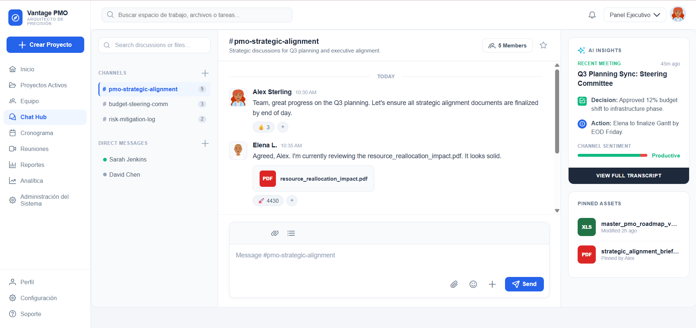
</div>
<div style="text-align:center;">
  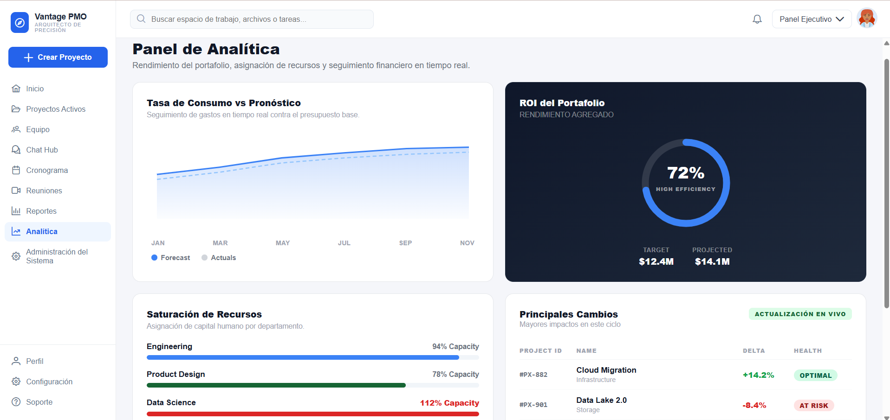
</div>
<div style="text-align:center;">
  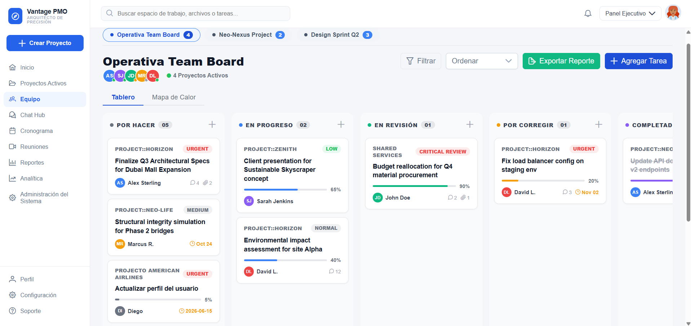
</div>
<div style="text-align:center;">
  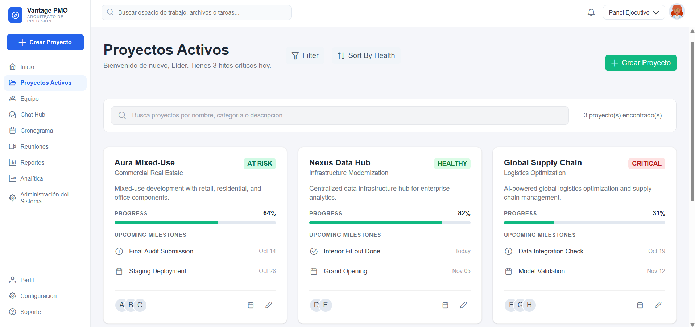
</div>

---

#### 5.2.3.6. Services Documentation Evidence for Sprint Review.
<a id="5-2-3-6-services-documentation-evidence-for-sprint-review"></a>

En este Sprint se documentarán los servicios desarrollados para soportar la lógica de negocio de la plataforma Vantage PMO. La documentación incluirá los endpoints REST implementados, métodos HTTP utilizados, parámetros de entrada, respuestas generadas y mecanismos de autenticación asociados.

Las actividades realizadas incluirán:

* Implementación de servicios REST.
* Configuración de autenticación y autorización.
* Integración de persistencia de datos.
* Desarrollo de endpoints para creación y gestión de proyectos.
* Integración de módulos frontend con servicios backend.
* Publicación de documentación técnica mediante Swagger/OpenAPI.
* Validación de consumo de servicios desde el frontend.

### Detalle de Servicios Implementados

| Recurso | Acción Implementada | HTTP | URL / Endpoint | Estado |
|----------|----------|----------|----------|----------|
| Render | Base de Datos | https://vantage-pmo-back-end-2.onrender.com/ | https://vantage-pmo-back-end-2.onrender.com/ | Activo |

La tabla será actualizada conforme se completen los servicios correspondientes al Sprint 3.

---

#### 5.2.3.7. Software Deployment Evidence for Sprint Review.
<a id="5-2-3-7-software-deployment-evidence-for-sprint-review"></a>

Durante este Sprint se realizarán las actividades necesarias para desplegar los servicios backend y consolidar el entorno de ejecución completo de la plataforma.

Las actividades previstas incluyen:

* Configuración de entornos de desarrollo y producción.
* Despliegue de servicios backend en plataforma cloud.
* Configuración de variables de entorno.
* Integración entre frontend desplegado y backend publicado.
* Validación de disponibilidad y conectividad de los servicios.
* Validación de funcionamiento de los nuevos módulos implementados durante el Sprint 3.
* Pruebas de integración entre ChatHub, gestión de proyectos y servicios backend.

### Evidencias de Despliegue

Se incorporarán capturas de pantalla correspondientes a:

* Plataforma de despliegue backend.
* Configuración de servicios.
* Estado operativo de las APIs.
* Conectividad entre frontend y backend.
* Funcionamiento de ChatHub.
* Funcionamiento de la creación de proyectos.
* Vista de Emprendedor.
* Configuración visual y modo oscuro.
* Evidencias de funcionamiento en ambiente productivo.

Render:
<td><div align="center">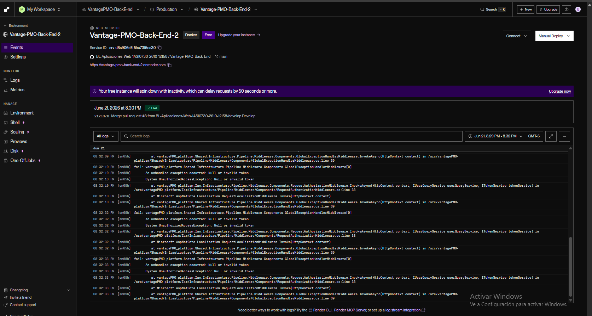</div></td>
<td><div align="center">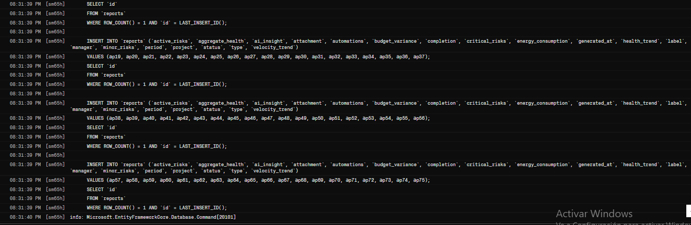</div></td>
<td><div align="center">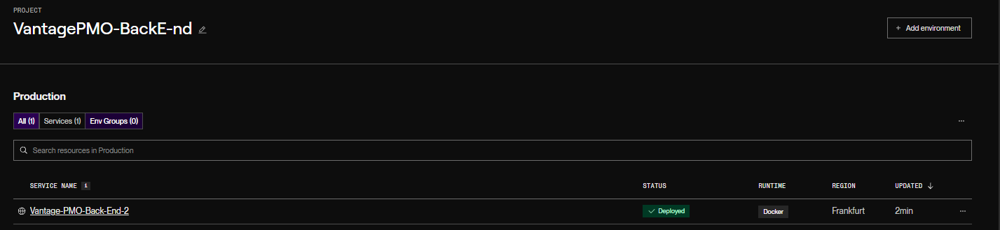</div></td>

MySQL:
<td><div align="center">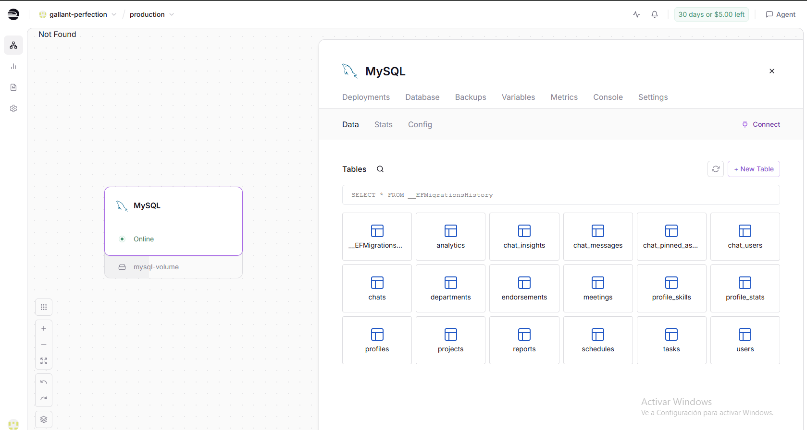</div></td>
<td><div align="center">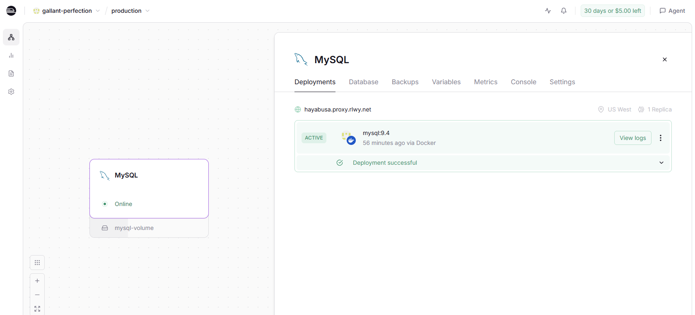</div></td>
<td><div align="center">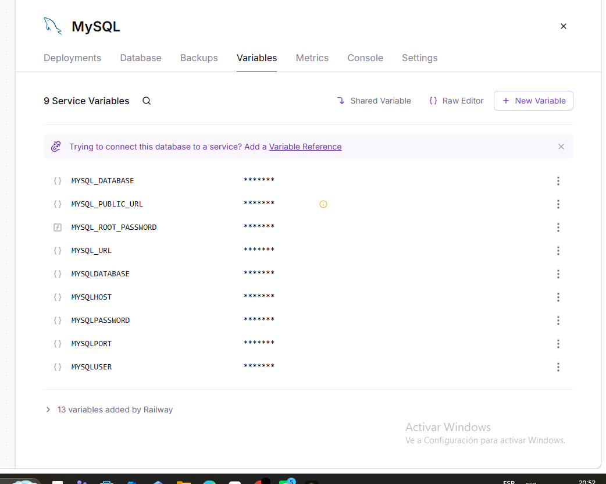</div></td>
<td><div align="center">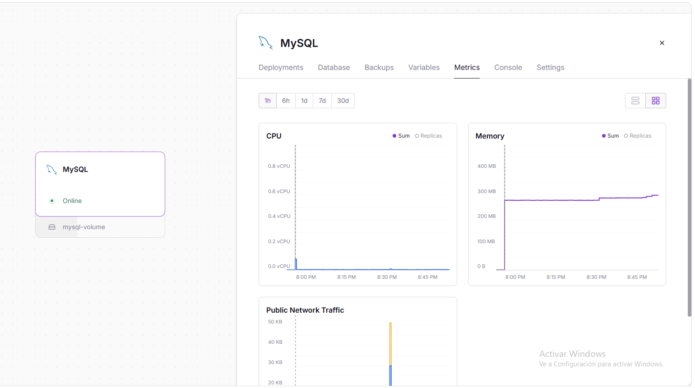</div></td>
<td><div align="center">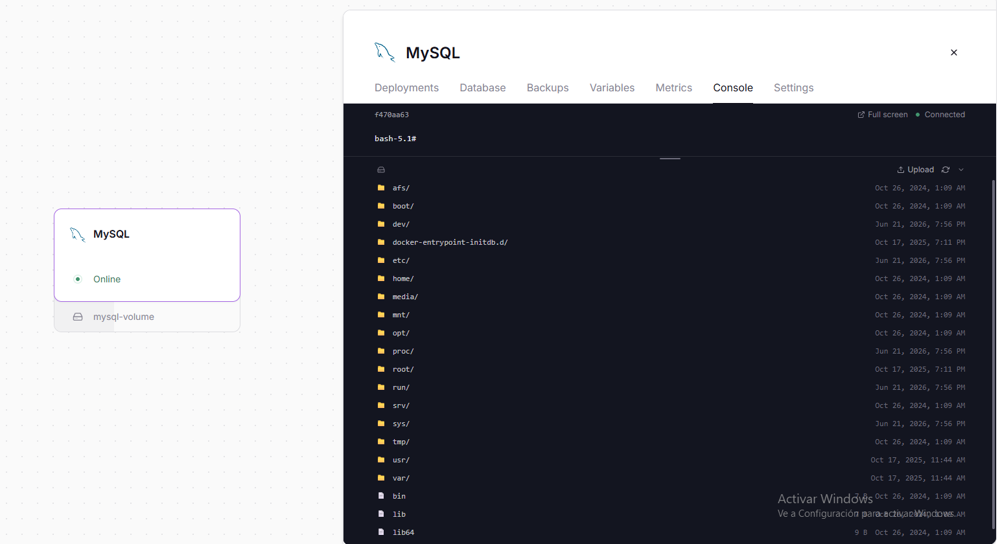</div></td>
<td><div align="center">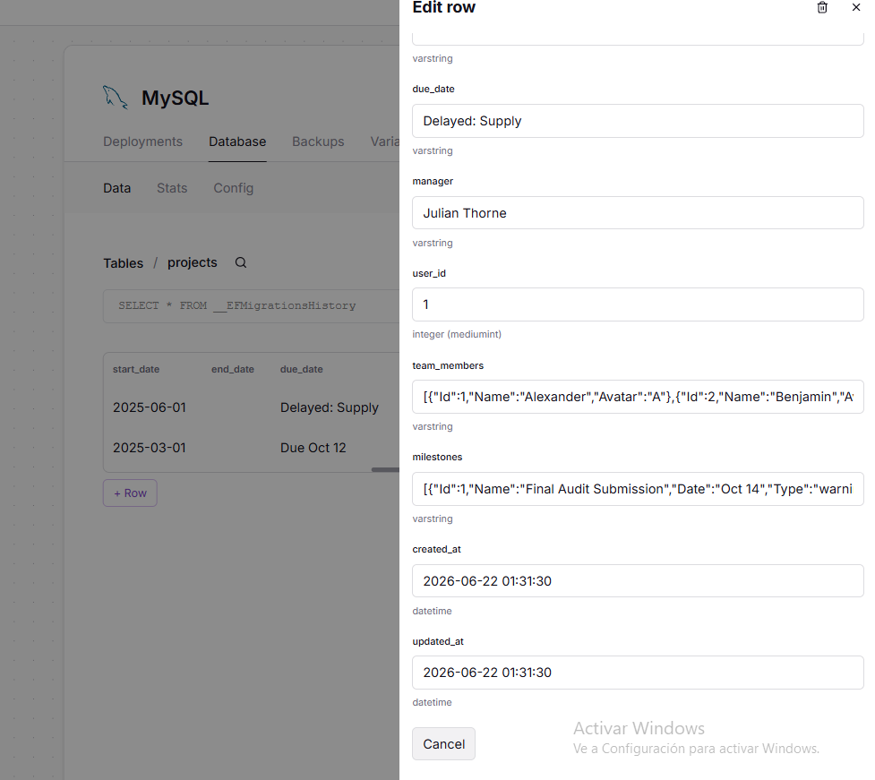</div></td>
<td><div align="center">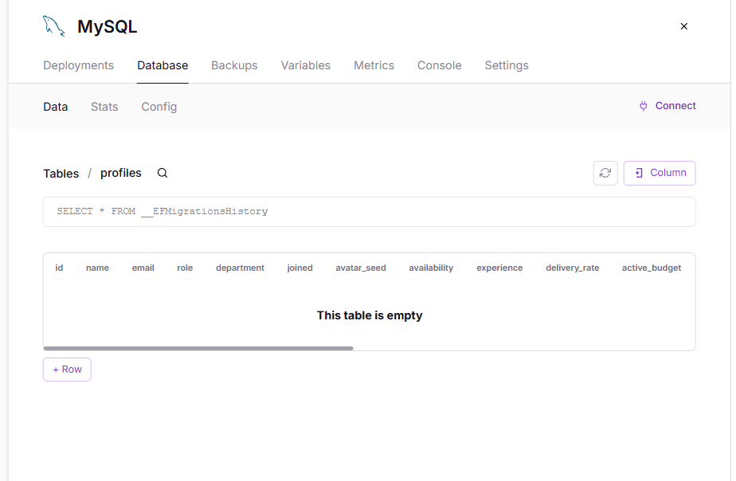</div></td>
<td><div align="center">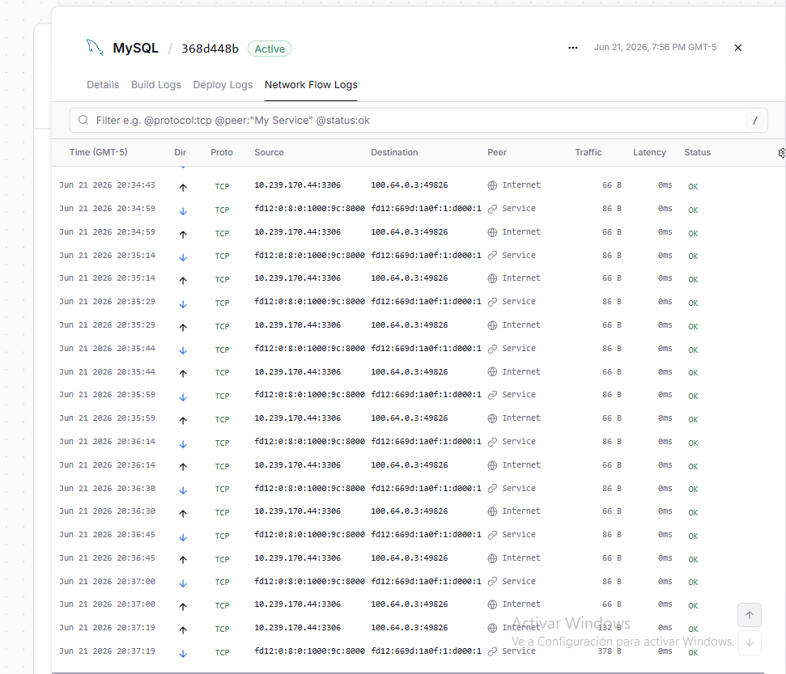</div></td>

---

#### 5.2.3.8.Team Collaboration Insights during Sprint.
<a id="5-2-3-8-team-collaboration-insights-during-sprint"></a>

La ejecución del Sprint 3 estará orientada a consolidar la integración tecnológica de la plataforma mediante el desarrollo coordinado de servicios backend, componentes frontend y actividades de despliegue.

El trabajo colaborativo del equipo se apoyará en los siguientes aspectos:

* **Integración Continua:** Se coordinarán actividades de desarrollo e integración entre frontend y backend para garantizar la compatibilidad entre componentes.
* **Desarrollo Full Stack:** El equipo trabajará simultáneamente en la implementación de servicios backend y en la mejora de los módulos visuales desarrollados en iteraciones anteriores.
* **Gestión de Versiones:** El uso de GitHub y Pull Requests permitirá mantener un flujo de trabajo ordenado y controlado durante la implementación de nuevas funcionalidades.
* **Calidad de Software:** Se realizarán pruebas funcionales e integraciones periódicas para asegurar la estabilidad de los servicios desarrollados.
* **Documentación Técnica:** Se mantendrá actualizada la documentación de APIs, despliegue y arquitectura para facilitar el mantenimiento futuro del sistema.
* **Mejora Continua de la Experiencia de Usuario:** Se realizarán ajustes y optimizaciones sobre módulos existentes para mejorar la usabilidad y consistencia visual de la plataforma.
* **Comunicación Efectiva:** El equipo continuará utilizando herramientas colaborativas para coordinar avances, resolver incidencias y dar seguimiento a las actividades planificadas.

### Analíticos de GitHub — Sprint 3

Las métricas de actividad del repositorio serán incorporadas al finalizar el Sprint 3, incluyendo evidencias de commits, contribuciones individuales, merges y participación de los integrantes del equipo.

<td><div align="center">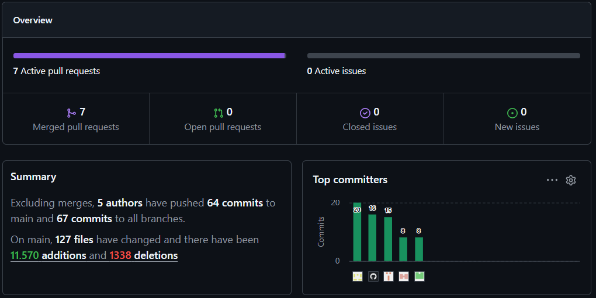</div></td>

| Integrante | Usuario GitHub | Commits |
| :--- | :--- | :---: |
| Quispe Llacsahuanga, César Agusto | user20-bit | 20 |
| Teran Zavala, Mauricio Alejandro | mau-tz | 16 |
| Rocha Cotrina, Alvaro | alvarorc24 | 15 |
| Esquicha Alcántara, Diego Alonso | DiegoEsquich | 8 |
| Guillen Giraldo, Mike Dylan | FulLHous | 8 |

Se espera mantener una participación equilibrada entre todos los integrantes del equipo, fortaleciendo la colaboración y asegurando el cumplimiento de los objetivos establecidos para este sprint.

<div style="text-align: left;">

### 5.2.4. Sprint 4
<a id="5-2-4-sprint-4"></a>

#### 5.2.4.1. Sprint Planning 4
<a id="5-2-4-1-sprint-planning-4"></a>

Durante el Sprint 4 se culminará el desarrollo del backend de la plataforma Vantage PMO, consolidando los servicios REST implementados en sprints anteriores y asegurando su correcto funcionamiento, estabilidad y seguridad. Este sprint estará orientado a finalizar la lógica de negocio, optimizar los endpoints existentes y validar la persistencia de datos, dejando el sistema preparado para su integración final y evaluación funcional.

El objetivo principal de este sprint es garantizar la correcta operación del backend como núcleo del sistema, asegurando una comunicación estable y eficiente con el frontend, el manejo adecuado de autenticación y autorización, así como la ejecución de procesos automáticos y validaciones críticas. De esta manera, la plataforma pasa de una versión parcialmente funcional a un sistema backend completo, consistente y listo para demostración y validación académica.


| Campo | Detalle |
| :--- | :--- |
| **Sprint #** | Sprint 4 |
| **Sprint Planning Background** | |
| **Date** | 2026/07/05 |
| **Time** | 10:00 PM |
| **Location** | Reunión virtual mediante Discord |
| **Prepared By** | Esquicha Alcántara, Diego Alonso |
| **Attendees** | Rocha Cotrina, Alvaro / Esquicha Alcántara, Diego Alonso / Quispe Llacsahuanga, César Agusto / Guillen Giraldo, Mike Dylan / Teran Zavala, Mauricio Alejandro |
| **Sprint n-4 Review Summary** | Se logró implementar la versión final funcional del backend, incluyendo endpoints principales, autenticación básica mediante JWT, documentación inicial de la API y la integración preliminar con el frontend. |
| **Sprint n-4 Retrospective Summary** | Se identificó la necesidad de culminar y robustecer el backend, reforzar la seguridad, mejorar la validación de datos, optimizar endpoints existentes y asegurar la correcta persistencia y consistencia de la información. |
| **Sprint Goal & User Stories** | **Sprint 4:** Nos enfocamos en culminar y consolidar el backend de la plataforma Vantage PMO. Creemos que esto permitirá garantizar una comunicación estable y segura entre frontend y backend, una correcta ejecución de la lógica de negocio y una persistencia de datos confiable. Esto se confirmará cuando todas las funcionalidades clave operen sobre servicios centralizados, con control de errores, seguridad y estabilidad, logrando una plataforma lista para validación final y demostración. |
| **Sprint 4 Velocity** | 21 Story Points |
| **Sum of Story Points** | 24 Story Points |

#### 5.2.4.2. Aspect Leaders and Collaborators.
<a id="5-2-4-2-aspect-leaders-and-collaborators"></a>

Durante el Sprint 4, el equipo centró sus esfuerzos en la culminación y consolidación del backend de la plataforma Vantage PMO, priorizando la finalización de la lógica de negocio, el refuerzo de los mecanismos de seguridad, la correcta persistencia de datos y la estabilidad de los servicios REST. Asimismo, se realizaron ajustes finales orientados a optimizar la integración con el frontend y asegurar un comportamiento consistente de la aplicación en todos sus módulos.

| Team Member (Last Name, First Name) | GitHub Username | Backend Services & Persistence | API integration | Authentication & Security| Data & Validation | Reports & Queries | Deployment | Testing | Frontend Improvements | Documentation |
| :--- | :--- | :---: | :---: | :---: | :---: | :---: | :---: | :---: | :---: | :---: |
| Rocha Cotrina, Alvaro | alvarorc24 | C | C | C | C | L | C | C | L | C |
| Esquicha Alcántara, Diego Alonso | DiegoEsquich | C | C | C | L | C | C | C | C | L |
| Quispe Llacsahuanga, César Agusto | user20-bit | C | L | C | C | C | C | L | C | C |
| Guillen Giraldo, Mike Dylan | FulLHous | C | C | L | L | C | L | C | L | C |
| Teran Zavala, Mauricio Alejandro | mau-tz | L | C | C | C | C | C | C | C | C |

*Leyenda: L = Lead (Líder), C = Collaborator (Colaborador)*

#### 5.2.4.3. Sprint Backlog 4.
<a id="5-2-4-3-sprint-backlog-4"></a>

El Sprint 4 tiene como objetivo culminar y estabilizar la capa backend de la plataforma Vantage PMO, asegurando la correcta persistencia de la información, la consolidación de la lógica de negocio y la integración completa con los componentes frontend desarrollados en los sprints anteriores.

Durante este sprint, el equipo se enfocará en finalizar los servicios REST principales, reforzar los mecanismos de seguridad y autenticación, y garantizar que las funcionalidades clave del sistema operen sobre datos reales almacenados en la base de datos. Asimismo, se trabajará en la integración final entre frontend y backend, permitiendo que las vistas existentes consuman endpoints funcionales y reflejen información actualizada de manera consistente.

Adicionalmente, se priorizará la generación de reportes finales, la correcta documentación de la API, y la validación del comportamiento del sistema frente a distintos escenarios de uso, incluyendo manejo de errores, control de accesos y flujos críticos del negocio. Estas actividades permitirán dejar la plataforma preparada para su entrega académica final, con una arquitectura backend robusta y alineada a los requerimientos definidos en el Product Backlog.

Finalmente, este sprint representa la transición desde una solución parcialmente integrada hacia una versión final estable, enfocada en el cierre del desarrollo, la consolidación funcional y la preparación del sistema para futuras mejoras o despliegues, asegurando una experiencia consistente, segura y escalable para los distintos perfiles de usuario.

### Screenshot del Board


*Trello:* https://trello.com/b/nXg9F2E2/vantage-pmo-sprint-backlog-4

### Sprint Backlog #03

| User Story Id | Title | Task Id | Task Title | Description | Est. (h) | Assigned To | Status |
| :--- | :--- | :--- | :--- | :--- | :---: | :--- | :---: |
| **US41** | Auth JWT | US41-T1 | Implementar generación de token JWT | Configurar la creación de tokens JWT al autenticar usuarios válidos, incluyendo claims básicos y tiempo de expiración. | 8h | Diego Esquicha | Done |
| | | US41-T2 | Proteger endpoints con middleware JWT | Aplicar validación de token en rutas privadas para asegurar que solo usuarios autenticados accedan a los recursos. | 8h | Diego Esquicha | Done |
| | | US41-T3 | Manejo de errores de autenticación | Implementar respuestas controladas para tokens inválidos, expirados o ausentes (401 / 403). | 6h | Alvaro Rocha | Done |
| **US43** | CRUD Proyectos API | US43-T1 | Implementar endpoint POST /projects | Recibir, validar y persistir proyectos en la base de datos desde el frontend. | 5h | Diego Esquicha | Done |
| | | US43-T2 | Implementar endpoint GET /projects | Recuperar la lista de proyectos asociados al usuario autenticado. | 4h | Cesar Quispe | Done |
| | | US43-T3 | Implementar endpoint PUT /projects/{id} | Permitir la actualización de datos del proyecto manteniendo integridad referencial. | 8h | Alvaro Rocha | Done |
| | | US43-T4 | Implementar endpoint DELETE /projects/{id} | Eliminar proyectos de forma lógica o física según reglas del negocio. | 8h | Diego Esquicha | Done |
| **US45** | API de Subida de Archivos | US45-T1 | Configurar endpoint multipart/form-data | Permitir la recepción de archivos binarios desde el frontend. | 2h | Cesar Quispe | Done |
| | | US45-T2 | Almacenamiento y generación de URL | Guardar archivos en el sistema definido y retornar una URL pública o privada. | 2h | Alvaro Rocha | Done |
| | | US45-T3 | Validación de tipo y tamaño de archivo | Restringir extensiones y tamaños para evitar cargas inválidas o riesgos de seguridad. | 4h | Dylan Guillen | Done |
| **US54** | JSON a PDF | US54-T1 | Estructurar modelo JSON de reporte | Definir la estructura de datos agregados que alimentarán el reporte PDF. | 8h | Alvaro Rocha | Done |
| | | US54-T2 | Integrar motor de generación PDF | Transformar el JSON en un archivo PDF descargable. | 8h | Alvaro Rocha | Done |
| | | US54-T3 | Exponer endpoint de descarga | Permitir al frontend solicitar y descargar el reporte generado. | 8h | Diego Esquicha | Done |
| **US42** | Swagger / Documentación | US42-T1 | Configurar Swagger en el backend | Habilitar el endpoint /swagger para visualización de la documentación. | 6h | Mauricio Teran | Done |
| | | US42-T2 | Documentar endpoints principales | Incluir descripción, parámetros, respuestas y códigos HTTP de cada servicio. | 2h | Mauricio Teran | Done |
| | | US42-T3 | Validar consistencia entre API y documentación | Asegurar que la documentación refleje el comportamiento real del backend. | 4h | Todo el equipo | Done |


#### 5.2.4.4. Development Evidence for Sprint Review.
<a id="5-2-4-4-development-evidence-for-sprint-review"></a>

En esta sección se presentan los avances obtenidos durante la fase de implementación correspondientes al Sprint Backlog 04, el cual estuvo enfocado en la culminación, estabilización y documentación de la capa backend de la plataforma Vantage PMO, así como en la integración final con los componentes frontend desarrollados en sprints anteriores.

Durante este sprint se documentan las actividades relacionadas con la finalización de servicios REST, el fortalecimiento de los mecanismos de autenticación y autorización mediante JWT, la correcta persistencia de la información, la gestión de proyectos, la subida y almacenamiento de archivos, y la generación de reportes ejecutivos en formato PDF a partir de datos estructurados en JSON.

Finalmente, se incluye una tabla con la evidencia de desarrollo obtenida a partir de los repositorios del proyecto, permitiendo identificar los commits realizados, las funcionalidades completadas, los cambios implementados y los responsables de cada actividad desarrollada durante el Sprint 4, consolidando así la entrega académica final del proyecto.

<table border="1" cellspacing="0" cellpadding="5">
  <tr>
    <th>Repository</th>
    <th>Branch</th>
    <th>Commit Id</th>
    <th>Commit Message</th>
    <th>Commit Message Body</th>
    <th>Commited on (Date)</th>
  </tr>

  <tr>
    <td>user20-bit/Vantage-PMO-Back-End</td>
    <td>main</td>
    <td>j3cgrf</td>
    <td>refactor: Skip sample seeding; remove Docker USER</td>
    <td>Desactiva seeding de ejemplo y elimina usuario explícito en Docker.</td>
    <td>2026-07-03</td>
  </tr>

  <tr>
    <td>user20-bit/Vantage-PMO-Back-End</td>
    <td>main</td>
    <td>989rgf</td>
    <td>feat: Add Analytics bounded context</td>
    <td>Agrega bounded context de Analytics con migraciones iniciales.</td>
    <td>2026-07-03</td>
  </tr>

  <tr>
    <td>user20-bit/Vantage-PMO-Back-End</td>
    <td>main</td>
    <td>rggrbb</td>
    <td>refactor: Add Reports bounded context</td>
    <td>Agrega contexto de Reportes (Quick Reports).</td>
    <td>2026-07-03</td>
  </tr>

  <tr>
    <td>user20-bit/Vantage-PMO-Back-End</td>
    <td>main</td>
    <td>30bgg4</td>
    <td>refactor: Add ChatHub module</td>
    <td>Implementa módulo ChatHub con dominio, API y configuración EF.</td>
    <td>2026-07-03</td>
  </tr>

  <tr>
    <td>user20-bit/Vantage-PMO-Back-End</td>
    <td>main</td>
    <td>b4b001</td>
    <td>refactor: Return user ID from signup and improve error handling</td>
    <td>Retorna el ID del usuario al registrarse y mejora el manejo de errores.</td>
    <td>2026-07-04</td>
  </tr>

  <tr>
    <td>mau-tz/Vantage-PMO-Back-End</td>
    <td>main</td>
    <td>vddvdf</td>
    <td>refactor: Handle OPTIONS requests and unauthorized access</td>
    <td>Gestiona solicitudes OPTIONS y accesos no autorizados.</td>
    <td>2026-07-04</td>
  </tr>

  <tr>
    <td>user20-bit/Vantage-PMO-Back-End</td>
    <td>main</td>
    <td>222aprl</td>
    <td>feat: Add workspace selection feature</td>
    <td>Agrega selección de workspace con modelo de dominio y API REST.</td>
    <td>2026-07-04</td>
  </tr>

  <tr>
    <td>user20-bit/Vantage-PMO-Back-End</td>
    <td>main</td>
    <td>456hhh</td>
    <td>feat: Enable Swagger UI in all environments</td>
    <td>Habilita Swagger UI en todos los entornos.</td>
    <td>2026-07-04</td>
  </tr>

  <tr>
    <td>user20-bit/Vantage-PMO-Back-End</td>
    <td>main</td>
    <td>j4b005</td>
    <td>fix: Resolve Linux Docker build failure</td>
    <td>Corrige error de build en Docker Linux por rutas REST duplicadas.</td>
    <td>2026-07-04</td>
  </tr>

  <tr>
    <td>user20-bit/Vantage-PMO-Back-End</td>
    <td>main</td>
    <td>jegrgr</td>
    <td>feat: Add UserId to profile creation</td>
    <td>Agrega UserId a la creación de perfiles con validaciones.</td>
    <td>2026-07-04</td>
  </tr>

  <tr>
    <td>user20-bit/Vantage-PMO-Back-End</td>
    <td>main</td>
    <td>c951885</td>
    <td>feat: Refactor Profiles module with localized resources</td>
    <td>Refactoriza el módulo Profiles usando recursos localizados.</td>
    <td>2026-07-04</td>
  </tr>

  <tr>
    <td>user20-bit/Vantage-PMO-Back-End</td>
    <td>main</td>
    <td>17df188</td>
    <td>refactor: sign-in response and email queries</td>
    <td>Refactoriza la respuesta del sign-in y optimiza consultas por email.</td>
    <td>2026-07-05</td>
  </tr>

  <tr>
    <td>user20-bit/Vantage-PMO-Back-End</td>
    <td>main</td>
    <td>b392e4d</td>
    <td>refactor: Fix value object handling in Profile domain</td>
    <td>Corrige el manejo de value objects dentro del dominio Profile.</td>
    <td>2026-07-05</td>
  </tr>
</table>

#### 5.2.4.5. Execution Evidence for Sprint Review.
<a id="5-2-4-5-execution-evidence-for-sprint-review"></a>

Durante el Sprint 4 se consolidó la arquitectura backend de la plataforma, fortaleciendo los bounded contexts, optimizando los servicios REST existentes y asegurando una integración estable y escalable con el frontend. Este sprint estuvo enfocado en la madurez técnica del sistema, la mejora de la seguridad, la estandarización de módulos y la preparación de la solución para entornos productivos.

### Resumen de Logros

* Refactorización y optimización de servicios backend para mejorar la mantenibilidad y consistencia del dominio.
* Consolidación de la integración frontend–backend mediante APIs REST alineadas con los contratos definidos.
* Mejora de los flujos de autenticación y autorización, incluyendo validaciones, manejo de errores y compatibilidad con el frontend.
* Optimización del manejo de perfiles de usuario, incorporando validaciones de dominio y localización de recursos.
* Implementación y refactorización de múltiples bounded contexts (Profiles, Meetings, Reports, Analytics, ChatHub, Support, Settings).
* Integración del módulo ChatHub con configuración de dominio, API REST y persistencia mediante Entity Framework.
* Implementación de la selección de workspace y fortalecimiento del modelo de dominio asociado.
* Corrección de errores críticos en módulos existentes (Profiles, Meetings, configuración del sistema).
* Optimización del despliegue mediante correcciones en Docker y compatibilidad con entornos Linux.
* Habilitación y mejora de la documentación técnica mediante Swagger UI en todos los entornos.
* Mejora del manejo de configuración del sistema, credenciales y parámetros de seguridad.
* Limpieza de código, eliminación de seeding innecesario y estandarización de la arquitectura backend.
* Integración de migraciones y preparación de la base de datos para escenarios productivos.
* Mejora del rendimiento general, estabilidad del sistema y experiencia de desarrollo.

### Video de Demostración y Navegación

Se incluirá el enlace al video de demostración correspondiente al Sprint 4, mostrando el funcionamiento de los servicios implementados, las nuevas funcionalidades desarrolladas y la integración completa de la plataforma.

Puedes acceder al video de la demostración funcional en el siguiente enlace:
https://upcedupe-my.sharepoint.com/:v:/g/personal/u202411799_upc_edu_pe/IQC3O67HzlLpTKMoU9eLBuGAAehF18QCkuR_qxaSBujDxzI?nav=eyJyZWZlcnJhbEluZm8iOnsicmVmZXJyYWxBcHAiOiJPbmVEcml2ZUZvckJ1c2luZXNzIiwicmVmZXJyYWxBcHBQbGF0Zm9ybSI6IldlYiIsInJlZmVycmFsTW9kZSI6InZpZXciLCJyZWZlcnJhbFZpZXciOiJNeUZpbGVzTGlua0NvcHkifX0&e=ifZUZ1

### Screenshots de la Implementación

Se incorporarán capturas de pantalla que evidencien las funcionalidades desarrolladas durante este sprint, incluyendo módulos frontend, respuestas de API, vistas de usuario, ChatHub, creación de proyectos, dashboards actualizados y evidencias de integración.

<div style="text-align:center;">
  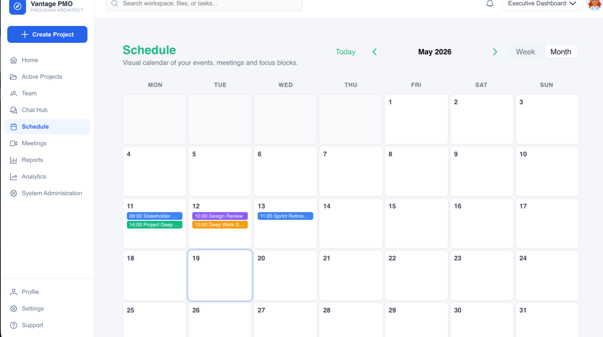
</div>
<div style="text-align:center;">
  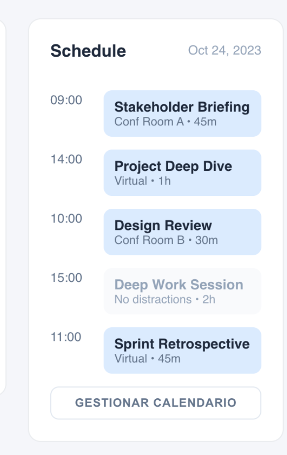
</div>
<div style="text-align:center;">
  
</div>
<div style="text-align:center;">
  
</div>

---

#### 5.2.4.6. Services Documentation Evidence for Sprint Review.
<a id="5-2-4-6-services-documentation-evidence-for-sprint-review"></a>

En este Sprint 4 se documentarán los servicios backend consolidados y optimizados que soportan la lógica de negocio de la plataforma Vantage PMO, enfocándose en la estabilización, refactorización y estandarización de los módulos desarrollados.

La documentación incluirá los endpoints REST finales, los métodos HTTP utilizados, parámetros de entrada y salida, códigos de respuesta, mecanismos de autenticación y consideraciones de seguridad, reflejando el estado maduro de la solución.

Las actividades realizadas durante este sprint incluyen:

* Consolidación y refactorización de servicios REST existentes.
* Optimización de los mecanismos de autenticación y autorización compatibles con el frontend.
* Ajustes y validaciones en la persistencia de datos y modelos de dominio.
* Implementación y mejora de endpoints para la gestión avanzada de proyectos y módulos asociados.
* Integración final entre los módulos frontend y los servicios backend.
* Publicación y validación de la documentación técnica mediante Swagger/OpenAPI en todos los entornos.
* Verificación del consumo correcto de los servicios desde el frontend y control de errores.
* Corrección de incidencias técnicas detectadas en sprints anteriores y preparación para despliegue final.

### Detalle de Servicios Implementados

| Recurso | Acción Implementada | HTTP | URL / Endpoint | Estado |
|----------|----------|----------|----------|----------|
| Render | Base de Datos | https://vantage-pmo.vercel.app/| https://vantage-pmo.vercel.app/ | Activo |

La tabla será actualizada conforme se completen los servicios correspondientes al Sprint 4.

---

#### 5.2.4.7. Software Deployment Evidence for Sprint Review.
<a id="5-2-4-7-software-deployment-evidence-for-sprint-review"></a>

Durante este Sprint se realizarán las actividades necesarias para desplegar los servicios backend y consolidar el entorno de ejecución completo de la plataforma.

Las actividades previstas incluyen:

* Configuración de entornos de desarrollo y producción.
* Despliegue de servicios backend en plataforma cloud.
* Configuración de variables de entorno.
* Integración entre frontend desplegado y backend publicado.
* Validación de disponibilidad y conectividad de los servicios.
* Validación de funcionamiento de los nuevos módulos implementados durante el Sprint 4.
* Pruebas de integración entre ChatHub, gestión de proyectos y servicios backend.

### Evidencias de Despliegue

Se incorporarán capturas de pantalla correspondientes a:

* Plataforma de despliegue backend.
* Configuración de servicios.
* Estado operativo de las APIs.
* Conectividad entre frontend y backend.
* Funcionamiento de ChatHub.
* Funcionamiento de la creación de proyectos.
* Vista de Emprendedor.
* Configuración visual y modo oscuro.
* Evidencias de funcionamiento en ambiente productivo.

Render:
<td><div align="center">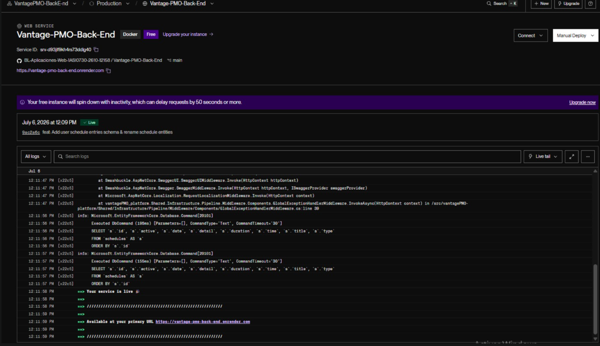</div></td>
<td><div align="center">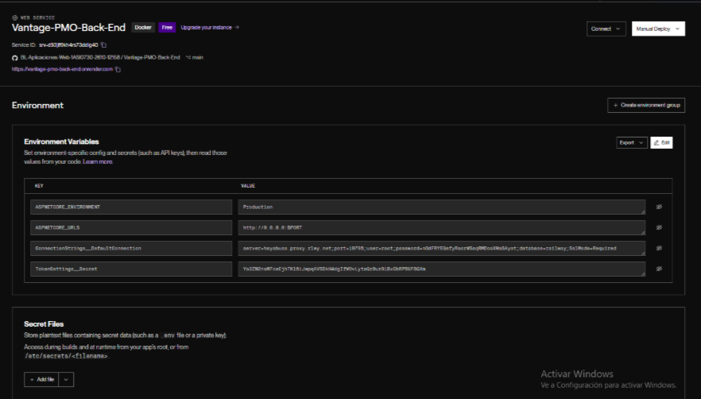</div></td>
<td><div align="center">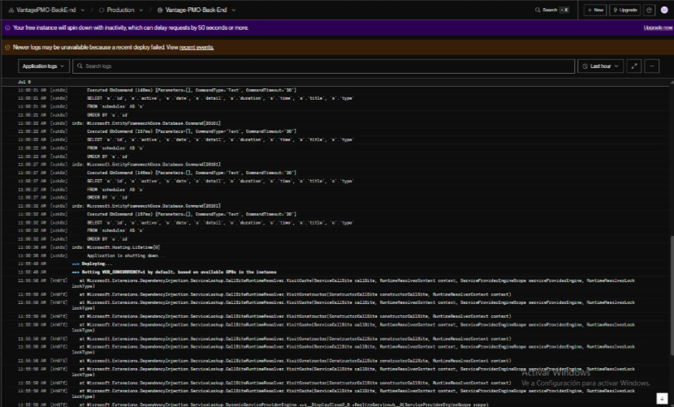</div></td>
<td><div align="center">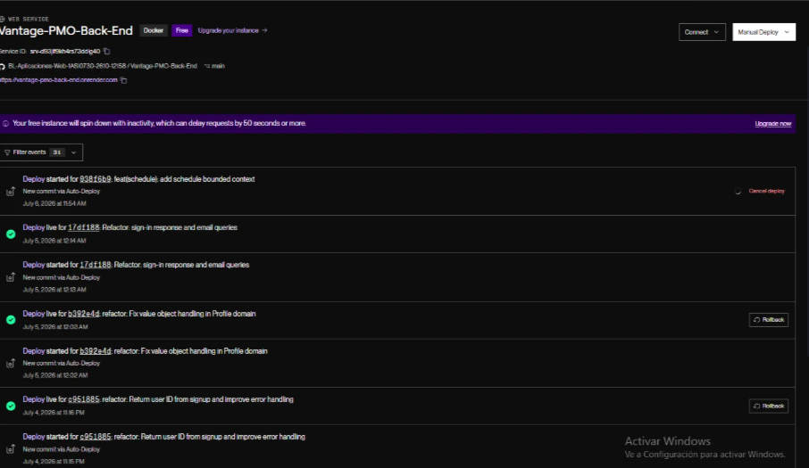</div></td>

MySQL:
<td><div align="center"></div></td>
<td><div align="center"></div></td>
<td><div align="center"></div></td>
<td><div align="center"></div></td>
<td><div align="center"></div></td>
<td><div align="center"></div></td>
<td><div align="center"></div></td>
<td><div align="center"></div></td>

Swagger:
<td><div align="center">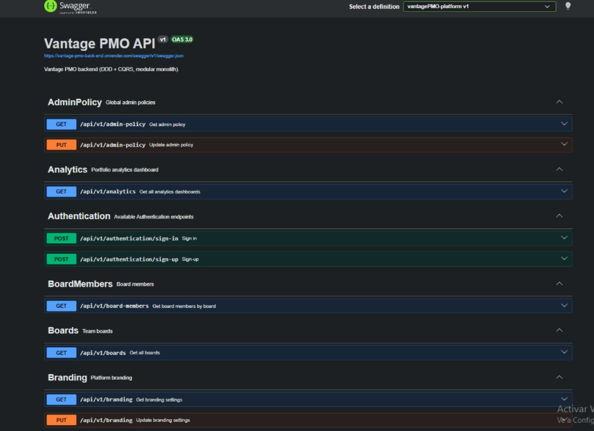</div></td>
<td><div align="center">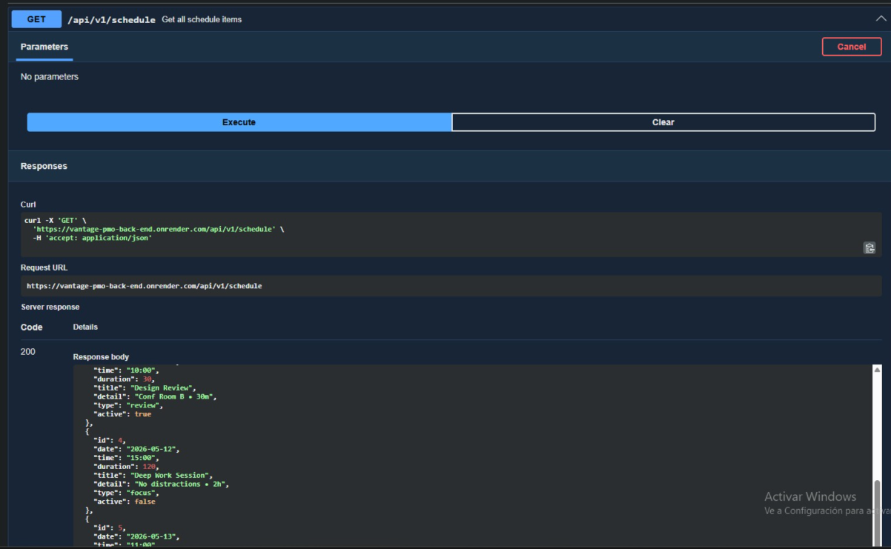</div></td>
<td><div align="center">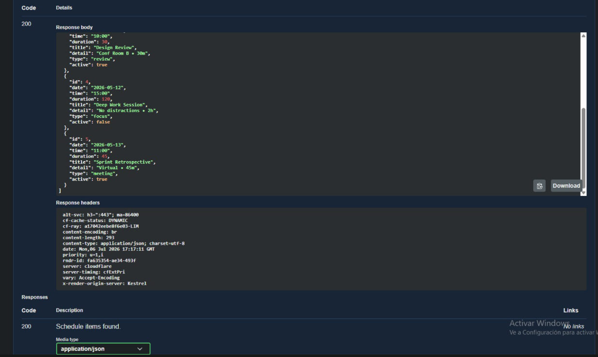</div></td>

---

#### 5.2.4.8.Team Collaboration Insights during Sprint.
<a id="5-2-4-8-team-collaboration-insights-during-sprint"></a>

La ejecución del Sprint 4 estará orientada a la consolidación final, estabilización y cierre técnico de la plataforma, integrando de manera definitiva los servicios backend, los componentes frontend y las actividades de documentación y preparación para entrega académica.

El trabajo colaborativo del equipo se apoyará en los siguientes aspectos:

* **Integración Continua:** Se realizarán integraciones finales entre frontend y backend, verificando la correcta interoperabilidad de los módulos implementados y corrigiendo inconsistencias detectadas en sprints anteriores.
* **Desarrollo Full Stack:** El equipo enfocará sus esfuerzos en la finalización de servicios backend críticos, ajustes de lógica de negocio y validación del consumo de APIs desde los módulos frontend.
* **Gestión de Versiones:** Se mantendrá un control riguroso del código fuente mediante GitHub, merges controlados y revisión de cambios para asegurar estabilidad en la rama principal.
* **Calidad de Software:** Se ejecutarán pruebas funcionales, validaciones de seguridad y verificación de flujos completos para garantizar el correcto funcionamiento de la plataforma.
* **Documentación Técnica:** Se consolidará la documentación final de APIs, arquitectura y despliegue, utilizando Swagger/OpenAPI como referencia principal.
* **Optimización y Corrección Final:** Se realizarán ajustes finales sobre módulos existentes, manejo de errores y configuraciones generales para asegurar una solución coherente y consistente.
* **Comunicación y Coordinación del Equipo:** El equipo continuará utilizando herramientas colaborativas para coordinar actividades, resolver incidencias finales y asegurar el cumplimiento de los objetivos del sprint.

### Analíticos de GitHub — Sprint 4

Las métricas de actividad del repositorio serán incorporadas al finalizar el Sprint 4, incluyendo evidencias de commits, contribuciones individuales, merges y participación de los integrantes del equipo.

<td><div align="center">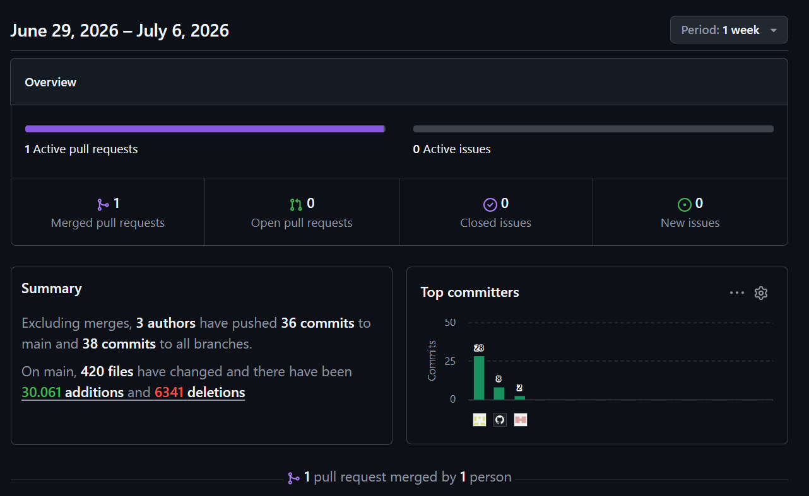</div></td>

| Integrante | Usuario GitHub | Commits |
| :--- | :--- | :---: |
| Quispe Llacsahuanga, César Agusto | user20-bit | 28 |
| Teran Zavala, Mauricio Alejandro | mau-tz | 8 |
| Guillen Giraldo, Mike Dylan | FulLHous | 2 |
| Esquicha Alcántara, Diego Alonso | DiegoEsquich | 0 |
| Rocha Cotrina, Alvaro | alvarorc24 | 0 |

Se espera mantener una participación equilibrada entre todos los integrantes del equipo, fortaleciendo la colaboración y asegurando el cumplimiento de los objetivos establecidos para este sprint.

## 5.3. Validation Interviews
<a id="#53-validation-interviews"></a>
En esta sección se documentan y describen las actividades relacionadas con las entrevistas de validación realizadas a lo largo del desarrollo del proyecto. Estas entrevistas tienen como propósito principal recopilar retroalimentación directa, entender las necesidades y expectativas de los usuarios, y confirmar o descartar las hipótesis planteadas sobre el producto. Para ello, los participantes de ambos segmentos interactuarán tanto con la landing page como con la aplicación web.

### 5.3.1. Diseño de Entrevistas
<a id="(#531-diseño-de-entrevistas)"></a>

**Preguntas Generales**

- Al ingresar a la Landing Page, ¿Qué crees que ofrece Vantage PMO?
- ¿La propuesta de valor presentada en la Landing Page te resulta clara y fácil de comprender? ¿Por qué?
- ¿Consideras que la información mostrada comunica adecuadamente los problemas que busca resolver la plataforma?
- ¿El diseño visual de la Landing Page transmite profesionalismo y confianza para la gestión de proyectos empresariales?
- ¿Te resultó sencillo identificar los principales beneficios de utilizar Vantage PMO?
- Durante la navegación de la plataforma, ¿Encontraste fácilmente las funciones más importantes?
- ¿Qué tan intuitiva te pareció la experiencia general de uso de la plataforma?
- ¿Consideras que la información presentada en los paneles y reportes es fácil de interpretar?
- Después de conocer la Landing Page y utilizar la plataforma, ¿Estarías interesado en utilizar Vantage PMO? ¿Por qué?

**Preguntas Segmento 1 - Líderes y Jefes de Gestión de Proyectos**

- ¿Consideras que Vantage PMO te ayudaría a reducir el tiempo que dedicas actualmente a consolidar información de proyectos?
- ¿Qué tan útil te parece contar con una vista centralizada del estado de múltiples proyectos en tiempo real?
- ¿Crees que la plataforma te permitiría detectar riesgos o desviaciones antes de que se conviertan en problemas mayores?
- ¿La información mostrada en los dashboards te parece suficiente para tomar decisiones rápidas y fundamentadas?
- ¿Qué tan valiosa consideras la integración de métricas, cronogramas y seguimiento de recursos en una sola plataforma?
- ¿Sientes que Vantage PMO podría ayudarte a mejorar la comunicación y coordinación con tu equipo de trabajo?
- ¿Hay alguna funcionalidad que esperabas encontrar para la gestión de proyectos y que no viste reflejada en la plataforma?
- ¿Qué característica de Vantage PMO te llamó más la atención y por qué?
- En una escala del 1 al 10, ¿qué tan probable sería que recomiendes Vantage PMO a otros gestores o líderes de proyectos?

**Preguntas para el Segmento 2 Empresas Medianas y Grandes con Múltiples Portafolios**
- ¿Consideras que Vantage PMO ayudaría a tu organización a obtener una visión más clara del estado de todos sus proyectos?
- ¿Qué tan valioso te parece contar con información consolidada de múltiples proyectos en una sola plataforma?
- ¿Crees que Vantage PMO podría contribuir a reducir sobrecostos o retrasos en la ejecución de proyectos?
- ¿La información presentada en los dashboards ejecutivos resulta útil para la toma de decisiones gerenciales?
- ¿Consideras que la plataforma facilitaría el control y la asignación eficiente de recursos compartidos entre distintos proyectos?
- ¿Qué tan importante consideras la capacidad de identificar riesgos y alertas de manera temprana dentro de la organización?
- ¿Ves a Vantage PMO como una solución viable para mejorar la gobernanza y el control de los proyectos corporativos?
- ¿Qué mejoras o funcionalidades adicionales agregarías para que la plataforma se adapte mejor a las necesidades de tu empresa?

### 5.3.2. Registro de Entrevistas

En esta sección presentaremos el registro de cada entrevista de validación que hemos realizado para cada segmento objetivo de nuestro proyecto.

**Segmento 1 - Líderes y Jefes de Gestión de Proyectos**

<table>
<tr>
<th colspan="2">Entrevista #1</th>
</tr>
<tr>
<td><b>Nombre</b></td>
<td>Gustabo</td>
</tr>
<tr>
<td><b>Apellidos</b></td>
<td>Pomassonco Arrelucea</td>
</tr>
<tr>
<td><b>Edad</b></td>
<td>30 años</td>
</tr>
<tr>
<td><b>Distrito</b></td>
<td>Chorrillos</td>
</tr>
<tr>
<td><b>Aplicaciones Usadas</b></td>
<td>WhatsApp, Google Drive, Google Meet, Microsoft Stream</td>
</tr>
<tr>
<td><b>Motivación</b></td>
<td>Gustabo se muestra motivado por la claridad de la propuesta de valor presentada en la landing page, ya que considera que comunica de manera directa los problemas principales de la gestión de proyectos, como la falta de visibilidad, el control limitado y la necesidad de estandarización, explicando de forma comprensible cómo la plataforma los soluciona.</td>
</tr>
<tr>
<td><b>Frustración</b></td>
<td>Una de las principales frustraciones de Gustabo es la falta de mayor visibilidad y anticipación en las alertas tempranas. Aunque reconoce que existen indicadores, considera que podrían destacarse más para permitir una identificación aún más rápida de los riesgos críticos.
Otra frustración identificada es la poca notoriedad de los accesos secundarios dentro de la plataforma. Gustavo percibe que algunas funcionalidades importantes no están suficientemente resaltadas, lo que podría afectar la eficiencia en la navegación para usuarios que buscan acciones específicas con rapidez.</td>
</tr>
	<tr>
    <td>Evidencia</td>
    <td><div align="center">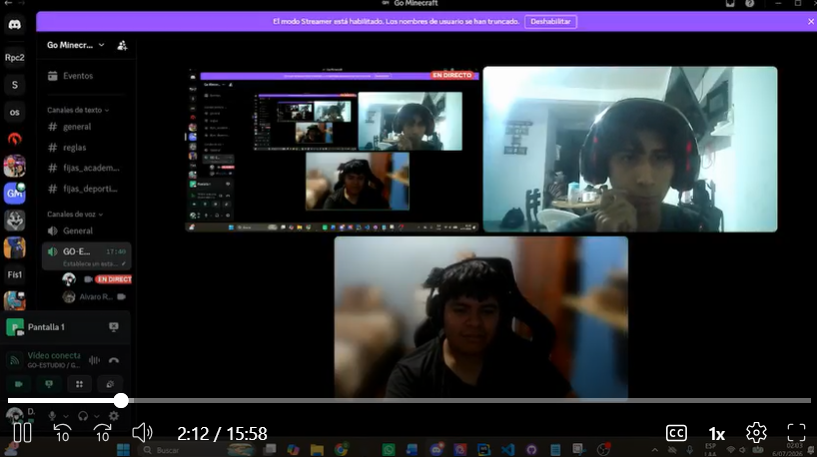</div></td>
  </tr>
<tr>
	 <tr>
    <td>Link</td>
   <td>
		<p><a target="_blank"  href="https://upcedupe-my.sharepoint.com/:v:/g/personal/u202411799_upc_edu_pe/IQAS_mf1QAPsTZ8WKFkZHOuHAdcfCka2uuMQcdGn-qHAz0E?nav=eyJyZWZlcnJhbEluZm8iOnsicmVmZXJyYWxBcHAiOiJTdHJlYW1XZWJBcHAiLCJyZWZlcnJhbFZpZXciOiJTaGFyZURpYWxvZy1MaW5rIiwicmVmZXJyYWxBcHBQbGF0Zm9ybSI6IldlYiIsInJlZmVycmFsTW9kZSI6InZpZXcifX0%3D&e=AwyOKC">Microsoft Stream</p>
	</td>
  </tr>
  <tr>
    <td>Duracion</td>
   <td>
		0: 00 min - 15: 58 min
	</td>
  </tr>
  <tr>
<td><b>Resumen</b></td>
<td>Gustabo percibe a Vantage PMO como una solución altamente efectiva para líderes y jefes de gestión de proyectos, destacando su propuesta de valor clara, su diseño profesional y su experiencia de uso intuitiva. Valora especialmente la centralización de información, la visualización clara de métricas, cronogramas y recursos, así como la capacidad de detectar riesgos y tomar decisiones rápidas y fundamentadas. Si bien identifica oportunidades de mejora relacionadas con la visibilidad de las alertas tempranas y el destaque de accesos secundarios, considera que la plataforma cubre gran parte del trabajo que actualmente se realiza de forma manual, razón por la cual la califica con un alto nivel de recomendación.</td>
</tr>
</table>

<table>
<tr>
<th colspan="2">Entrevista #2</th>
</tr>
<tr>
<td><b>Nombre</b></td>
<td>Diana</td>
</tr>
<tr>
<td><b>Apellidos</b></td>
<td>Li Gayoso</td>
</tr>
<tr>
<td><b>Edad</b></td>
<td>30 años</td>
</tr>
<tr>
<td><b>Distrito</b></td>
<td>Chorrillos</td>
</tr>
<tr>
<td><b>Aplicaciones Usadas</b></td>
<td>WhatsApp, Google Drive, Google Meet, Microsoft Stream</td>
</tr>
<tr>
<td><b>Motivación</b></td>
<td>Diana se muestra motivada por la propuesta de Vantage PMO como una plataforma que centraliza la gestión de proyectos y permite monitorear el avance en tiempo real. Considera que esta centralización responde a una necesidad frecuente en su trabajo, ya que reduce la dispersión de la información y facilita la toma de decisiones mediante indicadores y reportes claros.</td>
</tr>
<tr>
<td><b>Frustración</b></td>
<td>Una de las principales frustraciones de Diana es la necesidad de complementar la información de los dashboards con reportes más detallados cuando se requiere un análisis profundo. Aunque considera que los paneles son suficientes para el seguimiento diario, percibe una oportunidad de mejora en la profundidad analítica para ciertos casos. Diana considera que la plataforma tiene mucho potencial, pero que podría adaptarse aún mejor a las necesidades específicas de distintas organizaciones si se amplían estas capacidades.</td>
</tr>
	<tr>
    <td>Evidencia</td>
    <td><div align="center">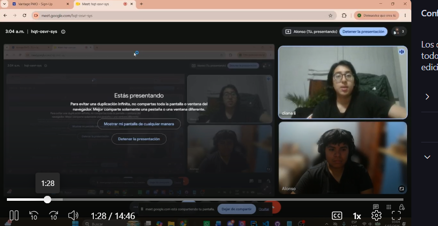</div></td>
  </tr>
<tr>
	 <tr>
    <td>Link</td>
   <td>
		<p><a target="_blank"  href="https://upcedupe-my.sharepoint.com/:v:/g/personal/u202411799_upc_edu_pe/IQBKw0WeEB0qQZyRdTaD_TqnAY9MEfTVihAbd6gMHNV-t74?nav=eyJyZWZlcnJhbEluZm8iOnsicmVmZXJyYWxBcHAiOiJTdHJlYW1XZWJBcHAiLCJyZWZlcnJhbFZpZXciOiJTaGFyZURpYWxvZy1MaW5rIiwicmVmZXJyYWxBcHBQbGF0Zm9ybSI6IldlYiIsInJlZmVycmFsTW9kZSI6InZpZXcifX0%3D&e=rcjM9a">Microsoft Stream</p>
	</td>
  </tr>
  <tr>
    <td>Duracion</td>
   <td>
		0: 00 min - 14:46 min
	</td>
  </tr>
  <tr>
<td><b>Resumen</b></td>
<td>Diana percibe a Vantage PMO como una plataforma con alto potencial para organizaciones que gestionan múltiples proyectos de manera simultánea, destacando su capacidad para centralizar información, ofrecer una vista consolidada en tiempo real y reducir el tiempo dedicado al seguimiento manual. Valora positivamente la claridad de la propuesta de valor, el diseño profesional y la experiencia de uso intuitiva, así como la integración de métricas, cronogramas y recursos en una sola herramienta.</td>
</tr>
</table>

**Segmento 2 Empresas Medianas y Grandes con Múltiples Portafolios**

<table>
<tr>
<th colspan="2">Entrevista #1</th>
</tr>
<tr>
<td><b>Nombre</b></td>
<td>Italo</td>
</tr>
<tr>
<td><b>Apellidos</b></td>
<td>Pancorbo Amoros</td>
</tr>
<tr>
<td><b>Edad</b></td>
<td>30 años</td>
</tr>
<tr>
<td><b>Distrito</b></td>
<td>Chorrillos</td>
</tr>
<tr>
<td><b>Aplicaciones Usadas</b></td>
<td>WhatsApp, Google Drive, Google Meet, Microsoft Stream</td>
</tr>
<tr>
<td><b>Motivación</b></td>
<td>Italo se siente motivado por la posibilidad de contar con una visión clara y consolidada del estado de todos los proyectos dentro de una sola plataforma. Considera que los reportes y las analíticas de Vantage PMO le permiten comprender la información desde un enfoque numérico y estadístico, lo que facilita una toma de decisiones más informada a nivel gerencial, Italo encuentra valor en la posibilidad de comparar proyectos y gestionar recursos compartidos de manera más eficiente.</td>
</tr>
<tr>
<td><b>Frustración</b></td>
<td>Una de las principales frustraciones de Italo es la falta de mayor visibilidad y anticipación en las alertas tempranas. Aunque reconoce que la funcionalidad existe, considera que podría reforzarse para que los usuarios identifiquen con mayor rapidez los posibles riesgos.
También manifiesta frustración respecto a la jerarquía visual de los puntos críticos dentro de la plataforma. Percibe que ciertos elementos importantes no destacan lo suficiente y sugiere que podrían enfatizarse más mediante cambios en tamaño, posición o diseño visual.</td>
</tr>
	<tr>
    <td>Evidencia</td>
    <td><div align="center">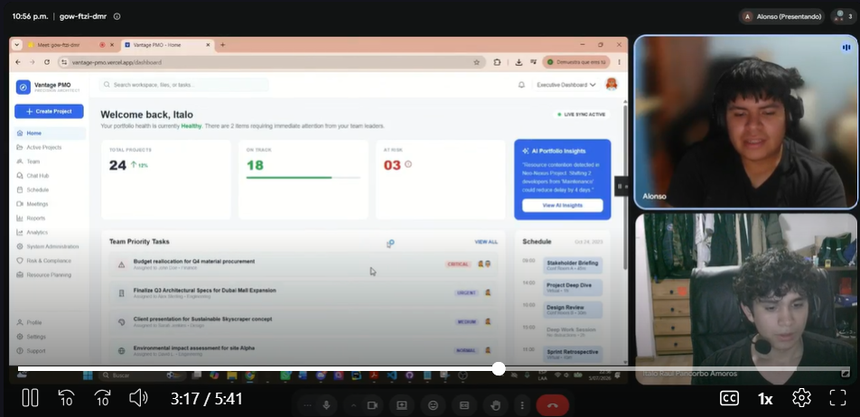</div></td>
  </tr>
<tr>
	 <tr>
    <td>Link</td>
   <td>
		<p><a target="_blank"  href="https://upcedupe-my.sharepoint.com/:v:/g/personal/u202411799_upc_edu_pe/IQDd1l9V3zXbS4eNwmDruChQAeHnHAy3OL-k5D0LaChVkqs?e=gt3aAW&nav=eyJyZWZlcnJhbEluZm8iOnsicmVmZXJyYWxBcHAiOiJTdHJlYW1XZWJBcHAiLCJyZWZlcnJhbFZpZXciOiJTaGFyZURpYWxvZy1MaW5rIiwicmVmZXJyYWxBcHBQbGF0Zm9ybSI6IldlYiIsInJlZmVycmFsTW9kZSI6InZpZXcifX0%3D">Microsoft Stream</p>
	</td>
  </tr>
  <tr>
    <td>Duracion</td>
   <td>
		0: 00 min - 5:41 min
	</td>
  </tr>
  <tr>
<td><b>Resumen</b></td>
<td>El entrevistado percibe a Vantage PMO como una plataforma sólida y viable para mejorar la gestión, gobernanza y control de proyectos dentro de una organización, destacando especialmente la integración de reportes, analíticas, control financiero, comunicación y gestión de riesgos en un solo sistema. Valora la capacidad de la herramienta para ofrecer una visión consolidada y comparativa de múltiples proyectos, lo que facilita la toma de decisiones gerenciales y la asignación eficiente de recursos. No obstante, identifica oportunidades de mejora relacionadas principalmente con la visibilidad de las alertas tempranas, la jerarquía visual de los puntos críticos y el resaltado de accesos secundarios, aspectos que, de optimizarse, podrían fortalecer aún más la experiencia del usuario y el enfoque preventivo de la plataforma.</td>
</tr>
</table>


<table>
<tr>
<th colspan="2">Entrevista #2</th>
</tr>
<tr>
<td><b>Nombre</b></td>
<td>Santiago</td>
</tr>
<tr>
<td><b>Apellidos</b></td>
<td>García Calderón</td>
</tr>
<tr>
<td><b>Edad</b></td>
<td>30 años</td>
</tr>
<tr>
<td><b>Distrito</b></td>
<td>Chorrillos</td>
</tr>
<tr>
<td><b>Aplicaciones Usadas</b></td>
<td>WhatsApp, Google Drive, Google Meet, Microsoft Stream</td>
</tr>
<tr>
<td><b>Motivación</b></td>
<td>Santiago manifiesta interés en utilizar plataformas que le permitan organizar su trabajo de manera eficiente y centralizada. Valora especialmente aquellas herramientas que presentan una interfaz intuitiva y visualmente clara, ya que esto le facilita identificar rápidamente las funcionalidades disponibles y comprender el estado de sus actividades. Asimismo, se siente motivado por soluciones digitales que optimizan la comunicación y el seguimiento de tareas, permitiéndole tomar decisiones oportunas y reducir el tiempo invertido en procesos manuales o desorganizados.</td>
</tr>
<tr>
<td><b>Frustración</b></td>
<td>Una de las principales frustraciones de Santiago es la falta de alertas tempranas claras que le permitan anticiparse a problemas o retrasos dentro de un proyecto. Considera que, cuando una plataforma no comunica de forma oportuna los riesgos o incidencias, se dificulta la toma de precauciones necesarias. Además, menciona que en algunas herramientas la información puede estar dispersa o poco destacada, lo que genera confusión y retrasa la identificación de aspectos críticos que requieren atención inmediata.</td>
</tr>
	<tr>
    <td>Evidencia</td>
    <td><div align="center">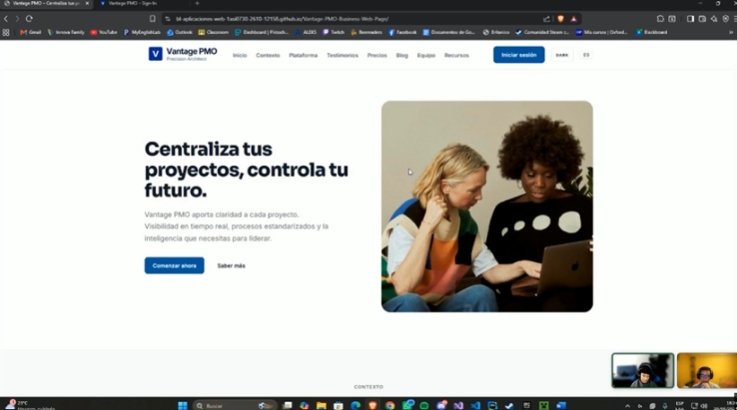</div></td>
  </tr>
<tr>
	 <tr>
    <td>Link</td>
   <td>
		<p><a target="_blank"  href="https://upcedupe-my.sharepoint.com/:v:/g/personal/u202411799_upc_edu_pe/IQBGvGy-lhHSRY-o5xqiBNvvAdFG3hWV6BXUJtAc3ienI2A?e=sVUIwW&nav=eyJyZWZlcnJhbEluZm8iOnsicmVmZXJyYWxBcHAiOiJTdHJlYW1XZWJBcHAiLCJyZWZlcnJhbFZpZXciOiJTaGFyZURpYWxvZy1MaW5rIiwicmVmZXJyYWxBcHBQbGF0Zm9ybSI6IldlYiIsInJlZmVycmFsTW9kZSI6InZpZXcifX0%3D">Microsoft Stream</p>
	</td>
  </tr>
  <tr>
    <td>Duracion</td>
   <td>
		0: 00 min - 19: 05 min
	</td>
  </tr>
  <tr>
<td><b>Resumen</b></td>
<td>El entrevistado manifestó que la plataforma evaluada resulta fácil de usar debido a que las herramientas son sencillas de identificar y la interfaz se percibe intuitiva, ordenada y visualmente pulida. Destacó que la navegación es fluida, lo que permite desplazarse entre las distintas secciones sin generar confusión, y que la información presentada es clara y fácil de entender, tanto en su contenido textual como visual. No obstante, señaló como aspecto de mejora la necesidad de implementar alertas tempranas más visibles y oportunas, ya que considera fundamental contar con notificaciones que permitan anticiparse a posibles riesgos o problemas y tomar decisiones preventivas de manera eficiente.</td>
</tr>
</table>

### 5.3.3. Evaluaciones según heurísticas

## UX Heuristics & Principles Evaluation

**Usability – Inclusive Design – Information Architecture**

| Campo | Detalle |
|---|---|
| **CARRERA** | Ingeniería de Software |
| **CURSO** | Aplicaciones Web |
| **SECCIÓN** | 12158 |
| **PROFESOR** | Villafuerte Bazán, Oscar Ivan |
| **AUDITOR** | MDEPS |
| **CLIENTE(S)** | Diana, Santiago, Italo y Gustabo |

**SITE o APP A EVALUAR:** Vantage PMO

---

### TAREAS A EVALUAR

El alcance de esta evaluación incluye la revisión de la usabilidad de las siguientes tareas:

- Identificación y uso de herramientas principales del sistema.
- Navegación entre módulos del dashboard
- Comprensión de la información visual presentada
- Visualización de alertas y notificaciones del sistema
- Interpretación del estado de proyectos y riesgos

No están incluidas en esta versión de la evaluación las siguientes tareas:

- Configuración avanzada de notificaciones
- Gestión de permisos por roles
- Integraciones externas avanzadas
---

### ESCALA DE SEVERIDAD

Los errores serán puntuados tomando en cuenta la siguiente escala de severidad:

| Nivel | Descripción |
|---|---|
| 1 | Problema superficial: puede ser fácilmente superado por el usuario. |
| 2 | Problema menor: genera cierta fricción, pero no impide el uso del sistema. |
| 3 | Problema mayor: afecta la toma de decisiones o genera confusión frecuente. |
| 4 | Problema crítico: impide continuar con el uso del sistema. |
---

### TABLA RESUMEN

| # | Problema | Escala de severidad | Heurística/Principio violada(o) |
|---|---|---|---|
| 1 | Las alertas tempranas no son lo suficientemente visibles ni oportunas para anticipar riesgos del proyecto. | 3 | Usability: Visibilidad del estado del sistema |
| 2 | La información visual es clara, pero podría reforzarse la jerarquía visual en indicadores críticos. | 2 | Information Architecture: Jerarquía visual |
| 3 | La navegación es fluida e intuitiva, aunque algunos accesos secundarios no están claramente destacados. | 1 | Usability: Reconocimiento antes que recuerdo |

---

### DESCRIPCIÓN DE PROBLEMAS

**PROBLEMA #1:** Falta de visibilidad y anticipación en alertas tempranas

**Severidad:** 3

**Heurística violada:** Usability – Visibilidad del estado del sistema

**Problema:**
Durante la entrevista, el usuario indicó que la plataforma es intuitiva, ordenada y fácil de comprender; sin embargo, resaltó que las alertas tempranas no se perciben con suficiente claridad ni prioridad visual. Esto dificulta la identificación rápida de riesgos o desviaciones en los proyectos, lo que puede afectar la toma de decisiones preventivas. La ausencia de señales visuales más destacadas puede ocasionar que el usuario reaccione de forma tardía ante problemas críticos.

**Recomendación:**
Mejorar la visibilidad de las alertas tempranas mediante el uso de colores de alta prioridad, íconos diferenciados y notificaciones contextuales en el dashboard principal. Asimismo, se recomienda clasificar las alertas por nivel de criticidad para facilitar una respuesta rápida y efectiva.

**PROBLEMA #2:** Jerarquía visual limitada en indicadores críticos

**Severidad: 2**

**Heurística violada:** Information Architecture – Jerarquía visual

**Problema:**
Si bien el entrevistado destacó que la información visual es clara y fácil de entender, algunos indicadores clave (estado del proyecto, riesgos, progreso) no resaltan lo suficiente frente a otros elementos del dashboard. Esto puede generar que el usuario invierta más tiempo en identificar información crítica.

**Recomendación:**
Reforzar la jerarquía visual utilizando tamaños de fuente diferenciados, contrastes de color y agrupación visual de indicadores clave, permitiendo que la información más relevante sea identificada de forma inmediata.

**PROBLEMA #3:** Accesos secundarios poco destacados

**Severidad:** 1

**Heurística violada:** Usability – Reconocimiento antes que recuerdo

**Problema:**
Aunque la navegación general fue descrita como fluida e intuitiva, algunos accesos secundarios no son inmediatamente reconocibles, lo que puede requerir exploración adicional por parte del usuario, especialmente en usuarios nuevos.

**Recomendación:**
Agregar etiquetas claras, íconos representativos o ayudas visuales que faciliten el reconocimiento inmediato de accesos secundarios sin afectar la simplicidad de la interfaz.
</div>

## 5.4. Video About-the-Product

| Título del Video      | Vantage PMO Product           | 
|-----------------------|------------------------------|
| Duración              | 1 minuto y 13 segundos       |  
| Fecha de Grabación    | 21/06/2026                   | 
| URL YouTube           | https://youtu.be/Vo4ptRyBrpw | 
| URL Microsoft Stream  | https://upcedupe-my.sharepoint.com/:v:/g/personal/u202411799_upc_edu_pe/IQCfF_HLycdKTZe-pKjjZldSAXqTAfaEkIG8ShXEr4HkNY4?nav=eyJyZWZlcnJhbEluZm8iOnsicmVmZXJyYWxBcHAiOiJPbmVEcml2ZUZvckJ1c2luZXNzIiwicmVmZXJyYWxBcHBQbGF0Zm9ybSI6IldlYiIsInJlZmVycmFsTW9kZSI6InZpZXciLCJyZWZlcnJhbFZpZXciOiJNeUZpbGVzTGlua0NvcHkifX0&e=JJKd1a |

