# Product Implementation, Validation & Deployment

## 5.1. Software Configuration Management
<a id="5-1-software-configuration-management"></a>

### 5.1.1. Software Development Environment Configuration
<a id="5-1-1-software-development-environment-configuration"></a>

A continuación, se listan las herramientas y estándares adoptados por el equipo para el desarrollo colaborativo del sistema:

| Actividad               | Herramienta / Guía | Propósito                                                                    | Tipo de acceso / Ruta     |
| ----------------------- | --------------------------------------------------------------------------------------------------------------------------------------------------------------------------------- | ----------------------------------------------------------------------------- | ------------------------------------------------------------------------------------------------------------------------------------------------------------------------------------------------------------------- |
| Project Management      | Trello Software   | Seguimiento de backlog, tareas y sprints.                                     | SaaS –[https://trello.com/](https://trello.com/software/jira)          |
| Requirements Management | Gherkin Conventions   | Escritura legible de requisitos con formato Given/When/Then.                  | [https://cucumber.io/docs/gherkin/](https://cucumber.io/docs/gherkin/)          |
| Product UX/UI Design    | Figma   | Prototipos y diseño responsive.                                              | SaaS –[https://figma.com](https://figma.com)     |
| Landing Page             | HTML, CSS, JavaScript, Vue     | Construcción de la interfaz web.                                             | [https://vuejs.org/guide/introduction.html](https://vuejs.org/guide/introduction.html)       |
| User Personas, Empathy Journey Mapping, Impact Mapping   | UXPressia                | Es una herramienta en línea para el mapeo de la trayectoria del cliente que crea mapas de impacto y personas.    | [https://uxpressia.com/](https://uxpressia.com/)        |
| Class Diagram and Database Diagram  | LucidChart | Organización y modelado de las tablas y entidades del proyecto.         | [https://www.lucidchart.com/](https://www.lucidchart.com/)                                                                            |
| Code Standards          | Google HTML/CSS Style Guide, Vue Style Guide, MDN Guidelines, W3C JavaScript Style Guide, Google JavaScript Style Guide, C# Coding Conventions, Microsoft ASP.NET Core Guidelines | Aplicación de buenas prácticas de desarrollo en frontend y backend.         | [https://developer.mozilla.org/](https://developer.mozilla.org/) / [https://learn.microsoft.com/en-us/dotnet/csharp/fundamentals/coding-style](https://learn.microsoft.com/en-us/dotnet/csharp/fundamentals/coding-style) |
| Version Control         | Git + GitHub     | Control de versiones y trabajo colaborativo.                                  | SaaS –[https://github.com](https://github.com)  |
| Software Deployment     | Github pages   | Despliegue continuo de la aplicación para ambientes de prueba y validación. | SaaS –[https://railway.app](https://railway.app) / [https://render.com](https://render.com)  |
| Upgrade of Branches and Commits | Visual Studio Code | Optimización y documentación del proyecto asimismo el trabajo colaborativo. |[https://code.visualstudio.com/](https://code.visualstudio.com/)  |
| EventStorming | Miro | Herramienta colaborativa grupal que permitio diseñar mejor algunos puntos del trabajo. |[https://miro.com/es/](https://miro.com/es/)  |

<div style="text-align: left; max-width: 900px; margin: 0 auto;">

### 5.1.2. Source Code Management
<a id="5-1-2-source-code-management"></a>

Para la gestión del código del proyecto, el equipo adoptó una estrategia simplificada en lugar de implementar completamente el modelo Git Flow. Se trabajó principalmente sobre una rama principal (main), la cual contiene la versión estable y actual del sistema en desarrollo. 

Adicionalmente, se crearon algunas ramas específicas organizadas por capítulos del proyecto. Estas ramas permitieron desarrollar avances de manera más ordenada antes de integrarlos a la rama principal, sin llegar a una estructura compleja de múltiples ramas por funcionalidades o versiones. 

Todas las funcionalidades y mejoras fueron finalmente integradas en la rama main, asegurando que esta siempre represente el estado más actualizado del proyecto. Este enfoque, aunque más sencillo que Git Flow, resultó adecuado para el alcance del trabajo, ya que facilitó el control del progreso sin generar una sobrecarga en la gestión de ramas.

 Por otro lado, se utilizó GitHub como repositorio central del proyecto, aprovechando también herramientas como GitHub Pages para la visualización del Landing Page. Esto permitió desplegar rápidamente los avances en formato web y contar con una versión accesible del sistema de manera ágil y eficiente.

---

**Landing Page — GitHub Pages**

Enlace de despliegue: 


**Landing Page — Repositorio GitHub**

Enlace del repositorio: https://github.com/BL-Aplicaciones-Web-1ASI0730-2610-12158/Vantage-PMO-Business-Web-Page

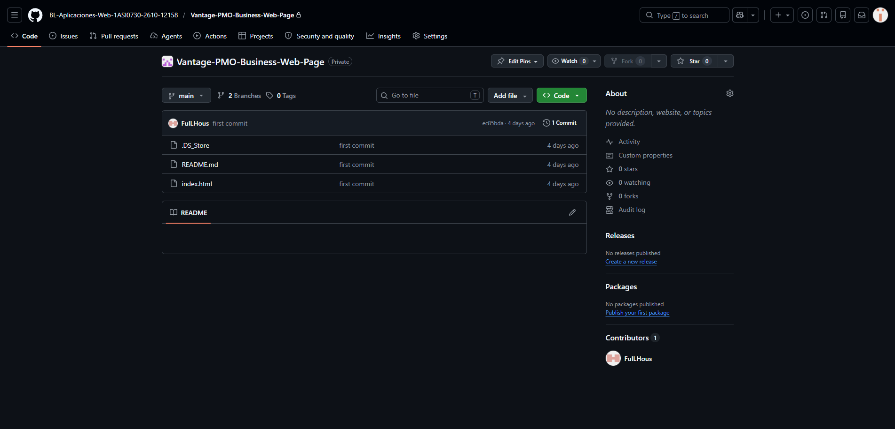

### Versionado Semántico

Se aplicará el esquema de **Semantic Versioning 2.0.0**, con el siguiente formato:

- **MAJOR**: Incompatibilidades en la API.
- **MINOR**: Nuevas funcionalidades sin romper compatibilidad.
- **PATCH**: Correcciones de errores menores y ajustes sin afectar funcionalidades.

_Ejemplo de versión:_ `v1.3.4`

### Convenciones de Commits

Se adoptará el estándar de **Conventional Commits** para la redacción de los mensajes de commit, lo cual permitirá estructurar mejor los cambios realizados. Este enfoque facilita la automatización de procesos como la integración continua y la generación de historiales de cambios (changelogs).

**Ejemplos:**

- `feat: add project creation form`
- `fix: resolve error in task assignment module`
- `docs: update user stories and diagrams`
- `chore: update dependencies`
### 5.1.3. Source Code Style Guide & Conventions
<a id="5-1-3-source-code-style-guide-conventions"></a>

El código desarrollado por los miembros del equipo esté completamente redactado en inglés.

## **HTML**

* **Use Lowercase Element Names**: Se recomienda utilizar minúsculas para todos los elementos HTML.
```html
<section class="hero">
<h1>Centralize your projects</h1>
</section>

**Close All HTML Elements**: Todos los elementos deben cerrarse correctamente para evitar errores de renderizado.
```html
<p>Centralize your projects, control your future.</p>

<a href="#Contact">Solicitar demo</a>
```

**Use Lowercase Attribute Names**: Los atributos deben escribirse en minúsculas.

```html
<input type="email" placeholder="tu@correo.com" id="fe"/>
```
**Use Semantic HTML Elements**: Se deben utilizar etiquetas semánticas para mejorar la estructura y accesibilidad.

```html
<nav>...</nav>
<section id="funciones">...</section>
<footer>...</footer>
```

**Use Descriptive IDs and Classes**: Los nombres deben ser claros y representar su función.
```html
<section id="contact">
  <div class="contact-form">
```
## **CSS**

**Use Kebab-Case for Class Names**: Las clases deben escribirse en minúsculas separadas por guiones.
```css
.contact-form {
  display: flex;
}
```
**Use CSS Variables for Colors**: Se deben definir colores reutilizables en :root.
```css
:root {
  --blue: #1E40AF;
  --navy: #0F172A;
}
```
**Group Styles by Sections**: El código CSS debe organizarse por secciones del sitio.
```css
/* NAV */
nav { ... }
/* HERO */
.hero { ... }
/* FOOTER */
footer { ... }
```
**Use Consistent Spacing**: Se debe mantener consistencia en márgenes, padding y alineación.
```css
.section {
  padding: 6rem 2rem;
}
```
**Responsive Design with Media Queries**: Se deben usar breakpoints para adaptar la interfaz.
```css
@media (max-width: 600px) {
  .hero {
    padding: 4rem 1rem;
  }
}
```
## **JavaScript**

**Use CamelCase for Variables and Functions**: Las variables y funciones deben usar camelCase.
```js
function sendForm() {
  const userName = document.getElementById('fn').value;
}
```
**Keep Functions Simple and Clear**: Las funciones deben ser cortas y fáciles de entender.
```js
if (!n || !e) {
  alert('Por favor completa tu nombre y correo.');
  return;
}
```

**Use Meaningful Variable Names**: Los nombres deben representar su propósito.
```js
const navLinks = document.getElementById('navLinks');
const hamburger = document.getElementById('hamburger');
```
**Avoid Inline JavaScript**: Se recomienda mantener la lógica separada del HTML.
```js
< button onclick="sendForm()">Enviar</ button>
```
### 5.1.4. Software Deployment Configuration

<a id="5-1-4-software-deployment-configuration"></a>

Para la Landing Page desarrollada en HTML, CSS y JavaScript, la configuración del despliegue en GitHub Pages se define de la siguiente manera:

Repositorio de Código Fuente

Se debe crear un repositorio en GitHub y subir todos los archivos del proyecto (HTML, CSS, JS). Es obligatorio que el archivo index.html esté ubicado en la raíz del repositorio para poder realizar el despliegue correctamente.


## 5.2. Landing Page, Services & Applications Implementation.
<a id="5-2-landing-page-services-applications-implementation"></a>
### 5.2.1. Sprint 1
<a id="5-2-1-sprint-1"></a>
##### 5.2.1.1. Sprint Planning 1
<a id="5-2-1-1-sprint-planning-1"></a>
En esta sección, se presentará la planificación de nuestro Sprint 1.

| **Sprint #** |                 **Sprint 1**              |
|--------------|-------------------------------------------|
|**Sprint Planning Background**                            |
| Date         | 2026/04/15                                |
| Time         | 16:00 pm                                  |
| Location     | Reunión virtual mediante discord          |
| Prepared By  | Esquicha Alcántara, Diego Alonso          |
| Attendees    |Rocha Cotrina, Alvaro / Esquicha Alcántara, Diego Alonso / Quispe llacsahuanga, César Agusto / Guillen Giraldo, Mike Dylan / Teran Zavala, Mauricio Alejandro|
| Sprint n-1 Review Summary |  No aplica                   |
| Sprint n-1 Retrospective Summary |  No aplica            |
| **Sprint Goal & User Stories**                           |
|**Sprint 1**  |Nos enfocamos en implementar la estructura principal y las funcionalidades clave de la plataforma de presentación y acceso de Vantage PMO. Creemos que esto aportará una percepción más sólida del producto y despertará un mayor interés entre los líderes de proyectos y empresarios corporativos, al comunicar de forma clara el valor de la gestión centralizada y la gobernanza de portafolios. Esto se confirmará cuando los usuarios potenciales puedan navegar de manera fluida por la interfaz inicial, comprendan fácilmente cómo la solución optimiza la supervisión de múltiples proyectos y muestren una clara intención de interactuar con el sistema o gestionar sus credenciales de acceso.|
| Sprint 1 Velocity   | 18  Story Points                   |
| Sum of Story Points | 18  Story Points                   |

##### 5.2.1.2. Aspect Leaders and Collaborators
<a id="5-2-1-2-aspect-leaders-and-collaborators"></a>
En el marco del Sprint 1, se han priorizado los componentes fundamentales del sistema, centrando los esfuerzos en la entrega de funcionalidades críticas: la visualización de información estratégica, una arquitectura de navegación intuitiva, el diseño responsivo de la interfaz y el flujo de seguridad para la autenticación de usuarios.

A fin de garantizar la trazabilidad y una ejecución coordinada, se ha implementado la Matriz de Liderazgo y Colaboración (LACX). En esta herramienta de gestión, se han designado responsables de liderazgo (L) y equipos de apoyo (C) para cada área técnica, optimizando así la sinergia y la calidad de los entregables

| Team Member (Last Name, First Name) | GitHub Username    | Hero | Pillars | Platform  | Features | Ai | About | Onboarding | Testimonials | Blog
| :---------------------------------- | :----------------- | :--------------------- | :------- | :------- | :----------- | :------------------- | :---------------- | :---------------- | :---------------- | :------------------
| Rocha Cotrina, Alvaro | alvarorc24     | L                      | C        | C        | C            | L                   | C | C   | C| C
| Esquicha Alcántara, Diego Alonso    | DiegoEsquich          | C                      | L        | C        | C            | C                   | L   | C| C| C
| Quispe llacsahuanga, César Agusto | user20-bit        | C                      | C        | L        | C            |    C   | C| L| C| C                  |
| Guillen Giraldo, Mike Dylan       | FulLHous          | C                      | C        | C        | L            | C                    |C| C| L| C  
| Teran Zavala, Mauricio Alejandro    | mau-tz | C                      | C        | C        | C            | L                    |C| C| C| L

##### 5.2.1.3. Sprint Backlog 1
<a id="5-2-1-3-sprint-backlog-1"></a>

El objetivo principal de este sprint consiste en establecer el núcleo funcional y de confianza de la plataforma Vantage PMO, transformando la Landing Page de un sitio informativo en una herramienta interactiva, segura y profesional. Para lograrlo, el equipo se enfocará en consolidar un sistema de autenticación robusto que no solo gestione el acceso, sino que cumpla estrictamente con los estándares legales de privacidad e internacionalización (i18n), eliminando barreras de entrada para mercados globales. Asimismo, se busca potenciar el compromiso del usuario mediante la implementación de un simulador de marca interactivo y un dashboard de portafolio dinámico, desarrollados bajo principios avanzados de UX y Branding para tangibilizar el valor del producto a través de recursos multimedia y micro-interacciones. Finalmente, se garantizará una experiencia de navegación omnicanal y de alto rendimiento mediante un diseño responsivo impecable y la integración de un sistema de notificaciones push, asegurando una comunicación persistente y una transición fluida hacia el ecosistema interno de gestión de proyectos.

**Screenshot del Board**

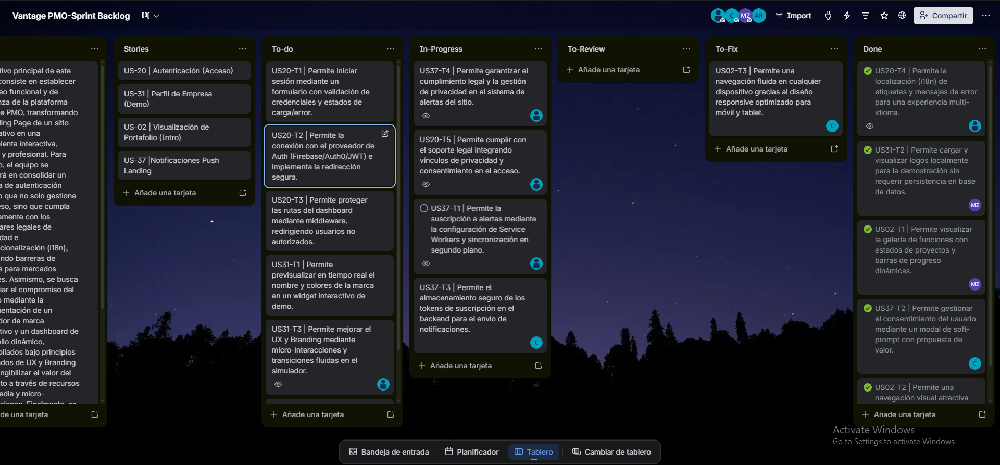

*Trello:* https://trello.com/b/9yf99IHI/vantage-pmo-sprint-backlog

<table border="1" cellspacing="0" cellpadding="5">
  <tr>
    <th>Sprint #</th>
    <th>Sprint 01</th>
    <th colspan="7"></th>
  </tr>
  <tr>
    <th colspan="2">User Story</th>
    <th colspan="2">Work-item / Task</th>
    <th colspan="5"></th>
  </tr>
  <tr>
    <th>Id</th>
    <th>Title</th>
    <th>Id</th>
    <th>Title</th>
    <th>Description</th>
    <th>Estimation (hours)</th>
    <th>Assigned To</th>
    <th>Status</th>
  </tr>

  <!-- US-020 -->
  <tr>
    <td>US-020</td>
    <td>Autenticación</td>
    <td>T001</td>
    <td>Formulario de inicio de sesión</td>
    <td>Permite iniciar sesión mediante un formulario con validación de credenciales y estados de carga/error.</td>
    <td>2h</td>
    <td>Alvaro Rocha</td>
    <td>Done</td>
  </tr>
  <tr>
    <td></td><td></td>
    <td>T002</td>
    <td>Integración con proveedor de autenticación</td>
    <td>Permite la conexión con el proveedor de Auth (Firebase/Auth0/JWT) e implementa la redirección segura.</td>
    <td>2h</td>
    <td>Diego Esquicha</td>
    <td>Done</td>
  </tr>
  <tr>
    <td></td><td></td>
    <td>T003</td>
    <td>Protección de rutas del dashboard</td>
    <td>Permite proteger las rutas del dashboard mediante middleware, redirigiendo usuarios no autorizados.</td>
    <td>1.5h</td>
    <td>Diego Esquicha</td>
    <td>Done</td>
  </tr>
  <tr>
    <td></td><td></td>
    <td>T004</td>
    <td>Soporte multi-idioma (i18n)</td>
    <td>Permite la localización (i18n) de etiquetas y mensajes de error para una experiencia multi-idioma.</td>
    <td>1h</td>
    <td>Dylan Guillen</td>
    <td>Done</td>
  </tr>
  <tr>
    <td></td><td></td>
    <td>T005</td>
    <td>Integración de privacidad y consentimiento</td>
    <td>Permite cumplir con el soporte legal integrando vínculos de privacidad y consentimiento en el acceso.</td>
    <td>1h</td>
    <td>Dylan Guillen</td>
    <td>Done</td>
  </tr>

  <!-- US-031 -->
  <tr>
    <td>US-031</td>
    <td>Perfil de Empresa</td>
    <td>T001</td>
    <td>Preview interactivo de marca</td>
    <td>Permite previsualizar en tiempo real el nombre y colores de la marca en un widget interactivo de demo.</td>
    <td>2.5h</td>
    <td>Alvaro Rocha</td>
    <td>Done</td>
  </tr>
  <tr>
    <td></td><td></td>
    <td>T002</td>
    <td>Carga local de logos</td>
    <td>Permite cargar y visualizar logos localmente para la demostración sin requerir persistencia en base de datos.</td>
    <td>1.5h</td>
    <td>Mauricio Teran</td>
    <td>Done</td>
  </tr>
  <tr>
    <td></td><td></td>
    <td>T003</td>
    <td>Mejoras UX y micro-interacciones</td>
    <td>Permite mejorar el UX y Branding mediante micro-interacciones y transiciones fluidas en el simulador.</td>
    <td>1h</td>
    <td>Dylan Guillen</td>
    <td>Done</td>
  </tr>
  <tr>
    <td></td><td></td>
    <td>T004</td>
    <td>Optimización de recursos multimedia</td>
    <td>Permite optimizar el rendimiento multimedia mediante la compresión y carga eficiente de activos visuales.</td>
    <td>1.5h</td>
    <td>Alvaro Rocha</td>
    <td>Done</td>
  </tr>

  <!-- US-002 -->
  <tr>
    <td>US-002</td>
    <td>Visión de Portafolio</td>
    <td>T001</td>
    <td>Galería de funciones con progreso</td>
    <td>Permite visualizar la galería de funciones con estados de proyectos y barras de progreso dinámicas.</td>
    <td>2h</td>
    <td>Mauricio Teran</td>
    <td>Done</td>
  </tr>
  <tr>
    <td></td><td></td>
    <td>T002</td>
    <td>Animaciones de scroll</td>
    <td>Permite una navegación visual atractiva mediante animaciones de scroll para revelar las funciones clave.</td>
    <td>1h</td>
    <td>Alvaro Rocha</td>
    <td>Done</td>
  </tr>
  <tr>
    <td></td><td></td>
    <td>T003</td>
    <td>Diseño responsive</td>
    <td>Permite una navegación fluida en cualquier dispositivo gracias al diseño responsive optimizado para móvil y tablet.</td>
    <td>2h</td>
    <td>Cesar Quispe</td>
    <td>Done</td>
  </tr>

  <!-- US-037 -->
  <tr>
    <td>US-037</td>
    <td>Notificaciones Push</td>
    <td>T001</td>
    <td>Configuración de Service Workers</td>
    <td>Permite la suscripción a alertas mediante la configuración de Service Workers y sincronización en segundo plano.</td>
    <td>2h</td>
    <td>Dylan Guillen</td>
    <td>Done</td>
  </tr>
  <tr>
    <td></td><td></td>
    <td>T002</td>
    <td>Gestión de consentimiento</td>
    <td>Permite gestionar el consentimiento del usuario mediante un modal de "soft-prompt" con propuesta de valor.</td>
    <td>1h</td>
    <td>Cesar Quispe</td>
    <td>Done</td>
  </tr>
  <tr>
    <td></td><td></td>
    <td>T003</td>
    <td>Almacenamiento de tokens</td>
    <td>Permite el almacenamiento seguro de los tokens de suscripción en el backend para el envío de notificaciones.</td>
    <td>1.5h</td>
    <td>Cesar Quispe</td>
    <td>Done</td>
  </tr>
  <tr>
    <td></td><td></td>
    <td>T004</td>
    <td>Cumplimiento legal de notificaciones</td>
    <td>Permite garantizar el cumplimiento legal y la gestión de privacidad en el sistema de alertas del sitio.</td>
    <td>1h</td>
    <td>Dylan Guillen</td>
    <td>Done</td>
  </tr>
</table>

##### 5.2.1.4. Development Evidence for Sprint Review
<a id="5-2-1-4-development-evidence-for-sprint-review"></a>

En esta sección se presentan los avances obtenidos durante la fase de implementación, considerando los productos definidos dentro del alcance del Sprint. En este caso, se analizará específicamente el Sprint Backlog 01, el cual está enfocado exclusivamente en el desarrollo de la Landing Page.

Se describen las funcionalidades implementadas y el progreso alcanzado en relación con los requerimientos establecidos para este sprint. Asimismo, se incluye una tabla que detalla la información correspondiente a los repositorios utilizados, donde se evidencian los commits realizados como parte del desarrollo, permitiendo así un seguimiento claro de los cambios y aportes efectuados durante el proceso.

<table border="1" cellspacing="0" cellpadding="5">
  <tr>
    <th>Repository</th>
    <th>Branch</th>
    <th>Commit Id</th>
    <th>Commit Message</th>
    <th>Commit Message Body</th>
    <th>Commited on (Date)</th>
  </tr>

  <tr>
    <td>FulLHous/Vantage-PMO-Business-Web-Page</td>
    <td>develop</td>
    <td>24a5c23</td>
    <td>feat: add products and ai sections with carousel.</td>
    <td>Permite visualizar el producto mediante un carrusel interactivo, al igual que la informacion de la ia.</td>
    <td>22/04/2026</td>
  </tr>
  <tr>
    <td>FulLHous/Vantage-PMO-Business-Web-Page</td>
    <td>develop</td>
    <td>fba762b</td>
    <td>feat: add client side i18n module (en/es)</td>
    <td>Permite incorporar un modulo de internacionalizacion del lado del cliente para alternar el contenido de la landing page entre espanol e ingles.</td>
    <td>21/04/2026</td>
  </tr>
  <tr>
    <td>FulLHous/Vantage-PMO-Business-Web-Page</td>
    <td>develop</td>
    <td>eb71d2f9f</td>
    <td>feat: add main and nav javascript modules.</td>
    <td>Permite modularizar la logica principal y la navegacion del sitio para mejorar la interaccion del usuario y la organizacion del codigo.</td>
    <td>21/04/2026</td>
  </tr>
  <tr>
    <td>mau-tz/Vantage-PMO-Business-Web-Page</td>
    <td>develop</td>
    <td>104b71f</td>
    <td>feat: add team section with assets, i18n & styles</td>
    <td>Permite agregar la section del equipo(team) con estilos y se le adiciona esa section a la internalización en español e ingles.</td>
    <td>25/04/2026</td>
  </tr>
  <tr>
    <td>mau-tz/Vantage-PMO-Business-Web-Page</td>
    <td>develop</td>
    <td>fbd6077</td>
    <td>feat: update team roles and spanish heading</td>
    <td>Permite actualizar los roles del equipo y corregir el encabezado en español para mantener la consistencia del contenido mostrado en la landing page.</td>
    <td>25/04/2026</td>
  </tr>
</table>

##### 5.2.1.5. Execution Evidence for Sprint Review
<a id="5-2-1-5-execution-evidence-for-sprint-review"></a>

Durante el presente Sprint, se ha logrado la transición de una interfaz estática a un ecosistema interactivo y funcional, cumpliendo con el objetivo de establecer el núcleo de acceso y la propuesta de valor visual de Vantage PMO. Los hitos alcanzados se centran en la implementación de un sistema de seguridad robusto, la personalización dinámica de la identidad de marca y la optimización de la experiencia de usuario a través de múltiples dispositivos y lenguajes.

**Resumen de Logros:**

- Seguridad y Acceso: Se ha desplegado un módulo de autenticación completo que integra proveedores de identidad modernos, garantizando un flujo de inicio de sesión seguro, validado y alineado con normativas legales de privacidad.

- Interactividad y Demostración: Se implementó un motor de previsualización en tiempo real que permite a los potenciales clientes interactuar con la plataforma, personalizando elementos de branding y visualizando la capacidad del dashboard de portafolio sin fricciones técnicas.

- Accesibilidad y Alcance Global: Gracias a la implementación de internacionalización (i18n) y un diseño estrictamente responsivo, la plataforma es ahora capaz de ofrecer una navegación coherente y profesional tanto en entornos de escritorio como en dispositivos móviles, eliminando barreras de idioma y formato.

- Comunicación Persistente: Se estableció la infraestructura de notificaciones push, permitiendo una conexión directa con el usuario y mejorando los índices de retención mediante alertas del sistema optimizadas.

A continuación, se presentan las evidencias gráficas de las vistas implementadas y el recurso audiovisual que detalla el flujo de navegación alcanzado:

Video de Demostración y Navegación: https://upcedupe-my.sharepoint.com/:v:/g/personal/u202411243_upc_edu_pe/IQBeKxnUoQKmRYT2cJBc8WMKAXQ7spnUE5tnzJIMjm1vmfU?nav=eyJyZWZlcnJhbEluZm8iOnsicmVmZXJyYWxBcHAiOiJTdHJlYW1XZWJBcHAiLCJyZWZlcnJhbFZpZXciOiJTaGFyZURpYWxvZy1MaW5rIiwicmVmZXJyYWxBcHBQbGF0Zm9ybSI6IldlYiIsInJlZmVycmFsTW9kZSI6InZpZXcifX0%3D&e=epsV7Q

Screenshots de la Implementación:

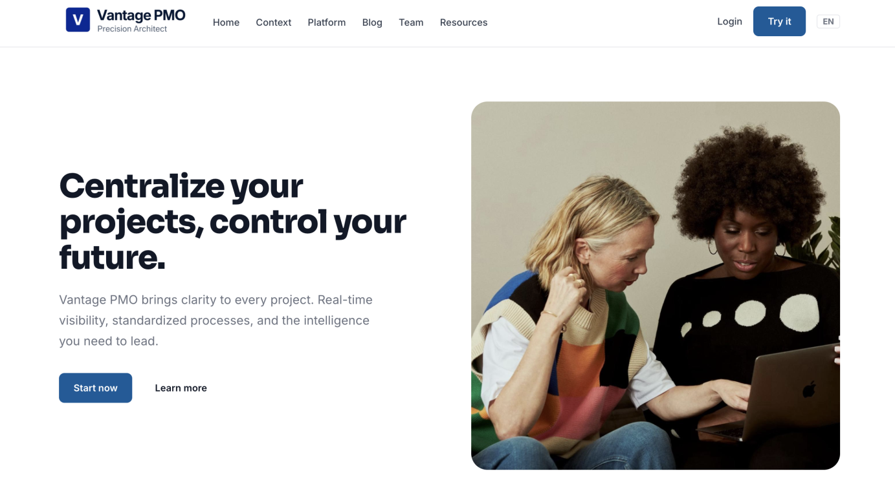

##### 5.2.1.6. Services Documentation Evidence for Sprint Review
<a id="5-2-1-6-services-documentation-evidence-for-sprint-review"></a>

Durante este sprint se llevó a cabo el desarrollo y la implementación completa del Landing Page del sistema, el cual representa el primer punto de contacto para los usuarios y funciona como acceso inicial a la plataforma.

En este sprint no se desarrollaron endpoints REST tradicionales; sin embargo, se incluye la documentación correspondiente a la URL donde se encuentra desplegado el recurso, junto con evidencias del despliegue, la interacción del usuario y los commits asociados al proceso de desarrollo.

**Descripción del logro:**

- Desarrollo e implementación del Landing Page estático.
- Despliegue del Landing Page en un entorno accesible.

<table border="1" cellspacing="0" cellpadding="5">
  <tr>
    <th>Recurso</th>
    <th>Acción implementada</th>
    <th>HTTP</th>
    <th>URL / Endpoint</th>
    <th>Link de repositorio</th>
  </tr>
  <tr>
    <td>Landig Page</td>
    <td>Vista inicial</td>
    <td>GET</td>
    <td><a href="https://bl-aplicaciones-web-1asi0730-2610-12158.github.io/Vantage-PMO-Business-Web-Page/">https://bl-aplicaciones-web-1asi0730-2610-12158.github.io/Vantage-PMO-Business-Web-Page/</a></td>
    <td><a href="https://github.com/BL-Aplicaciones-Web-1ASI0730-2610-12158/Vantage-PMO-Business-Web-Page">https://github.com/BL-Aplicaciones-Web-1ASI0730-2610-12158/Vantage-PMO-Business-Web-Page</a></td>
  </tr>
</table>

##### 5.2.1.7. Software Deployment Evidence for Sprint Review
<a id="5-2-1-7-software-deployment-evidence-for-sprint-review"></a>

En este Sprint se ejecutaron las tareas necesarias para publicar la Landing Page, haciendo uso de GitHub Pages como servicio de alojamiento web. A continuación, se presentan las actividades desarrolladas durante este proceso:


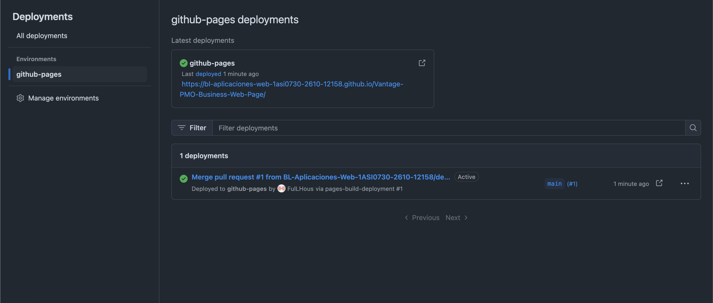


##### 5.2.1.8. Team Collaboration Insights during Sprint
<a id="5-2-1-8-team-collaboration-insights-during-sprint"></a>

La finalización de este Sprint es el resultado de un esfuerzo coordinado para transformar los requerimientos de Vantage PMO en componentes de software funcionales. El equipo adoptó un flujo de trabajo ágil y riguroso, caracterizado por los siguientes puntos clave:

- La carga de trabajo se distribuyó estratégicamente, permitiendo que cada desarrollador liderara áreas críticas según su especialidad, desde la lógica de internacionalización hasta la optimización del diseño responsivo y multimedia.

- La evolución del proyecto se documentó a través de un historial de cambios continuo y granular. La unión de los módulos se realizó mediante procesos de Pull Request hacia la rama de integración, asegurando que cada nueva funcionalidad cumpliera con los estándares del proyecto antes de ser consolidada.

- Mantuvimos un canal de comunicación técnica constante para gestionar la integración de APIs y estilos, logrando resolver discrepancias de diseño o lógica de manera inmediata y colaborativa.

- El éxito de la entrega se fundamentó en la aplicación de buenas prácticas de desarrollo, asegurando un código limpio, mantenible y alineado con los objetivos de negocio de la plataforma.

- Este enfoque metodológico no solo permitió cumplir con el Sprint Goal, sino que garantizó una contribución equilibrada y de alto impacto por parte de todos los miembros del equipo en la construcción de la Landing Page.

**Métricas de Actividad en el Repositorio**

Como evidencia del dinamismo y la colaboración técnica, se adjuntan los indicadores de actividad (commits, merges y contribuciones) extraídos de GitHub:

### Analíticos de GitHub — Report

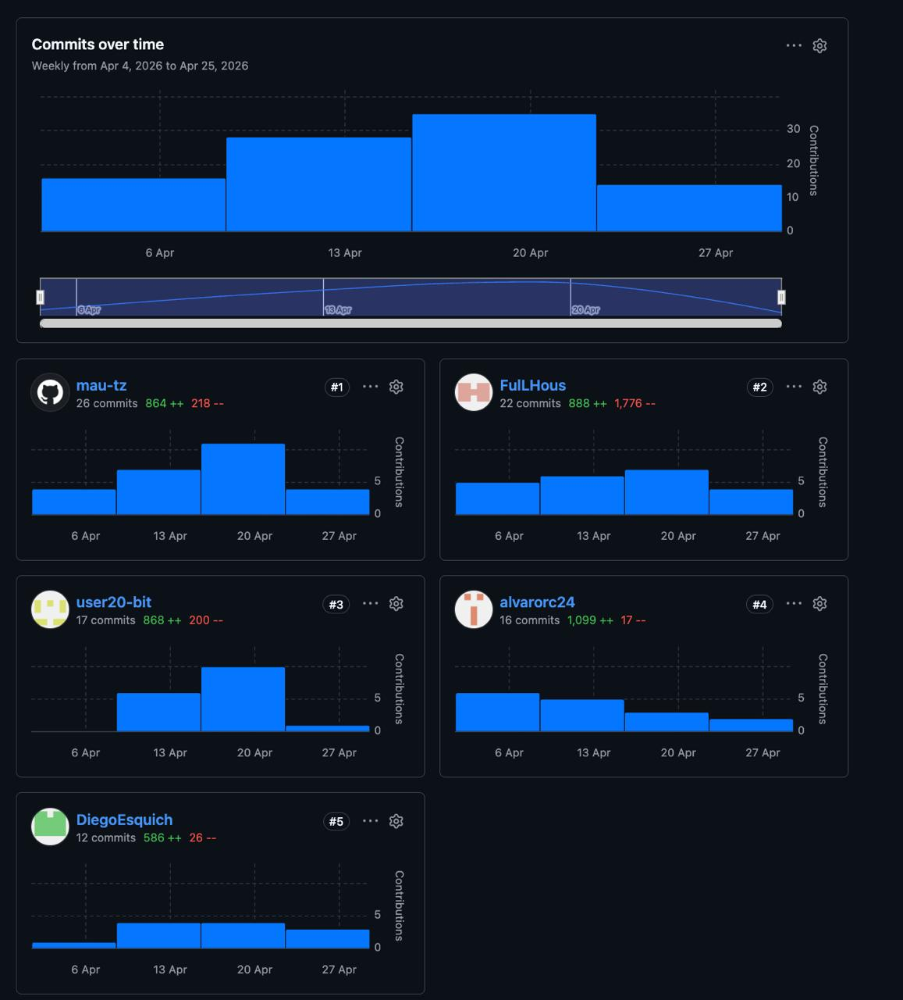

#### Analíticos de GitHub — Landing Page
 
<p align="center">
  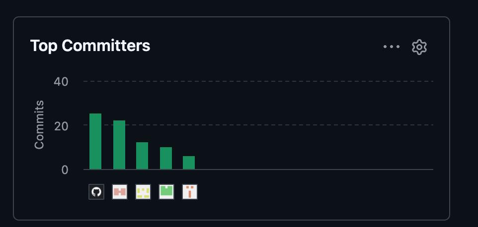
</p>
Se evidencia la participación plena de los cinco integrantes en el desarrollo de la Landing Page. La distribución de las contribuciones técnicas valida una colaboración equitativa y constante por parte de todo el equipo durante el ciclo de trabajo inicial.

| Integrante | Usuario GitHub | Commits |
|---|---|---|
| Bautista Rivera, Jose Diego | `mau-tz` | 25 |
| Guillen Giraldo, Mike Dylan| `FulLHous` | 22 |
| Quispe Llacsahuanga, César Agusto | `user20-bit` | 12 |
| Esquicha Alcántara, Diego Alonso | `DiegoEsquich` | 10 |
| Rocha Cotrina, Alvaro | `alvarorc24` | 16 |

Se evidencia la colaboración constante y la sinergia grupal mediante la trazabilidad de los aportes individuales. Cada integrante sumó valor en áreas críticas del desarrollo, garantizando no solo el avance técnico del sistema, sino también el cumplimiento de los acuerdos establecidos durante la planificación del ciclo de trabajo.

</div>


### 5.2.2. Sprint 2
<a id="5-2-2-sprint-2"></a>

#### 5.2.2.1. Sprint Planning 2
<a id="5-2-2-1-sprint-planning-2"></a>

En esta sección se presenta la planificación correspondiente al Sprint 2, enfocado en el desarrollo de las funcionalidades interactivas del entorno interno de gestión de proyectos.

| Campo | Detalle |
| :--- | :--- |
| **Sprint #** | Sprint 2 |
| **Sprint Planning Background** | |
| **Date** | 2026/05/02 |
| **Time** | 22:00 pm |
| **Location** | Reunión virtual mediante Discord |
| **Prepared By** | Guillen Giraldo, Mike Dylan |
| **Attendees** | Rocha Cotrina, Alvaro / Esquicha Alcántara, Diego Alonso / Quispe Llacsahuanga, César Agusto / Guillen Giraldo, Mike Dylan / Teran Zavala, Mauricio Alejandro |
| **Sprint n-1 Review Summary** | Se completó exitosamente el desarrollo y despliegue de la Landing Page institucional, incluyendo autenticación visual, internacionalización, responsive design y notificaciones push. |
| **Sprint n-1 Retrospective Summary** | Se identificó la necesidad de mejorar la integración entre componentes frontend y backend, además de reforzar la validación de formularios y la consistencia visual entre módulos. |
| **Sprint Goal & User Stories** | **Sprint 2**: Nos enfocamos en implementar las funcionalidades operativas e interactivas principales. Creemos que esto permitirá a líderes de proyectos y equipos empresariales gestionar tareas, visualizar proyectos, monitorear avances y centralizar la colaboración dentro de una plataforma intuitiva. Esto se confirmará cuando los usuarios puedan interactuar con tableros Kanban, dashboards visuales, comentarios, filtros y estados dinámicos sin fricciones técnicas, logrando una experiencia de gestión fluida y mas precisa. |
| **Sprint 2 Velocity** | 26 Story Points |
| **Sum of Story Points** | 26 Story Points |

### 5.2.2.2. Aspect Leaders and Collaborators.
<a id="5-2-2-2-aspect-leaders-and-collaborators"></a>
Durante el Sprint 2, el equipo priorizó el desarrollo de los módulos centrales en la dirije la gestión visual de proyectos, interacción de tareas, dashboards operativos y componentes de experiencia de usuario avanzada. El objetivo principal fue dar una experiencia funcional similar a un entorno PMO real, integrando componentes frontend reutilizables.

Para asegurar una correcta coordinación y distribución de responsabilidades, se implementó nuevamente la matriz de liderazgo y colaboración (LACX), asignando líderes técnicos y colaboradores según la especialidad de cada integrante del equipo.

| Team Member (Last Name, First Name) | GitHub Username | Dashboard | Kanban | API | Auth | Notifications | Reports | Risks | Calendar | UI/UX |
| :--- | :--- | :---: | :---: | :---: | :---: | :---: | :---: | :---: | :---: | :---: |
| Rocha Cotrina, Alvaro | alvarorc24 | L | C | C | C | C | L | C | C | C |
| Esquicha Alcántara, Diego Alonso | DiegoEsquich | C | C | L | L | C | C | C | C | C |
| Quispe Llacsahuanga, César Agusto | user20-bit | C | L | C | C | L | C | C | C | L |
| Guillen Giraldo, Mike Dylan | FulLHous | C | C | C | C | C | C | L | C | L |
| Teran Zavala, Mauricio Alejandro | mau-tz | C | C | C | C | C | C | C | L | C |

*Leyenda: L = Lead (Líder), C = Collaborator (Colaborador)*

#### 5.2.2.3. Sprint Backlog 2.
<a id="5-2-2-3-sprint-backlog-2"></a>

El Sprint 2 se ven las funcionalidades operativas mediante la implementación de componente y herramientas de monitoreo visual. El equipo trabajó en la integración de tableros Kanban, dashboards de seguimiento, comentarios colaborativos, filtros dinámicos, autenticación segura y generación de reportes, permitiendo transformar la plataforma en un entorno funcional para la gestión de proyectos.

### Screenshot del Board
<div style="text-align:center;">
  
</div>

**Trello:** [Trello Sprint 2](https://trello.com/b/9yf99IHI/vantage-pmo-sprint-backlog) [https://trello.com/b/9yf99IHI/vantage-pmo-sprint-backlog]

### Sprint Backlog #02

| User Story Id | Title | Task Id | Task Title | Description | Est. (h) | Assigned To | Status |
| :--- | :--- | :--- | :--- | :--- | :---: | :--- | :---: |
| **US-033** | Tablero Kanban | T001 | Implementación drag & drop | Permite mover tareas entre columnas mediante interacción visual drag and drop. | 3h | Cesar Quispe | Done |
| | | T002 | Persistencia de estados | Permite actualizar el estado de tareas en tiempo real mediante conexión API. | 2h | Diego Esquicha | Done |
| | | T003 | Renderizado dinámico de tareas | Permite visualizar tareas dinámicamente dentro del tablero Kanban. | 1h | Alvaro Rocha | Done |
| **US-061** | Barra de Progreso | T001 | Cálculo dinámico de avance | Permite visualizar el porcentaje de avance automáticamente según tareas completadas. | 2h | Alvaro Rocha | Done |
| | | T002 | Actualización visual de progreso | Permite refrescar dinámicamente la barra de progreso en pantalla. | 1h | Mauricio Teran | Done |
| **US-062** | Chat / Comentarios UI | T001 | Feed de comentarios | Permite visualizar mensajes y comentarios asociados a tareas del proyecto. | 2h | Mauricio Teran | Done |
| | | T002 | Diseño de burbujas de conversación | Permite mejorar la experiencia visual de interacción colaborativa. | 1h | Dylan Guillen | Done |
| | | T003 | Renderizado dinámico de mensajes | Permite mostrar mensajes dinámicamente dentro del chat colaborativo. | 1h | Cesar Quispe | Done |
| **US-063** | Campanita Avisos | T001 | Centro de notificaciones | Permite visualizar alertas activas dentro del dashboard. | 2h | Cesar Quispe | Done |
| | | T002 | Actualización de avisos | Permite refrescar automáticamente las notificaciones mostradas. | 1h | Alvaro Rocha | Done |
| **US-064** | Risk Table | T001 | Tabla de riesgos críticos | Permite resaltar riesgos críticos mediante colores y prioridades. | 2h | Dylan Guillen | Done |
| | | T002 | Renderizado de riesgos | Permite visualizar dinámicamente riesgos registrados en el sistema. | 1h | Diego Esquicha | Done |
| **US-039** | Calendario Mensual | T001 | Calendario interactivo | Permite visualizar hitos y eventos importantes del proyecto. | 2h | Mauricio Teran | Done |
| | | T002 | Navegación entre meses | Permite cambiar de mes mediante controles interactivos. | 1h | Cesar Quispe | Done |
| **US-041** | Auth JWT | T001 | Generación de tokens | Permite asegurar las peticiones mediante autenticación JWT. | 2h | Diego Esquicha | Done | 
| **US-043** | CRUD Proyectos API | T001 | Endpoints REST | Permite crear, listar, editar y eliminar proyectos desde la API. | 4h | Diego Esquicha | Done |
| | | T002 | Serialización de respuestas JSON | Permite estructurar respuestas JSON para comunicación con frontend. | 1h | Alvaro Rocha | Done |
| **US-054** | JSON a PDF | T001 | Generación de reportes PDF | Permite exportar reportes ejecutivos desde la plataforma. | 2h | Alvaro Rocha | Done |
|

#### 5.2.2.4. Development Evidence for Sprint Review.
<a id="5-2-2-4-development-evidence-for-sprint-review"></a>

En esta sección se presentan los avances obtenidos durante la fase de implementación correspondientes al Sprint Backlog 02, enfocado en el desarrollo de funcionalidades interactivas y componentes principales del sistema de gestión de proyectos.

Durante este sprint se implementaron funcionalidades relacionadas con el tablero Kanban, autenticación mediante JWT, visualización de progreso, sistema de comentarios colaborativos, gestión de riesgos, calendario mensual, generación de reportes PDF y consumo de endpoints REST para la administración de proyectos.

<table border="1" cellspacing="0" cellpadding="5">
  <tr>
    <th>Repository</th>
    <th>Branch</th>
    <th>Commit Id</th>
    <th>Commit Message</th>
    <th>Commit Message Body</th>
    <th>Commited on (Date)</th>
  </tr>

  <tr>
    <td>DiegoEsquich/Vantage-PMO-Front-End</td>
    <td>develop</td>
    <td>a12f4d2</td>
    <td>feat(task-collaboration): implement kanban board ui and task workflow logic</td>
    <td>Permite implementar la interfaz del tablero Kanban y la lógica de flujo colaborativo de tareas.</td>
    <td>12/05/2026</td>
  </tr>

  <tr>
    <td>DiegoEsquich/Vantage-PMO-Front-End</td>
    <td>develop</td>
    <td>b82ac14</td>
    <td>feat(task-collaboration): add task collaboration endpoint, data, and route</td>
    <td>Permite implementar endpoints y rutas para la colaboración y gestión de tareas.</td>
    <td>12/05/2026</td>
  </tr>

  <tr>
    <td>alvarorc24/Vantage-PMO-Front-End</td>
    <td>develop</td>
    <td>c73de91</td>
    <td>feat(reports): implement api, store, view, entity</td>
    <td>Permite implementar la estructura de reportes mediante API, vistas, entidades y almacenamiento.</td>
    <td>12/05/2026</td>
  </tr>

  <tr>
    <td>alvarorc24/Vantage-PMO-Front-End</td>
    <td>develop</td>
    <td>d42cb66</td>
    <td>feat(reports): api config, mock data and route</td>
    <td>Permite configurar rutas y datos simulados para la gestión de reportes.</td>
    <td>12/05/2026</td>
  </tr>

  <tr>
    <td>mau-tz/Vantage-PMO-Front-End</td>
    <td>develop</td>
    <td>e91bd72</td>
    <td>feat(project): active projects view with styles</td>
    <td>Permite visualizar proyectos activos mediante una interfaz estilizada e interactiva.</td>
    <td>13/05/2026</td>
  </tr>

  <tr>
    <td>mau-tz/Vantage-PMO-Front-End</td>
    <td>develop</td>
    <td>f25da18</td>
    <td>feat(project): add milestone timeline and enhance project styles</td>
    <td>Permite implementar una línea de tiempo de hitos y mejorar la visualización de proyectos.</td>
    <td>13/05/2026</td>
  </tr>

  <tr>
    <td>user20-bit/Vantage-PMO-Front-End</td>
    <td>develop</td>
    <td>g66ae42</td>
    <td>feat(system-administration): integrate admin panel with branding, security and notification settings</td>
    <td>Permite integrar configuraciones de seguridad y notificaciones dentro del panel administrativo.</td>
    <td>13/05/2026</td>
  </tr>

  <tr>
    <td>user20-bit/Vantage-PMO-Front-End</td>
    <td>develop</td>
    <td>h87ef24</td>
    <td>feat(system-administration): redesign admin module with enterprise settings workspace UI</td>
    <td>Permite rediseñar el módulo administrativo mediante una interfaz de configuración empresarial.</td>
    <td>13/05/2026</td>
  </tr>

  <tr>
    <td>FulLHous/Vantage-PMO-Front-End</td>
    <td>develop</td>
    <td>i53bc74</td>
    <td>feat(ui): implement schedule calendar view component</td>
    <td>Permite visualizar actividades y eventos mediante un calendario interactivo mensual.</td>
    <td>14/05/2026</td>
  </tr>

  <tr>
    <td>FulLHous/Vantage-PMO-Front-End</td>
    <td>develop</td>
    <td>j42da55</td>
    <td>feat(meetings): implement entity, API service, assembler, and store</td>
    <td>Permite implementar la gestión de reuniones mediante entidades, servicios API y almacenamiento.</td>
    <td>14/05/2026</td>
  </tr>

  <tr>
    <td>FulLHous/Vantage-PMO-Front-End</td>
    <td>develop</td>
    <td>k92ca11</td>
    <td>feat(ui): add meetings management view and export report dialog</td>
    <td>Permite gestionar reuniones y exportar reportes mediante ventanas de diálogo interactivas.</td>
    <td>14/05/2026</td>
  </tr>

  <tr>
    <td>FulLHous/Vantage-PMO-Front-End</td>
    <td>develop</td>
    <td>l52fe90</td>
    <td>feat(ui): add responsive CSS layouts for support and task views</td>
    <td>Permite adaptar las vistas de soporte y tareas mediante estilos responsive.</td>
    <td>15/05/2026</td>
  </tr>

  <tr>
    <td>FulLHous/Vantage-PMO-Front-End</td>
    <td>develop</td>
    <td>m81df63</td>
    <td>feat(auth): improve forms with password visibility toggles and robust validation</td>
    <td>Permite mejorar la autenticación mediante validaciones robustas y visualización de contraseñas.</td>
    <td>15/05/2026</td>
  </tr>

  <tr>
    <td>FulLHous/Vantage-PMO-Front-End</td>
    <td>develop</td>
    <td>n22bc84</td>
    <td>feat(auth): add forgot and reset password routes</td>
    <td>Permite implementar recuperación y restablecimiento de contraseña mediante rutas de autenticación.</td>
    <td>15/05/2026</td>
  </tr>

</table>

#### 5.2.2.5. Execution Evidence for Sprint Review.
<a id="5-2-2-5-execution-evidence-for-sprint-review"></a>
Durante el Sprint 2 se logró consolidar el entorno interactivo principal, integrando módulos funcionales orientados a la gestión operativa de proyectos y colaboración entre equipos.

### Resumen de Logros:

*   **Gestión Visual de Proyectos:** Se implementó un tablero Kanban completamente interactivo con actualización dinámica de estado.
*   **Dashboard Ejecutivo:** Se integraron barras de progreso, indicadores visuales y métricas estratégicas para el monitoreo continuo de proyectos.
*   **Seguridad** Se desarrolló un sistema de autenticación para proyectos, asegurando una comunicación estructurada entre frontend.
*   **Comunicación y Riesgos:** Se añadieron módulos de comentarios colaborativos, centro de notificaciones y tabla de riesgos críticos para fortalecer la coordinación entre equipos.
*   **Reportes y Seguimiento:** Se incorporó la generación de reportes PDF y un calendario interactivo para visualizar hitos y actividades relevantes.

### Video de Demostración y Navegación
Puedes acceder al video de la demostración funcional en el siguiente enlace:
[Enlace a Video de Demostración ](https://upcedupe-my.sharepoint.com/:v:/g/personal/u202411799_upc_edu_pe/IQB9_MnQmbOJQ4bIrihqyoPJAf8ovP4aL_gm3Tv7x9twqk8?nav=eyJyZWZlcnJhbEluZm8iOnsicmVmZXJyYWxBcHAiOiJPbmVEcml2ZUZvckJ1c2luZXNzIiwicmVmZXJyYWxBcHBQbGF0Zm9ybSI6IldlYiIsInJlZmVycmFsTW9kZSI6InZpZXciLCJyZWZlcnJhbFZpZXciOiJNeUZpbGVzTGlua0NvcHkifX0&e=hJb0Ta) - (https://upcedupe-my.sharepoint.com/:v:/g/personal/u202411799_upc_edu_pe/IQB9_MnQmbOJQ4bIrihqyoPJAf8ovP4aL_gm3Tv7x9twqk8?nav=eyJyZWZlcnJhbEluZm8iOnsicmVmZXJyYWxBcHAiOiJPbmVEcml2ZUZvckJ1c2luZXNzIiwicmVmZXJyYWxBcHBQbGF0Zm9ybSI6IldlYiIsInJlZmVycmFsTW9kZSI6InZpZXciLCJyZWZlcnJhbFZpZXciOiJNeUZpbGVzTGlua0NvcHkifX0&e=hJb0Ta) 

### Screenshots de la Implementación

<div style="text-align:center;">
  
</div>

<div style="text-align:center;">
  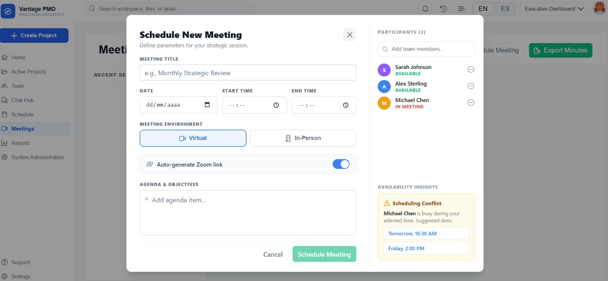
</div>

#### 5.2.2.6. Services Documentation Evidence for Sprint Review.
<a id="5-2-2-6-services-documentation-evidence-for-sprint-review"></a>
En este Sprint se ejecutaron actividades de despliegue relacionadas con el frontend. Se utilizaron entornos cloud para garantizar la accesibilidad y estabilidad del sistema.

**Las actividades realizadas incluyen:**

* **Frontend Deployment:** Despliegue del frontend en entorno web.
* **Environment Configuration:** Configuración de variables de entorno y autenticación JWT.

### Detalle de Entornos de Despliegue

| Componente | Plataforma / Herramienta | Estado | URL / Acceso |
| :--- | :--- | :---: | :--- |
| **Frontend Web** | Vercel / Netlify | `Live` | [https://vantagepmo-297ec.web.app] |
| **Documentación** | Swagger UI | `Public` | `/api/docs` |

---

#### 5.2.2.7. Software Deployment Evidence for Sprint Review.
<a id="5-2-2-7-software-deployment-evidence-for-sprint-review"></a>

- Desarrollo e implementación del Fronted.
- Registro y visualizacion de opciones del fronted.


<div style="text-align:center;">
  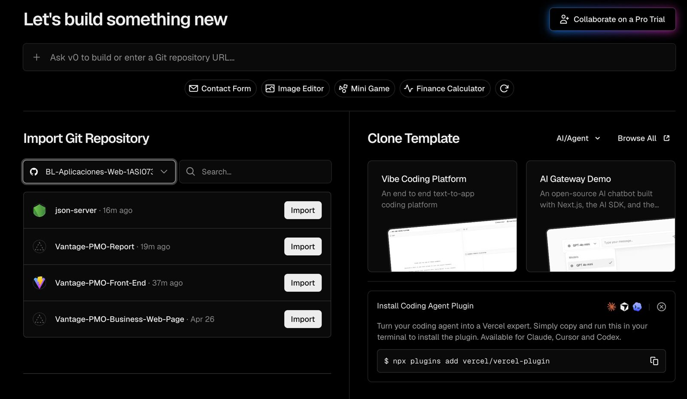
</div>

<div style="text-align:center;">
  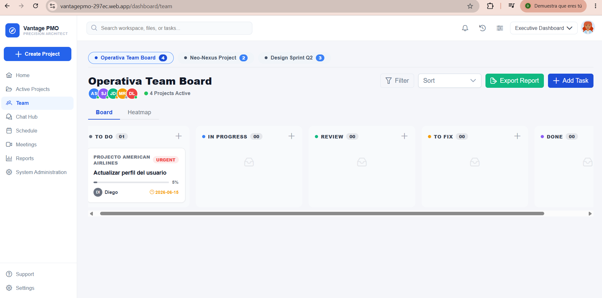
</div>

<div style="text-align:center;">
  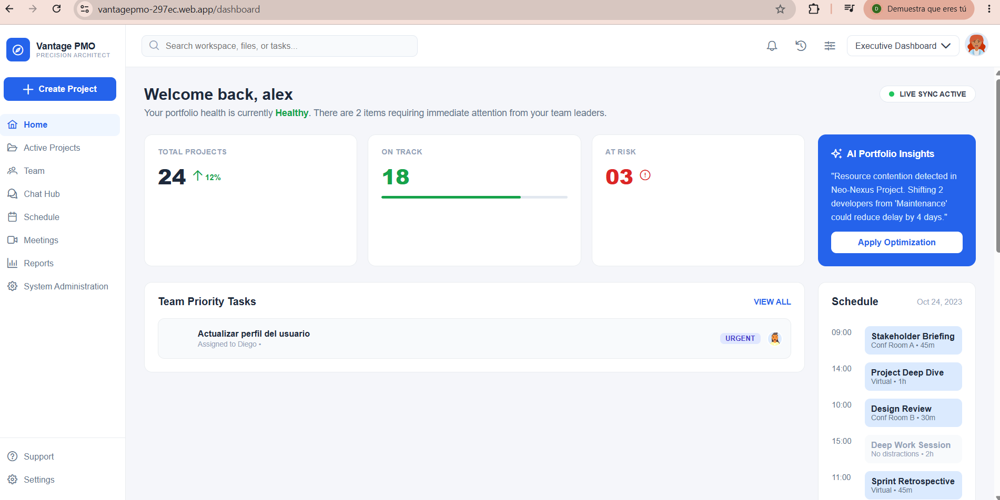
</div>

<div style="text-align:center;">
  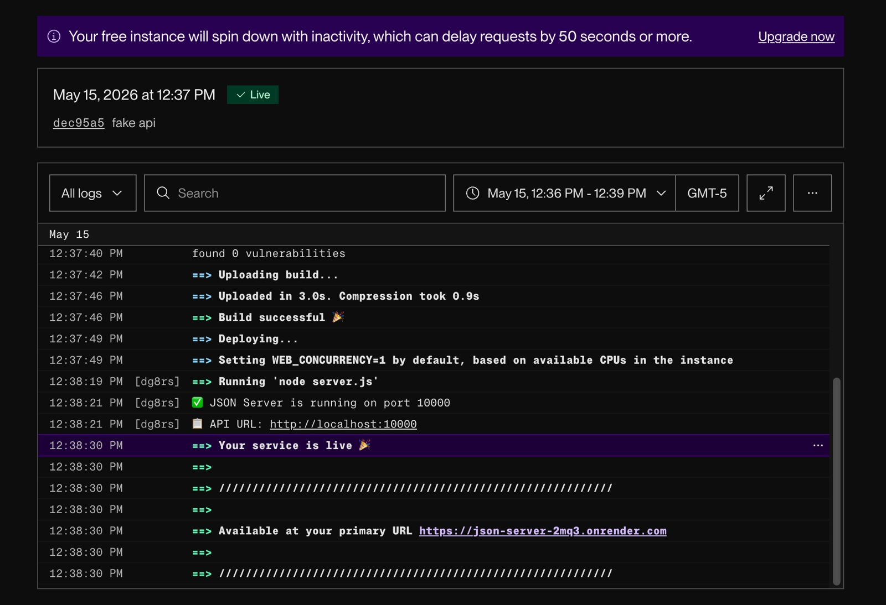
</div>

#### 5.2.2.8.Team Collaboration Insights during Sprint.

<a id="5-2-2-8-team-collaboration-insights-during-sprint"></a>

La ejecución del Sprint 2 permitió integrar múltiples componentes frontend dentro de la arquitectura funcional y colaborativa. El trabajo del equipo se caracterizó por los siguientes aspectos:

*   **Sinergia Técnica:** Se fortaleció la colaboración entre frontend mediante integraciones continuas y validaciones cruzadas entre módulos visuales y servicios REST.
*   **Gestión de Control de Versiones:** El uso de ramas de desarrollo y Pull Requests permitió mantener orden de integración estable, evitando conflictos y asegurando la calidad del código entregado.
*   **Consistencia Visual y Funcional:** La coordinación grupal ayudo a mantener consistencia entre dashboards, componentes UI y lógica de negocio, especialmente en funcionalidades como Kanban, comentarios y notificaciones.
*   **Cultura de Calidad:** Se aplicaron buenas prácticas de desarrollo ágil, incluyendo revisiones semanales, commits y pruebas funcionales constantes.
*   **Comunicación Efectiva:** El equipo mantuvo la comunicación ante cambios mediante Discord y GitHub, logrando resolver rápidamente problemas de integración y dependencias entre servicios.

### Analíticos de GitHub — Sprint 2
**Analíticos de GitHub — Plataforma Interna**

<p align="center">
  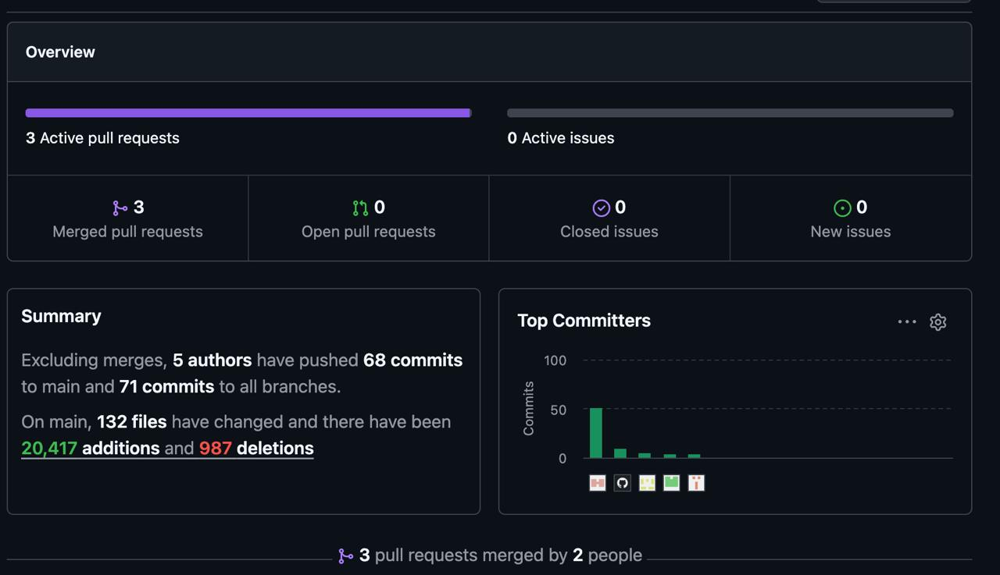
</p>

| Integrante | Usuario GitHub | Commits |
| :--- | :--- | :---: |
| Guillen Giraldo, Mike Dylan | FulLHous | 51 |
| Quispe Llacsahuanga, César Agusto | user20-bit | 9 |
| Esquicha Alcántara, Diego Alonso | DiegoEsquich | 5 |
| Rocha Cotrina, Alvaro | alvarorc24 | 3 |
| Teran Zavala, Mauricio Alejandro | mau-tz | 3|

Se evidencia una participación activa y equilibrada de todos los integrantes del equipo durante el Sprint 2, reflejando un trabajo colaborativo de la plataforma Vantage PMO.